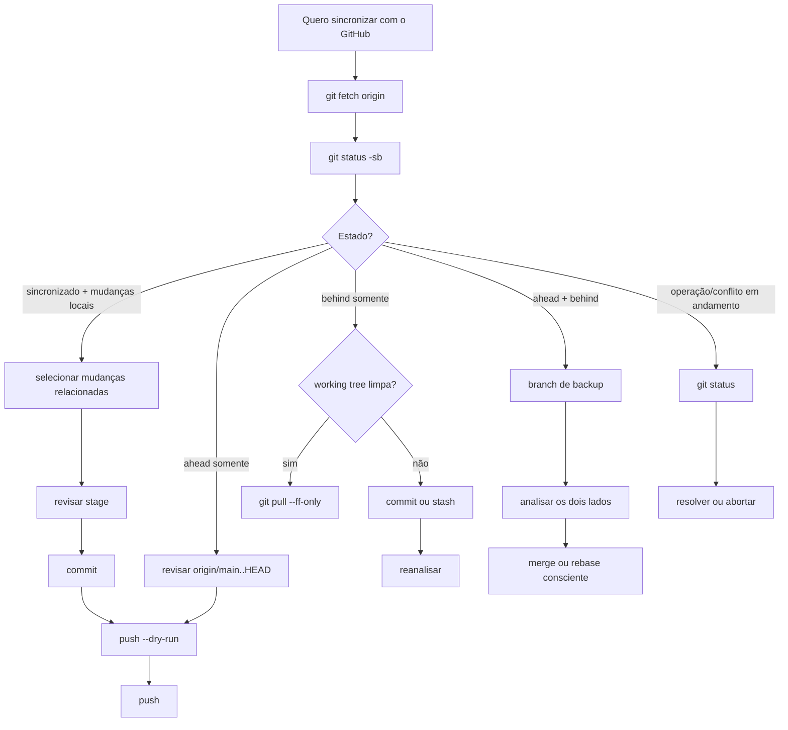

<a id="top"></a>

<p align="center">
  <a href="https://diego-ch4m4x.github.io/Guia_Git/" title="Abrir o guia interativo">
    
  </a>
</p>

# Git + GitHub — Guia Prático e Manual Operacional para Situações Reais

> **Da primeira instalação ao troubleshooting: entender o estado, executar com segurança e validar o resultado.**

<p align="center">
  <a href="#idioma-e-convencoes"></a>
  <a href="#metadados-do-documento"></a>
  <a href="#metadados-do-documento"></a>
  <a href="#capitulo-11"></a>
  <a href="#capitulo-5-14"></a>
  <a href="./LICENSE"></a>
  <a href="./LICENSE"></a>
</p>

<p align="center">
  <a href="https://diego-ch4m4x.github.io/Guia_Git/">
    
  </a>
  <a href="https://github.com/Diego-Ch4m4X/Guia_Git">
    
  </a>
</p>

> [!IMPORTANT]
> **Nunca usou Git?** Vá direto para o [Capítulo 0](#capitulo-0) e faça apenas esse laboratório primeiro. O restante do manual existe para quando você precisar entender, colaborar, diagnosticar ou recuperar uma situação real.

> [!NOTE]
> **Este arquivo (`README.md`) é o único documento Markdown oficial do projeto e a fonte canônica do conteúdo.** Não existe um segundo `README.md` com conteúdo paralelo. O `index.html` é apenas a interface interativa deste mesmo conteúdo.

**Atalhos:** [🌐 Index interativo](https://diego-ch4m4x.github.io/Guia_Git/) · [📁 Repositório](https://github.com/Diego-Ch4m4X/Guia_Git) · [🚀 Começar pelo Capítulo 0](#capitulo-0) · [🧭 Diagnóstico](#capitulo-10) · [📋 Consulta rápida](#capitulo-17) · [⚙️ Metadados](#metadados-do-documento)

**Navegação rápida:**  
[🟠 Comece aqui](#capitulo-0) · [🧠 Como funciona](#capitulo-1) · [🔁 Dia a dia](#capitulo-7) · [🧭 Situações reais](#capitulo-11) · [📋 Consulta](#capitulo-17) · [📖 Entenda os comandos](#capitulo-19-7) · [🔤 Glossário](#capitulo-21) · [🔗 Referências](#capitulo-22)

**Legenda rápida:** 🟠 início/prioridade · 🧠 modelo mental · 🧪 laboratório · 🧭 troubleshooting · 🛡️ condição de parada/segurança · 📋 consulta · 🔗 referência

> **Nota de escopo:** não existe uma lista finita de “todos os erros possíveis” do Git. Este manual cobre **79 cenários operacionais** de situações cotidianas, falhas práticas e recuperação, do nível iniciante ao intermediário, com alguns casos avançados de segurança e integridade. O número não pretende representar todos os estados possíveis do Git.

---

## Mapa do documento

> **PARTE 0 — COMECE AQUI (capítulo 0)**  
> Um caminho curto e descartável dividido em duas vitórias: primeiro publicar uma mudança; depois trazer uma mudança remota para o PC. Inclui orientação mínima de terminal e autenticação para não bloquear quem começa do zero.
>
> **PARTE I — COMO FUNCIONA (capítulos 1–6)**  
> Fundamentos: Git x GitHub, instalação, autenticação, repositório, `.git`, working tree, stage, commit, `HEAD`, branches, remotos, upstream, `status`, `diff`, `log` e `fetch`.
>
> **PARTE II — TRABALHANDO NO DIA A DIA (capítulos 7–10)**  
> Fluxo pessoal essencial, fluxo seguro/auditável, colaboração com branch + Pull Request, fork + upstream, equivalência CLI ↔ VS Code, arquivos, bons commits, integração e método universal de diagnóstico.
>
> **PARTE III — RESOLVENDO PROBLEMAS / CASOS REAIS (capítulos 11–16)**  
> Situações operacionais organizadas por sintoma e contexto, com perfil multidimensional, condições de parada e o estudo de caso completo de `behind 15` + rebase + arquivo que reapareceu.
>
> **PARTE IV — CONSULTA RÁPIDA E REFERÊNCIA (capítulos 17–22 + apêndice)**  
> Tabela de erros, combos, matriz por efeito/risco, dicionário de comandos, checklists, cheat sheets, glossário, fontes oficiais e changelog.

---

<a id="indice"></a>

## Encontre pelo objetivo

| Quero... | Vá para |
|---|---|
| nunca usei Git | [Capítulo 0 — primeiro ciclo completo](#capitulo-0) |
| já tenho arquivos no PC e acabei de criar o repositório no GitHub | [4.2.1 — decidir entre remoto vazio e remoto com histórico](#capitulo-4-2-1) |
| já tenho arquivos no PC e o repositório ainda não existe no GitHub | [4.2.2 — criar o repositório remoto pela linha de comando](#capitulo-4-2-2) |
| publicar uma mudança simples | [`GIT-001`](#git-001) / [`GIT-002`](#git-002) |
| trazer o que mudou no GitHub | [`GIT-006`](#git-006) / [`GIT-012`](#git-012) |
| entender `ahead` / `behind` | [Capítulo 7](#capitulo-7) |
| resolver um push recusado | [`GIT-014`](#git-014) |
| achar um problema pelo sintoma | [Tabela rápida — capítulo 17](#capitulo-17) |
| recuperar commit/branch | [`GIT-043`](#git-043), [`GIT-061`](#git-061), [`GIT-063`](#git-063) |
| colaborar com branch/PR | [7.10 — Pull Request](#capitulo-7-10) |
| contribuir via fork | [7.11 — fork/upstream](#capitulo-7-11) |
| resolver autenticação | [`GIT-058`](#git-058), [`GIT-076`](#git-076), [`GIT-077`](#git-077) |
| consultar comandos rapidamente | [Capítulos 17–20](#capitulo-17) |
| entender o que cada parte de um comando significa | [19.7 — Dicionário de comandos, argumentos e referências](#capitulo-19-7) |
| corrigi um clone criado em uma subpasta indesejada | [4.9 — Mover/realocar um repositório com segurança](#capitulo-4-9) |
| quero apagar apenas a cópia local e manter o repositório no GitHub | [4.10 — Remover a cópia local sem apagar o GitHub](#capitulo-4-10) |
| quero excluir o projeto do PC e também o repositório no GitHub | [4.11 — Excluir local + remoto conscientemente](#capitulo-4-11) |

## Índice resumido

- [0. Comece aqui — seu primeiro ciclo completo com Git e GitHub](#capitulo-0)
- [1. Como usar este guia e manual](#capitulo-1)
- [2. Git e GitHub: o que são e como se relacionam](#capitulo-2)
- [3. Instalação, configuração inicial e autenticação](#capitulo-3)
- [4. Criar, clonar, conectar e identificar repositórios](#capitulo-4)
- [5. Como Git funciona: working tree, stage, commits e remoto](#capitulo-5)
- [6. Ler o estado: status, diff, log, fetch e inspeção](#capitulo-6)
- [7. Fluxos do dia a dia: pessoal, seguro e colaborativo](#capitulo-7)
- [8. Arquivos e versionamento: selecionar, restaurar, remover, ignorar e proteger](#capitulo-8)
- [9. Bons commits, branches, merge, rebase, stash e tags](#capitulo-9)
- [10. Método universal para diagnóstico e resolução de problemas](#capitulo-10)
- [11. Casos reais — alterações e sincronização](#capitulo-11)
- [12. Casos reais — stage e commits](#capitulo-12)
- [13. Casos reais — arquivos, branches, merge e rebase](#capitulo-13)
- [14. Casos reais — remotos, autenticação e permissões](#capitulo-14)
- [15. Casos reais — recuperação, arquivos grandes e integridade](#capitulo-15)
- [16. Estudo de caso completo — pasta movida, behind 15, ZIP reaparecendo e rebase](#capitulo-16)
- [17. Tabela rápida de erros e primeira resposta](#capitulo-17)
- [18. Combos operacionais prontos](#capitulo-18)
- [19. Comandos por efeito e nível de risco](#capitulo-19)
- [20. Checklists, cheat sheets e validação final](#capitulo-20)
- [21. Glossário operacional](#capitulo-21)
- [22. Referências oficiais e materiais complementares](#capitulo-22)
- [Apêndice — Changelog](#changelog)

## Índice completo

<details>
<summary><strong>Ver todos os subtópicos, LABs e 79 cenários GIT-xxx</strong></summary>

> Use este índice quando precisar localizar uma seção específica. Ele permanece completo para não perder subtópicos, mas fica recolhido por padrão para reduzir a carga visual de quem está começando.

- [0. Comece aqui — seu primeiro ciclo completo com Git e GitHub](#capitulo-0)
   - [0.1 Escolha seu caminho](#capitulo-0-1)
   - [0.2 O que você **não** precisa aprender agora](#capitulo-0-2)
   - [0.3 Antes de começar — terminal, pasta atual e laboratório descartável](#capitulo-0-3)
   - [0.4 Confirme a instalação e configure a autoria](#capitulo-0-4)
   - [0.5 Vitória 1 — faça sua primeira alteração](#capitulo-0-5)
   - [0.6 Prepare conscientemente apenas esse arquivo](#capitulo-0-6)
   - [0.7 Crie seu primeiro commit](#capitulo-0-7)
   - [0.8 Publique no GitHub — conclusão da Vitória 1](#capitulo-0-8)
   - [0.9 Vitória 2 — faça uma alteração remota e traga para o PC](#capitulo-0-9)
   - [0.10 O que acabou de acontecer?](#capitulo-0-10)
   - [0.11 Mini-exercício de verificação](#capitulo-0-11)
- [1. Como usar este guia e manual](#capitulo-1)
   - [1.1 Objetivo](#capitulo-1-1)
   - [1.2 Para quem é](#capitulo-1-2)
   - [1.3 Como o conteúdo está organizado](#capitulo-1-3)
   - [1.4 Trilhas recomendadas](#capitulo-1-4)
   - [1.5 Como usar durante uma falha](#capitulo-1-5)
   - [1.6 Convenções](#capitulo-1-6)
- [2. Git e GitHub: o que são e como se relacionam](#capitulo-2)
   - [2.1 O que é controle de versão](#capitulo-2-1)
   - [2.2 O que é Git](#capitulo-2-2)
   - [2.3 O que é GitHub](#capitulo-2-3)
   - [2.4 Git não é “upload de arquivos”](#capitulo-2-4)
   - [2.5 GitHub também pode alterar o histórico](#capitulo-2-5)
   - [2.6 CLI, VS Code, GitHub Desktop e interface web](#capitulo-2-6)
- [3. Instalação, configuração inicial e autenticação](#capitulo-3)
   - [3.1 Pré-requisitos](#capitulo-3-1)
   - [3.2 Instalar no Windows](#capitulo-3-2)
   - [3.3 Instalar no Linux](#capitulo-3-3)
   - [3.4 Instalar no macOS](#capitulo-3-4)
   - [3.5 Configurar nome e e-mail dos commits](#capitulo-3-5)
   - [3.6 Identidade do commit não é login do GitHub](#capitulo-3-6)
   - [3.7 Definir `main` como padrão para novos repositórios](#capitulo-3-7)
   - [3.8 Ver configurações e sua origem](#capitulo-3-8)
   - [3.9 Autenticação HTTPS no GitHub](#capitulo-3-9)
   - [3.10 Autenticação SSH](#capitulo-3-10)
   - [3.11 Confirmar destino antes do push](#capitulo-3-11)
   - [3.12 Checklist de configuração inicial](#capitulo-3-12)
- [4. Criar, clonar, conectar e identificar repositórios](#capitulo-4)
   - [4.1 Criar um repositório novo localmente](#capitulo-4-1)
   - [4.2 Criar o repositório primeiro no GitHub](#capitulo-4-2)
   - [4.2.1 Já tenho os arquivos no PC e acabei de criar o repositório no GitHub](#capitulo-4-2-1)
   - [4.2.2 Já tenho os arquivos no PC e o repositório ainda não existe no GitHub](#capitulo-4-2-2)
   - [4.3 Clonar um repositório existente](#capitulo-4-3)
   - [4.4 Conectar repositório local a um remoto](#capitulo-4-4)
   - [4.5 Alterar a URL de `origin`](#capitulo-4-5)
   - [4.6 Remover `origin`](#capitulo-4-6)
   - [4.7 Descobrir a raiz real do repositório](#capitulo-4-7)
   - [4.8 Inspecionar a pasta `.git`](#capitulo-4-8)
   - [4.9 Mover/realocar um repositório com segurança](#capitulo-4-9)
   - [4.10 Remover a cópia local sem apagar o GitHub](#capitulo-4-10)
   - [4.11 Excluir local + remoto conscientemente](#capitulo-4-11)
- [5. Como Git funciona: working tree, stage, commits e remoto](#capitulo-5)
   - [5.1 As quatro camadas](#capitulo-5-1)
   - [5.2 Working tree](#capitulo-5-2)
   - [5.3 Stage / Index](#capitulo-5-3)
   - [5.4 Commit](#capitulo-5-4)
   - [5.5 `HEAD`](#capitulo-5-5)
   - [5.6 `main` não é uma palavra mágica](#capitulo-5-6)
   - [5.7 `origin`](#capitulo-5-7)
   - [5.8 `origin/main`](#capitulo-5-8)
   - [5.9 Upstream: qual branch remota minha branch acompanha?](#capitulo-5-9)
   - [5.10 Um arquivo pode existir em estados diferentes](#capitulo-5-10)
   - [5.11 Matriz — onde está minha mudança?](#capitulo-5-11)
   - [5.12 `git add .` versus `git add -A`](#capitulo-5-12)
   - [5.13 Mini-glossário para seguir sem travar](#capitulo-5-13)
   - [5.14 LAB-01 — Três versões do mesmo arquivo: HEAD, stage e working tree](#capitulo-5-14)
- [6. Ler o estado: status, diff, log, fetch e inspeção](#capitulo-6)
   - [6.1 `git status`](#capitulo-6-1)
   - [6.2 `git status -sb`](#capitulo-6-2)
   - [6.3 Símbolos comuns de arquivo](#capitulo-6-3)
   - [6.4 `git diff`](#capitulo-6-4)
   - [6.5 `git diff --staged`](#capitulo-6-5)
   - [6.6 Auditoria resumida do stage](#capitulo-6-6)
   - [6.7 `git log`](#capitulo-6-7)
   - [6.8 Comparar commits locais e remotos](#capitulo-6-8)
   - [6.9 Comparar estado final local e remoto](#capitulo-6-9)
   - [6.10 `git fetch`](#capitulo-6-10)
   - [6.11 `git reflog`](#capitulo-6-11)
   - [6.12 `git ls-files` e `git ls-tree`](#capitulo-6-12)
- [7. Fluxos do dia a dia: pessoal, seguro e colaborativo](#capitulo-7)
   - [7.1 Fluxo essencial — projeto pessoal simples](#capitulo-7-1)
   - [7.2 Fluxo seguro/auditável — colaboração ou mudança relevante](#capitulo-7-2)
   - [7.3 Qual fluxo usar?](#capitulo-7-3)
   - [7.4 Estado final esperado](#capitulo-7-4)
   - [7.5 O que fazer quando aparece apenas `ahead`](#capitulo-7-5)
   - [7.6 O que fazer quando aparece `behind`](#capitulo-7-6)
   - [7.7 O que fazer quando aparece `ahead + behind`](#capitulo-7-7)
   - [7.8 `git push --dry-run`: quando vale a pena](#capitulo-7-8)
   - [7.9 `git pull` versus `fetch + decisão`](#capitulo-7-9)
   - [7.10 Fluxo colaborativo — branch → push → Pull Request](#capitulo-7-10)
   - [7.11 Contribuição sem write — fork → upstream → Pull Request](#capitulo-7-11)
   - [7.12 CLI ↔ VS Code Source Control — equivalência conceitual](#capitulo-7-12)
   - [7.13 LAB-02 — Simule `behind 1` de forma controlada](#capitulo-7-13)
- [8. Arquivos e versionamento: selecionar, restaurar, remover, ignorar e proteger](#capitulo-8)
   - [8.1 Adicionar arquivo específico ao stage](#capitulo-8-1)
   - [8.2 Auditar o que está preparado](#capitulo-8-2)
   - [8.3 Adicionar todo o repositório ao stage](#capitulo-8-3)
   - [8.4 Selecionar apenas partes de uma alteração](#capitulo-8-4)
   - [8.5 Retirar arquivo do stage](#capitulo-8-5)
   - [8.6 Retirar tudo do stage](#capitulo-8-6)
   - [8.7 Desfazer alteração local não commitada](#capitulo-8-7)
   - [8.8 Remover arquivo do PC e registrar a remoção](#capitulo-8-8)
   - [8.9 Parar de rastrear, mas manter no PC](#capitulo-8-9)
   - [8.10 Renomear/mover com Git](#capitulo-8-10)
   - [8.11 `.gitignore`](#capitulo-8-11)
   - [8.12 Prevenção — não versione segredos](#capitulo-8-12)
   - [8.13 Pastas vazias](#capitulo-8-13)
   - [8.14 LF e CRLF](#capitulo-8-14)
   - [8.15 LAB-03 — Pare de rastrear um arquivo sem apagá-lo do PC](#capitulo-8-15)
- [9. Bons commits, branches, merge, rebase, stash e tags](#capitulo-9)
   - [9.1 Como criar bons commits](#capitulo-9-1)
   - [9.2 Ver branches](#capitulo-9-2)
   - [9.3 Criar e trocar de branch](#capitulo-9-3)
   - [9.4 Referência de segurança para o commit atual](#capitulo-9-4)
   - [9.5 Merge](#capitulo-9-5)
   - [9.6 Rebase](#capitulo-9-6)
   - [9.7 Restaurar versão explícita de outra branch/commit](#capitulo-9-7)
   - [9.8 Stash](#capitulo-9-8)
   - [9.9 Tags](#capitulo-9-9)
   - [9.10 Corrigir o último commit sem mudar a mensagem](#capitulo-9-10)
   - [9.11 Corrigir a mensagem do último commit](#capitulo-9-11)
   - [9.12 Desfazer commit já publicado sem reescrever histórico](#capitulo-9-12)
   - [9.13 Entendendo `HEAD~1`, `HEAD~2` e referências relativas](#capitulo-9-13)
   - [9.14 LAB-04 — Merge fast-forward local](#capitulo-9-14)
   - [9.15 LAB-05 — Crie e resolva um conflito simples](#capitulo-9-15)
- [10. Método universal para diagnóstico e resolução de problemas](#capitulo-10)
   - [10.1 Regra operacional](#capitulo-10-1)
   - [10.2 Diagnóstico em duas fases — local primeiro, remoto depois](#capitulo-10-2)
   - [10.3 Perguntas que devem ser respondidas](#capitulo-10-3)
   - [10.4 Condições de parada](#capitulo-10-4)
   - [10.5 Árvore de decisão rápida](#capitulo-10-5)
   - [10.6 Regra de recuperação](#capitulo-10-6)
   - [10.7 Por que este manual é orientado a cenários](#capitulo-10-7)
   - [10.8 Quando pedir ajuda — contexto mínimo e seguro](#capitulo-10-8)
- [11. Casos reais — alterações e sincronização](#capitulo-11)
   - [11.1 GIT-001 — Editei ou substituí arquivos existentes somente no PC e quero publicar](#git-001)
   - [11.2 GIT-002 — Criei arquivos novos no PC](#git-002)
   - [11.3 GIT-003 — Apaguei um arquivo fisicamente no PC](#git-003)
   - [11.4 GIT-004 — Renomeei ou movi um arquivo](#git-004)
   - [11.5 GIT-005 — Editei ou substituí muitos arquivos e quero publicar tudo](#git-005)
   - [11.6 GIT-006 — Alterei apenas pelo GitHub e quero trazer para o PC](#git-006)
   - [11.7 GIT-007 — Deletei um arquivo diretamente no GitHub](#git-007)
   - [11.8 GIT-008 — Alterei um arquivo no GitHub e outro arquivo diferente no PC](#git-008)
   - [11.9 GIT-009 — Alterei o mesmo arquivo no GitHub e no PC](#git-009)
   - [11.10 GIT-010 — Mudei a pasta física do repositório no computador](#git-010)
   - [11.11 GIT-011 — `status` mostra apenas `[ahead N]`](#git-011)
   - [11.12 GIT-012 — `status` mostra apenas `[behind N]`](#git-012)
   - [11.13 GIT-013 — `status` mostra `[ahead N, behind M]`](#git-013)
   - [11.14 GIT-014 — Push recusado: `non-fast-forward`](#git-014)
   - [11.15 GIT-015 — `git push --dry-run` foi recusado](#git-015)
   - [11.16 GIT-016 — `git pull` diz que alterações locais seriam sobrescritas](#git-016)
   - [11.17 GIT-017 — `git pull` falha com `refusing to merge unrelated histories`](#git-017)
   - [11.18 GIT-018 — Git diz `Everything up-to-date`, mas o GitHub não mostra minha alteração](#git-018)
- [12. Casos reais — stage e commits](#capitulo-12)
   - [12.1 GIT-019 — Executei `git add -A` e entrou arquivo que não deveria](#git-019)
   - [12.2 GIT-020 — Quero retirar tudo do stage e começar de novo](#git-020)
   - [12.3 GIT-021 — Alterei um arquivo depois de executar `git add`](#git-021)
   - [12.4 GIT-022 — Adicionei arquivo novo ao stage e depois apaguei fisicamente](#git-022)
   - [12.5 GIT-023 — Quero commitar apenas parte das alterações de um arquivo](#git-023)
   - [12.6 GIT-024 — Fiz commit e esqueci um arquivo](#git-024)
   - [12.7 GIT-025 — Mensagem do último commit está errada](#git-025)
   - [12.8 GIT-026 — O último commit ficou com nome/e-mail errados](#git-026)
   - [12.9 GIT-027 — Quero desfazer o último commit local, mas manter os arquivos alterados](#git-027)
   - [12.10 GIT-028 — Publiquei um commit ruim e quero desfazê-lo sem reescrever histórico](#git-028)
   - [12.11 GIT-029 — Fiz commit na branch errada e ainda não publiquei](#git-029)
   - [12.12 GIT-030 — Fiz commit na branch errada e já publiquei](#git-030)
   - [12.13 GIT-031 — Fiz `amend` e o hash mudou](#git-031)
   - [12.14 GIT-079 — Executei `git commit` sem `-m` e abriu um editor](#git-079)
- [13. Casos reais — arquivos, branches, merge e rebase](#capitulo-13)
   - [13.1 GIT-032 — Adicionei arquivo ao `.gitignore`, mas Git continua rastreando](#git-032)
   - [13.2 GIT-033 — Quero apagar do GitHub, mas manter o arquivo no PC](#git-033)
   - [13.3 GIT-034 — Deletei localmente, mas o arquivo continua no GitHub](#git-034)
   - [13.4 GIT-035 — Arquivo apagado reaparece depois de pull/rebase](#git-035)
   - [13.5 GIT-036 — Renomeei apenas maiúsculas/minúsculas no Windows e Git não percebe direito](#git-036)
   - [13.6 GIT-037 — Git mostra alterações enormes causadas por LF/CRLF](#git-037)
   - [13.7 GIT-038 — Git mostra alteração somente de permissão/file mode](#git-038)
   - [13.8 GIT-039 — Quero versionar uma pasta vazia](#git-039)
   - [13.9 GIT-040 — `git switch` é bloqueado porque tenho alterações locais](#git-040)
   - [13.10 GIT-041 — Branch local não tem upstream](#git-041)
   - [13.11 GIT-042 — Branch remota foi apagada, mas ainda aparece localmente](#git-042)
   - [13.12 GIT-043 — Deletei uma branch local sem querer](#git-043)
   - [13.13 GIT-044 — Estou em `detached HEAD` e fiz commits importantes](#git-044)
   - [13.14 GIT-045 — Merge gerou conflito](#git-045)
   - [13.15 GIT-046 — Rebase gerou conflito](#git-046)
   - [13.16 GIT-047 — Quero manter exatamente a versão de uma branch de backup durante o rebase](#git-047)
   - [13.17 GIT-048 — `ours` e `theirs` parecem invertidos durante rebase](#git-048)
   - [13.18 GIT-049 — Conflito em arquivo binário](#git-049)
   - [13.19 GIT-050 — Resolvi conflito, mas deixei marcadores no arquivo](#git-050)
   - [13.20 GIT-051 — Não sei se estou no meio de merge ou rebase](#git-051)
   - [13.21 GIT-052 — Cherry-pick gerou conflito](#git-052)
- [14. Casos reais — remotos, autenticação e permissões](#capitulo-14)
   - [14.1 GIT-053 — Não sei para qual repositório vou dar push](#git-053)
   - [14.2 GIT-054 — `origin` aponta para repositório errado](#git-054)
   - [14.3 GIT-055 — Repositório foi renomeado ou movido no GitHub](#git-055)
   - [14.4 GIT-056 — Quero confirmar a identidade usada nos commits](#git-056)
   - [14.5 GIT-057 — Quero verificar contas GitHub conhecidas no Windows](#git-057)
   - [14.6 GIT-058 — Push retorna 403 / sem permissão](#git-058)
   - [14.7 GIT-059 — SSH retorna `Permission denied (publickey)`](#git-059)
   - [14.8 GIT-060 — Push recusado por branch protegida](#git-060)
   - [14.9 GIT-076 — HTTPS pede senha, mas a senha normal da conta GitHub não funciona](#git-076)
   - [14.10 GIT-077 — Login pelo navegador/Git Credential Manager foi fechado, expirou ou falhou](#git-077)
   - [14.11 GIT-078 — Meu fork está desatualizado em relação ao repositório original](#git-078)
- [15. Casos reais — recuperação, arquivos grandes e integridade](#capitulo-15)
   - [15.1 GIT-061 — Fiz `git reset --hard` e perdi um commit](#git-061)
   - [15.2 GIT-062 — Usei `git restore` e descartei alteração nunca commitada](#git-062)
   - [15.3 GIT-063 — Fiz amend/rebase e “perdi” o commit antigo](#git-063)
   - [15.4 GIT-064 — Apaguei branch remota por engano](#git-064)
   - [15.5 GIT-065 — `git stash pop` gerou conflito](#git-065)
   - [15.6 GIT-066 — Existe `.git/index.lock` e Git não executa operações](#git-066)
   - [15.7 GIT-067 — Push recusado porque arquivo ultrapassa 100 MiB no GitHub](#git-067)
   - [15.8 GIT-068 — Commitei senha, token ou credencial](#git-068)
   - [15.9 GIT-069 — `.git` sumiu ou o repositório parece corrompido](#git-069)
   - [15.10 GIT-070 — Executei `git init` sem querer dentro de uma subpasta](#git-070)
   - [15.11 GIT-071 — `fatal: not a git repository`](#git-071)
   - [15.12 GIT-072 — Repositório apresenta `bad object`, corrupção ou erros de objetos](#git-072)
   - [15.13 GIT-073 — Arquivos não rastreados impedem checkout/merge/pull](#git-073)
   - [15.14 GIT-074 — Quero remover arquivos não rastreados, mas com segurança](#git-074)
   - [15.15 GIT-075 — Git mostra um diff gigantesco em bibliotecas minificadas](#git-075)
- [16. Estudo de caso completo — pasta movida, behind 15, ZIP reaparecendo e rebase](#capitulo-16)
   - [16.1 Situação inicial](#capitulo-16-1)
   - [16.2 Confirmar repositório, remoto, branch e identidade](#capitulo-16-2)
   - [16.3 Atualizar a visão do remoto](#capitulo-16-3)
   - [16.4 Preparar alterações locais](#capitulo-16-4)
   - [16.5 Commit local e push dry-run recusado](#capitulo-16-5)
   - [16.6 Corrigir o commit antes da integração](#capitulo-16-6)
   - [16.7 Reaplicar o commit local sobre os 15 commits remotos](#capitulo-16-7)
   - [16.8 O ZIP reapareceu — por quê?](#capitulo-16-8)
   - [16.9 Remover corretamente o arquivo rastreado](#capitulo-16-9)
   - [16.10 Auditar exatamente o que seria enviado](#capitulo-16-10)
   - [16.11 Simular e executar o push](#capitulo-16-11)
   - [16.12 O que esse caso ensina](#capitulo-16-12)
- [17. Tabela rápida de erros e primeira resposta](#capitulo-17)
   - [17.1 Diagnóstico rápido por sintoma](#capitulo-17-1)
- [18. Combos operacionais prontos](#capitulo-18)
   - [18.1 Combo A / A+ — Tenho alterações locais e quero publicar](#capitulo-18-1)
   - [18.2 Combo B — Alterei somente no GitHub e quero atualizar o PC](#capitulo-18-2)
   - [18.3 Combo C — Deletei localmente e quero remover também do GitHub](#capitulo-18-3)
   - [18.4 Combo D — Quero remover do GitHub mas manter no PC](#capitulo-18-4)
   - [18.5 Combo E — Estou `behind`](#capitulo-18-5)
   - [18.6 Combo F — Estou `ahead + behind`](#capitulo-18-6)
   - [18.7 Combo G — Push recusado](#capitulo-18-7)
   - [18.8 Combo H — Quero saber onde estou antes de qualquer coisa](#capitulo-18-8)
   - [18.9 Combo I — Quero uma referência de segurança para o commit atual](#capitulo-18-9)
   - [18.10 Combo J — Primeira configuração de uma máquina nova](#capitulo-18-10)
   - [18.11 Combo K — Clonar um projeto existente e começar corretamente](#capitulo-18-11)
   - [18.12 Combo L — Fluxo colaborativo com Pull Request](#capitulo-18-12)
   - [18.13 Combo M — Atualizar fork a partir de `upstream`](#capitulo-18-13)
- [19. Comandos por efeito e nível de risco](#capitulo-19)
   - [19.1 Leitura/diagnóstico — baixo risco operacional](#capitulo-19-1)
   - [19.2 Atualiza referências de acompanhamento remoto **localmente**, sem integrar](#capitulo-19-2)
   - [19.3 Stage e working tree](#capitulo-19-3)
   - [19.4 Histórico local](#capitulo-19-4)
   - [19.5 Remoto](#capitulo-19-5)
   - [19.6 Princípio para comandos destrutivos](#capitulo-19-6)
   - [19.7 Dicionário de comandos, argumentos e referências](#capitulo-19-7)
      - [19.7.1 Como ler a sintaxe](#capitulo-19-7-1)
      - [19.7.2 Git — comandos usados no guia](#capitulo-19-7-2)
      - [19.7.3 GitHub CLI (`gh`)](#capitulo-19-7-3)
      - [19.7.4 PowerShell e auxiliares de shell](#capitulo-19-7-4)
- [20. Checklists, cheat sheets e validação final](#capitulo-20)
   - [20.1 Checklist essencial — projeto pessoal simples](#capitulo-20-1)
   - [20.2 Checklist completo — colaboração/operação relevante](#capitulo-20-2)
   - [20.3 Cheat sheet — uso diário essencial](#capitulo-20-3)
   - [20.4 Cheat sheet — fluxo seguro/auditável](#capitulo-20-4)
   - [20.5 Cheat sheet — identificar onde estou](#capitulo-20-5)
   - [20.6 Cheat sheet — histórico e divergência](#capitulo-20-6)
   - [20.7 Cheat sheet — rebase](#capitulo-20-7)
   - [20.8 Cheat sheet — arquivos](#capitulo-20-8)
- [21. Glossário operacional](#capitulo-21)
   - [21.1 Termos fundamentais](#capitulo-21-1)
   - [21.2 Termos adicionais de configuração](#capitulo-21-2)
- [22. Referências oficiais e materiais complementares](#capitulo-22)
   - [22.1 Git — documentação oficial](#capitulo-22-1)
   - [22.2 GitHub — documentação oficial](#capitulo-22-2)
   - [22.3 Materiais complementares orientados a aprendizagem/situações](#capitulo-22-3)
   - [22.4 Como usar as referências junto deste manual](#capitulo-22-4)
- [Apêndice — Changelog](#changelog)

</details>
---


> **PARTE 0 — COMECE AQUI**
<a id="capitulo-0"></a>
# 0. Comece aqui — seu primeiro ciclo completo com Git e GitHub

> **Se você nunca usou Git, faça apenas este capítulo primeiro.** Não tente aprender o restante do manual antes de concluir este laboratório.
>
> **Objetivo:** obter duas vitórias concretas em um repositório descartável: **(1)** publicar sua primeira mudança e **(2)** trazer para o PC uma mudança criada no GitHub.
>
> Use um repositório de laboratório. Não pratique `reset`, `clean`, rebase ou outras operações novas em um projeto importante.

<a id="capitulo-0-1"></a>
## 0.1 Escolha seu caminho

| Se você está nesta situação | Comece por |
|---|---|
| Nunca usei Git | conclua o capítulo 0 e pare ali por enquanto |
| Já tenho os arquivos no PC e o repositório ainda não existe no GitHub | [4.2.2](#capitulo-4-2-2) |
| Já tenho os arquivos no PC e criei o repositório no GitHub | [4.2.1](#capitulo-4-2-1) |
| Perdi/apaguei a pasta local e quero restaurar o repositório do GitHub no PC | [4.3 — Clonar um repositório existente](#capitulo-4-3) |
| Editei/substituí um arquivo no PC e quero publicar essa alteração no GitHub | [11.1 — GIT-001](#git-001) |
| Alterei/substituí um arquivo no GitHub e quero trazer essa alteração para o PC | [11.6 — GIT-006](#git-006) |
| Quero mover/trocar a pasta local do repositório com segurança | [4.9 — Mover/realocar um repositório com segurança](#capitulo-4-9) |
| Já faço `add → commit → push`, mas não entendo o porquê | capítulos 5–10 |
| Quero trabalhar em equipe | capítulos 7.10 e 7.11 |
| Estou com um erro agora | capítulo 10 + tabela do capítulo 17 + cenário `GIT-xxx` correspondente |
| Quero apenas lembrar comandos | capítulos 17–20 |

<a id="capitulo-0-2"></a>
## 0.2 O que você **não** precisa aprender agora

Na primeira etapa, você não precisa dominar:

```text
rebase
reflog
cherry-pick
detached HEAD
filter-repo
fsck
reset --hard
corrupção de objetos
```

Saiba apenas que este manual contém esses assuntos para quando forem necessários. Para começar, concentre-se no ciclo:

```text
ver → selecionar → revisar → registrar → publicar → validar
```

Em comandos:

```text
status → add → diff --staged → commit → push → status
```

<a id="capitulo-0-3"></a>
## 0.3 Antes de começar — terminal, pasta atual e laboratório descartável

### O que é o terminal neste guia

O terminal é a janela em que você executará os comandos Git. No Windows, você pode usar **PowerShell**, **Windows Terminal** ou o **terminal integrado do VS Code**. No Linux/macOS, use o terminal do sistema.

Para saber em qual pasta você está:

PowerShell:

```powershell
Get-Location
```

**Entenda os comandos:** [`Get-Location`](#cmd-powershell-get-location)

Bash/Linux/macOS/Git Bash:

```bash
pwd
```

**Entenda os comandos:** [`pwd`](#cmd-shell-pwd)

Para entrar em uma pasta:

```bash
cd caminho-da-pasta
```

**Entenda os comandos:** [`cd`](#cmd-shell-cd)

> **Segurança ao copiar comandos:** não cole no terminal um bloco que você não entende. Neste manual, valores como `<arquivo>` e `<branch>` são placeholders e devem ser substituídos; não digite os sinais `<` e `>` literalmente.

> **Se o terminal parecer “travado” após `git log`, `git diff`, `git help` ou outro comando de leitura:** o Git pode ter aberto um **paginador** (frequentemente `less`). Se a tela estiver ocupada e aparecer algo como `(END)` ou `:` no rodapé, pressione `q` para sair da visualização. Isso não desfaz commits nem altera o repositório; apenas fecha o paginador.

### Crie o laboratório

No GitHub Web:

1. clique em **New repository**;
2. informe o nome `laboratorio-git`;
3. marque a opção para inicializar o repositório com um `README.md`;
4. crie o repositório e copie a URL **HTTPS**.

> A interface do GitHub pode mudar de posição ou rótulo com o tempo; o objetivo permanece o mesmo: criar um repositório descartável com um primeiro commit e obter sua URL de clone.

Depois clone:

```bash
git clone https://github.com/SEU-USUARIO/laboratorio-git.git
cd laboratorio-git
```

**Entenda os comandos:** [`git clone`](#cmd-git-clone) · [`cd`](#cmd-shell-cd)

Confirme:

```bash
git status
```

**Entenda os comandos:** [`git status`](#cmd-git-status)

Você deve estar em um repositório válido. Se aparecer `fatal: not a git repository`, não continue; confirme a pasta atual. Consulte também `GIT-071`.

> **Alternativa gráfica:** GitHub Desktop também pode clonar e versionar repositórios. Este manual é **CLI-first** porque a linha de comando torna o estado e os efeitos mais explícitos; o capítulo 7.12 mapeia os conceitos principais para o VS Code Source Control.

<a id="capitulo-0-4"></a>
## 0.4 Confirme a instalação e configure a autoria

```bash
git --version
git config --global user.name "Seu Nome"
git config --global user.email "seu-email@example.com"
```

**Entenda os comandos:** [`git --version`](#cmd-git-version) · [`git config`](#cmd-git-config)

Confira:

```bash
git config user.name
git config user.email
```

**Entenda os comandos:** [`git config`](#cmd-git-config)

Esses valores identificam a **autoria do commit**. Eles não são, por si só, o login usado para autenticar no GitHub.

> **Compatibilidade:** este manual usa comandos modernos como `git switch` e `git restore`. Prefira uma versão atual do Git. Se sua instalação for antiga e esses comandos não existirem, atualize o Git antes de seguir os exemplos principais.

<a id="capitulo-0-5"></a>
## 0.5 Vitória 1 — faça sua primeira alteração

Crie um arquivo chamado `ola-git.txt` com este conteúdo:

```text
Meu primeiro arquivo versionado com Git.
```

Você pode fazê-lo de três formas.

**VS Code:** abra a pasta `laboratorio-git`, crie um novo arquivo chamado `ola-git.txt`, digite o conteúdo e salve.

**PowerShell:**

```powershell
'Meu primeiro arquivo versionado com Git.' | Set-Content ola-git.txt
```

**Entenda os comandos:** [`Set-Content`](#cmd-powershell-set-content) · [`|`](#cmd-shell-pipe)

**Bash/Linux/macOS/Git Bash:**

```bash
printf '%s\n' 'Meu primeiro arquivo versionado com Git.' > ola-git.txt
```

Agora observe:

```bash
git status -sb
```

**Entenda os comandos:** [`git status`](#cmd-git-status)

Saída aproximada:

```text
## main...origin/main
?? ola-git.txt
```

> Como este laboratório foi criado por `git clone`, a branch local normalmente já possui **upstream** configurado e por isso `status -sb` consegue mostrar `main...origin/main`. Em um repositório sem upstream, essa comparação remota e os indicadores `ahead/behind` podem não aparecer.

`??` significa **untracked (não rastreado)**: o arquivo existe na working tree, mas ainda não participa do próximo commit.

<a id="capitulo-0-6"></a>
## 0.6 Prepare conscientemente apenas esse arquivo

```bash
git add ola-git.txt
```

**Entenda os comandos:** [`git add`](#cmd-git-add)

Revise o que entrou no stage:

```bash
git diff --staged
```

**Entenda os comandos:** [`git diff`](#cmd-git-diff)

Aqui está a ideia central:

> `git add` **não faz upload**. Ele coloca uma versão escolhida do arquivo no **stage (área de preparação)** para formar o próximo commit.

<a id="capitulo-0-7"></a>
## 0.7 Crie seu primeiro commit

```bash
git commit -m "Adiciona primeiro arquivo do laboratório"
```

**Entenda os comandos:** [`git commit`](#cmd-git-commit)

Confira:

```bash
git status -sb
git log --oneline -3
```

**Entenda os comandos:** [`git status`](#cmd-git-status) · [`git log`](#cmd-git-log)

Agora a mudança está registrada no histórico local, mas ainda pode não estar no GitHub.

> Se você executar apenas `git commit` sem `-m` e abrir um editor inesperado, isso não é erro: o Git está pedindo a mensagem do commit. Consulte `GIT-079`.

<a id="capitulo-0-8"></a>
## 0.8 Publique no GitHub — conclusão da Vitória 1

Antes do primeiro push, saiba o que pode acontecer: em HTTPS, um gerenciador/helper de credenciais pode abrir uma janela do navegador para autenticação. No Windows, o caminho recomendado neste manual é HTTPS + Git Credential Manager (GCM). Use a conta que possui acesso ao repositório e conclua o fluxo.

> **Linux/macOS:** o HTTPS pode usar o helper disponível no ambiente; GitHub CLI (`gh auth login`) e SSH também são opções comuns. Veja 3.9 e 3.10. Não troque de método no meio do laboratório apenas porque apareceu uma tela de autenticação: primeiro identifique o que seu ambiente está solicitando.

> A senha normal da conta GitHub não é aceita como autenticação de operações Git via HTTPS. Se aparecer erro de autenticação ou 401/403, consulte `GIT-058`, `GIT-076` e `GIT-077` antes de tentar comandos mais agressivos.

Publique:

```bash
git push
```

**Entenda os comandos:** [`git push`](#cmd-git-push)

Depois:

```bash
git status -sb
```

**Entenda os comandos:** [`git status`](#cmd-git-status)

Estado típico após um push bem-sucedido para o upstream correto:

```text
## main...origin/main
```

Abra o GitHub e confirme que `ola-git.txt` apareceu.

> **Vitória 1 concluída.** Você já percorreu o ciclo **working tree → stage → commit local → remoto**. Se seu objetivo era apenas fazer o primeiro ciclo, você pode parar aqui e continuar depois.
>
> Neste laboratório, o remoto é o **GitHub**. Em outros projetos, `git push` pode publicar commits em outro serviço ou servidor Git.

<a id="capitulo-0-9"></a>
## 0.9 Vitória 2 — faça uma alteração remota e traga para o PC

No GitHub Web, edite o `README.md` e crie um commit pela interface.

No terminal local:

```bash
git fetch origin
git status -sb
```

**Entenda os comandos:** [`git fetch`](#cmd-git-fetch) · [`git status`](#cmd-git-status)

Você deve observar algo parecido com:

```text
## main...origin/main [behind 1]
```

`behind 1` significa que existe um commit conhecido no remoto que sua branch local ainda não incorporou.

Se sua working tree estiver limpa e a relação for linear:

```bash
git pull --ff-only
git status -sb
```

**Entenda os comandos:** [`git pull`](#cmd-git-pull) · [`git status`](#cmd-git-status)

Estado típico após a atualização:

```text
## main...origin/main
```

**fast-forward (avanço linear)** significa que sua branch pode apenas avançar até o commit remoto, sem precisar conciliar duas linhas de histórico. `--ff-only` manda o Git **parar** se isso não for possível.

> Se `git pull --ff-only` falhar, isso não significa que o repositório está quebrado. Significa que a integração exige uma decisão que esse modo se recusa a tomar automaticamente. Consulte `GIT-012` ou `GIT-013`.

<a id="capitulo-0-10"></a>
## 0.10 O que acabou de acontecer?

### Vitória 1

```text
arquivo criado/editado
        ↓
working tree
        ↓ git add
stage
        ↓ git commit
histórico local
        ↓ git push
branch remota no GitHub
```

### Vitória 2

```text
novo commit criado no GitHub Web
        ↓
git fetch atualiza sua visão do remoto
        ↓
status mostra behind
        ↓
git pull --ff-only
        ↓
branch local avança
```

Resumo operacional:

- `status` mostra o estado;
- `add` seleciona versões para o próximo commit;
- `diff --staged` revisa essa seleção;
- `commit` registra no histórico local;
- `push` publica commits para o remoto configurado;
- `fetch` atualiza referências remotas conhecidas;
- `pull --ff-only` traz uma atualização linear sem inventar uma estratégia de integração.

<a id="capitulo-0-11"></a>
## 0.11 Mini-exercício de verificação

Sem consultar o texto acima, tente responder:

1. depois de editar um arquivo e **antes** de `git add`, onde está a mudança?
2. depois de `git add`, ela já está no GitHub?
3. depois de `git commit`, ela já está necessariamente no GitHub?
4. o que significa `[behind 1]`?
5. por que `git pull --ff-only` pode parar em vez de integrar?

Respostas:

<details>
<summary>Mostrar respostas</summary>

1. na working tree;
2. não, está preparada no stage;
3. não, o commit é local até ser publicado;
4. existe um commit remoto conhecido ainda não incorporado pela branch local;
5. porque a atualização não pode ser feita como simples avanço linear ou alguma pré-condição não foi atendida.

</details>

[↑ Voltar ao índice](#indice)

---

> **PARTE I — COMO FUNCIONA**

<a id="capitulo-1"></a>
# 1. Como usar este guia e manual

> **Ao concluir a PARTE I, consigo:**
>
> - [ ] explicar a diferença entre Git e GitHub;
> - [ ] reconhecer um repositório e o papel de `.git`;
> - [ ] explicar working tree → stage → commit → remoto;
> - [ ] identificar `HEAD`, branch, `origin/main` e upstream;
> - [ ] ler `status`, `diff`, `log` e `fetch` sem tratá-los como uma única ação.

<a id="capitulo-1-1"></a>
## 1.1 Objetivo

Este documento reúne duas necessidades que normalmente aparecem separadas:

1. **entender como Git e GitHub funcionam**, desde a instalação e a configuração inicial;
2. **resolver situações reais**, com diagnóstico, procedimento, condição de parada, recuperação e validação.

A proposta não é ensinar uma sequência decorada de comandos. O objetivo é permitir que a pessoa saiba **qual é o estado atual do repositório, o que cada comando altera e como confirmar o resultado**.

<a id="capitulo-1-2"></a>
## 1.2 Para quem é

- quem nunca configurou Git;
- quem usa Git ocasionalmente e esquece o fluxo;
- estudantes que precisam construir um modelo mental correto;
- pessoas que trabalham pelo VS Code, terminal, PowerShell, Bash ou GitHub;
- quem já sabe `add → commit → push`, mas trava quando aparece um erro.

<a id="capitulo-1-3"></a>
## 1.3 Como o conteúdo está organizado

O documento possui cinco camadas de uso:

| Parte | Objetivo |
|---|---|
| **PARTE 0 — Comece aqui** | obter **duas primeiras vitórias** em um laboratório descartável: publicar e depois sincronizar uma mudança remota |
| **PARTE I — Como funciona** | formar o modelo mental: instalação, configuração, repositório, stage, commits, remotos e leitura de estado |
| **PARTE II — Trabalhando no dia a dia** | aplicar fluxos pessoal, seguro e colaborativo; trabalhar com arquivos, branches, PRs, forks e diagnóstico |
| **PARTE III — Resolvendo problemas** | partir do sintoma e seguir diagnóstico → preservação → ação → validação |
| **PARTE IV — Consulta rápida** | tabelas, combos, risco, checklists, cheat sheets, glossário e referências |

O documento é único e canônico, mas não precisa ser lido linearmente por todos os públicos.

<a id="capitulo-1-4"></a>
## 1.4 Trilhas recomendadas

### Nunca usei Git

1. capítulo 0 — conclua as duas vitórias;
2. capítulos 2–5 — fundamentos; depois faça o `LAB-01`;
3. capítulo 6 — leitura de estado;
4. capítulo 7.1–7.4 — fluxo pessoal e validação; depois faça o `LAB-02`;
5. capítulo 8 — arquivos e stage; depois faça o `LAB-03`;
6. capítulo 9.1–9.5 — bons commits, branches e merge; depois faça `LAB-04` e `LAB-05` quando se sentir confortável;
7. capítulo 10 — diagnóstico;
8. rebase, stash, reflog e cenários avançados: **pule na primeira leitura** e consulte quando precisar.

### Já uso Git, mas quero entender melhor

1. capítulos 5–10;
2. estudo de caso do capítulo 16;
3. mini-laboratórios `LAB-01` a `LAB-05`;
4. cenários conforme os problemas encontrados.

### Estou com uma falha agora

1. execute o diagnóstico **local** do capítulo 10;
2. se houver remoto adequado e rede disponível, atualize a visão remota;
3. use a tabela do capítulo 17;
4. vá diretamente ao `GIT-xxx` correspondente.

### Quero trabalhar em equipe/GitHub

Leia especialmente os capítulos 7.10–7.12 sobre branch, Pull Request, fork, upstream e equivalência com VS Code.

<a id="capitulo-1-5"></a>
## 1.5 Como usar durante uma falha

Se algo já deu errado, não é necessário reler tudo.

Comece pelo estado local:

```bash
git status
git branch -vv
git remote -v
```

**Entenda os comandos:** [`git status`](#cmd-git-status) · [`git branch`](#cmd-git-branch) · [`git remote`](#cmd-git-remote)

Depois, **se existir o remoto adequado e houver acesso de rede/autenticação**, atualize sua visão dele:

```bash
git fetch origin
git status -sb
```

**Entenda os comandos:** [`git fetch`](#cmd-git-fetch) · [`git status`](#cmd-git-status)

Se seu remoto não se chama `origin`, não copie o segundo bloco literalmente; descubra o nome correto com `git remote -v`.

Depois use a árvore de decisão do capítulo 10 ou procure o cenário `GIT-xxx` correspondente.

<a id="idioma-e-convencoes"></a>
<a id="capitulo-1-6"></a>
## 1.6 Convenções

Comandos portáveis são mostrados como:

```bash
git status
```

**Entenda os comandos:** [`git status`](#cmd-git-status)

Comandos específicos do PowerShell são indicados explicitamente:

```powershell
Test-Path .\arquivo.txt
```

**Entenda os comandos:** [`Test-Path`](#cmd-powershell-test-path)

Valores entre `< >` são **placeholders didáticos** e devem ser substituídos. Não digite os sinais `<` e `>` literalmente:

```text
<arquivo>
<branch>
<commit>
<repositorio>
```

Exemplo:

```bash
# Forma genérica apresentada no manual
git add <arquivo>

# Exemplo real
git add README.md
```

**Entenda os comandos:** [`git add`](#cmd-git-add)

Os sinais `<` e `>` também podem ter significado especial no shell; por isso use sempre o valor real.

### Regra “Entenda este comando”

Este manual evita transformar Git em copiar/colar. Blocos executáveis de Git, GitHub CLI e PowerShell trazem, quando aplicável, uma linha **Entenda os comandos** que aponta para o [dicionário técnico do capítulo 19.7](#capitulo-19-7).

A explicação longa fica centralizada no dicionário para não repetir dezenas de vezes a mesma definição. Quando uma consequência é decisiva **antes de executar** — por exemplo, o argumento `DESTINO` de `git clone` criar/usar uma pasta local — o próprio procedimento também explica essa consequência inline.

### Como ler exemplos de saída

Sempre que possível, o manual separa três coisas:

1. **Comando** — o que você executa;
2. **Saída aproximada** — um exemplo, que pode variar por versão, idioma, sistema, configuração e nome da branch;
3. **O que precisa estar verdadeiro** — o estado conceitual que deve ser confirmado antes de avançar.

> Não copie uma saída de exemplo para o terminal. Linhas como `## main...origin/main [behind 1]` são resultados para interpretar, não comandos.

[↑ Voltar ao índice](#indice)


---

<a id="capitulo-2"></a>
# 2. Git e GitHub: o que são e como se relacionam

<a id="capitulo-2-1"></a>
## 2.1 O que é controle de versão

Controle de versão registra mudanças em arquivos ao longo do tempo. Em vez de depender de cópias como `projeto-final`, `projeto-final-2` e `projeto-agora-vai`, o histórico passa a ser estruturado em commits.

<a id="capitulo-2-2"></a>
## 2.2 O que é Git

**Git é o sistema de controle de versão.** Ele funciona localmente e mantém um banco de objetos e referências dentro do repositório, normalmente no diretório oculto `.git`.

Você pode usar Git sem GitHub.

<a id="capitulo-2-3"></a>
## 2.3 O que é GitHub

**GitHub é um serviço de hospedagem e colaboração que trabalha com repositórios Git.** Ele adiciona recursos como:

- hospedagem remota;
- Pull Requests;
- Issues;
- Actions;
- Releases;
- permissões e colaboração;
- interface web.

<a id="capitulo-2-4"></a>
## 2.4 Git não é “upload de arquivos”

Um fluxo simplificado é:

```text
arquivo editado
    ↓
git add
    ↓
stage
    ↓
git commit
    ↓
histórico local
    ↓
git push
    ↓
GitHub
```

Isso explica por que apagar ou copiar um arquivo no Explorer não equivale automaticamente a alterar o histórico remoto.

<a id="capitulo-2-5"></a>
## 2.5 GitHub também pode alterar o histórico

Editar, criar ou remover arquivos diretamente pela interface web pode gerar novos commits no GitHub. Portanto, o remoto pode avançar enquanto sua cópia local continua parada.

Por isso `git fetch` e a leitura de `ahead/behind` são parte importante do fluxo seguro.

<a id="capitulo-2-6"></a>
## 2.6 CLI, VS Code, GitHub Desktop e interface web

As interfaces são diferentes, mas trabalham sobre os mesmos conceitos de repositório e histórico.

| Interface | Papel neste manual |
|---|---|
| Terminal / PowerShell / Bash | **referência canônica**: mostra comandos e efeitos de forma explícita |
| VS Code Source Control | mapeamento conceitual dos fluxos mais comuns; rótulos podem variar por versão |
| GitHub Desktop | alternativa gráfica válida, especialmente para quem prefere evitar terminal; não é o fluxo principal deste material |
| GitHub Web | trabalha principalmente sobre o repositório remoto e pode criar commits/PRs |

Aprender o modelo mental do Git torna todas essas interfaces mais previsíveis. O objetivo deste manual não é ensinar cada botão de cada aplicativo, e sim explicar **o estado que está sendo alterado**.

[↑ Voltar ao índice](#indice)

---

<a id="capitulo-3"></a>
# 3. Instalação, configuração inicial e autenticação

<a id="capitulo-3-1"></a>
## 3.1 Pré-requisitos

Para usar Git localmente você precisa do Git instalado. Para publicar no GitHub, também precisa de uma conta e de um método de autenticação autorizado.

Este manual usa `git switch` e `git restore`; prefira uma versão atual do Git. Em ambientes muito antigos, esses comandos podem não existir — para um iniciante, atualizar o Git é normalmente mais simples e menos ambíguo do que memorizar sintaxes legadas.

<a id="capitulo-3-2"></a>
## 3.2 Instalar no Windows

Use o **Git for Windows**, disponibilizado a partir do site oficial do Git:

```text
https://git-scm.com/download/win
```

Depois abra PowerShell, Terminal ou terminal integrado do VS Code e confirme:

```bash
git --version
```

**Entenda os comandos:** [`git --version`](#cmd-git-version)

<a id="capitulo-3-3"></a>
## 3.3 Instalar no Linux

Use preferencialmente o gerenciador de pacotes da distribuição.

Debian/Ubuntu e derivados:

```bash
sudo apt update
sudo apt install git
```

Fedora/RHEL e derivados:

```bash
sudo dnf install git
```

Arch Linux e derivados:

```bash
sudo pacman -S git
```

Depois:

```bash
git --version
```

**Entenda os comandos:** [`git --version`](#cmd-git-version)

<a id="capitulo-3-4"></a>
## 3.4 Instalar no macOS

Uma opção é instalar as Command Line Tools:

```bash
xcode-select --install
```

Ou usar um gerenciador como Homebrew:

```bash
brew install git
```

Confirme:

```bash
git --version
```

**Entenda os comandos:** [`git --version`](#cmd-git-version)

<a id="capitulo-3-5"></a>
## 3.5 Configurar nome e e-mail dos commits

Configuração global para o usuário da máquina:

```bash
git config --global user.name "Seu Nome"
git config --global user.email "seu-email@example.com"
```

**Entenda os comandos:** [`git config`](#cmd-git-config)

Consultar:

```bash
git config --global user.name
git config --global user.email
```

**Entenda os comandos:** [`git config`](#cmd-git-config)

Configuração efetiva no repositório atual:

```bash
git config user.name
git config user.email
```

**Entenda os comandos:** [`git config`](#cmd-git-config)

<a id="capitulo-3-6"></a>
## 3.6 Identidade do commit não é login do GitHub

Isto:

```bash
git config user.name
git config user.email
```

**Entenda os comandos:** [`git config`](#cmd-git-config)

responde **quem será registrado como autor do commit**.

Não responde necessariamente **qual conta está autenticada para o push**.

<a id="capitulo-3-7"></a>
## 3.7 Definir `main` como padrão para novos repositórios

Opcionalmente:

```bash
git config --global init.defaultBranch main
```

**Entenda os comandos:** [`git config`](#cmd-git-config)

Isso não renomeia automaticamente branches já existentes.

<a id="capitulo-3-8"></a>
## 3.8 Ver configurações e sua origem

```bash
git config --global --list
git config --local --list
git config --show-origin --get user.name
git config --show-origin --get user.email
```

**Entenda os comandos:** [`git config`](#cmd-git-config)

Uma configuração local pode sobrescrever a global naquele repositório.

<a id="capitulo-3-9"></a>
## 3.9 Autenticação HTTPS no GitHub

Para quem começa no **Windows**, o caminho recomendado neste manual é **HTTPS + Git Credential Manager (GCM)**, que normalmente conclui o login pelo navegador e armazena a credencial de forma integrada ao sistema.

Ver o helper configurado:

```bash
git config --show-origin --get credential.helper
```

**Entenda os comandos:** [`git config`](#cmd-git-config)

No Windows com GCM, listar contas GitHub conhecidas:

```bash
git credential-manager github list
```

**Entenda os comandos:** [`git credential-manager`](#cmd-git-credential-manager)

> Se esse comando não existir, confirme se o Git Credential Manager está instalado e consulte a documentação correspondente à versão da sua instalação.

### Alternativa: GitHub CLI

Para quem já usa terminal com frequência:

```bash
gh auth status
gh auth login
```

**Entenda os comandos:** [`gh auth status`](#cmd-gh-auth-status) · [`gh auth login`](#cmd-gh-auth-login)

### Quando aparece uma janela do navegador

Isso é esperado em fluxos modernos de autenticação. Conclua o login com a conta que possui acesso ao repositório e volte ao terminal.

### Personal Access Token (PAT)

A senha normal da conta GitHub não é aceita para autenticar operações Git via HTTPS. Um **Personal Access Token** pode ser exigido por determinadas ferramentas ou fluxos.

Para quem começa no Windows, prefira GCM. Use PAT quando a ferramenta ou o ambiente exigir explicitamente; trate o token como um segredo.

Consulte `GIT-058`, `GIT-076` e `GIT-077` para falhas de autenticação.

<a id="capitulo-3-10"></a>
## 3.10 Autenticação SSH

SSH é uma alternativa ao HTTPS. Depois de cadastrar sua chave pública no GitHub, teste:

```bash
ssh -T git@github.com
```

O remoto SSH costuma ter formato semelhante a:

```text
git@github.com:USUARIO/REPOSITORIO.git
```

<a id="capitulo-3-11"></a>
## 3.11 Confirmar destino antes do push

Independentemente do método de autenticação:

```bash
git remote -v
```

**Entenda os comandos:** [`git remote`](#cmd-git-remote)

Isso mostra para onde `fetch` e `push` estão apontando.

<a id="capitulo-3-12"></a>
## 3.12 Checklist de configuração inicial

```bash
git --version
git config user.name
git config user.email
git config --show-origin --get credential.helper
```

**Entenda os comandos:** [`git --version`](#cmd-git-version) · [`git config`](#cmd-git-config)

Quando estiver dentro de um repositório:

```bash
git remote -v
git branch -vv
```

**Entenda os comandos:** [`git remote`](#cmd-git-remote) · [`git branch`](#cmd-git-branch)

[↑ Voltar ao índice](#indice)


---

<a id="capitulo-4"></a>
# 4. Criar, clonar, conectar e identificar repositórios

<a id="capitulo-4-1"></a>
## 4.1 Criar um repositório novo localmente

Dentro da pasta do projeto:

```bash
git init
```

**Entenda os comandos:** [`git init`](#cmd-git-init)

Depois:

```bash
git status
```

**Entenda os comandos:** [`git status`](#cmd-git-status)

### Atenção

Não execute `git init` apenas porque moveu uma pasta que já era um repositório. Se `.git` foi movido junto, o repositório continua existindo.

<a id="capitulo-4-2"></a>
## 4.2 Criar/conectar o repositório remoto: escolha a rota correta

Antes de criar ou conectar um remoto, identifique **qual dos três estados** representa seu projeto:

| Estado atual | Rota recomendada |
|---|---|
| o repositório já existe no GitHub e você **ainda não tem arquivos locais** | clone normalmente com `git clone` |
| você **já tem os arquivos no PC** e o repositório **já foi criado no GitHub** | siga [4.2.1](#capitulo-4-2-1) e descubra se o remoto está vazio ou se já possui histórico |
| você **já tem os arquivos no PC** e o repositório **ainda não existe no GitHub** | siga [4.2.2](#capitulo-4-2-2) para criar o remoto pela linha de comando com GitHub CLI |

Se o repositório já existe no GitHub e você ainda não possui uma cópia local, prefira cloná-lo:

```bash
git clone https://github.com/USUARIO/REPOSITORIO.git
```

**Entenda os comandos:** [`git clone`](#cmd-git-clone)

Isso já cria a configuração de `origin` e traz o histórico existente.


<a id="capitulo-4-2-1"></a>
## 4.2.1 Já tenho os arquivos no PC e acabei de criar o repositório no GitHub

Esse é um cenário comum: os arquivos do projeto já existem no computador, mas você acabou de criar o repositório pela página do GitHub. Antes de executar `git init`, responda duas perguntas diferentes:

1. **o GitHub já possui algum commit?**
2. **onde está a pasta que você quer que seja a raiz final do repositório local — ela não existe, está vazia ou já contém seus arquivos?**

A segunda pergunta é importante porque o destino de `git clone` altera diretamente a árvore de pastas do seu computador.

```text
arquivos no PC
      +
GitHub já criado
      │
      ▼
o remoto possui commit?
   ┌───────┴────────┐
  NÃO              SIM
   │                 │
 Caso A            Caso B
 git init        preservar histórico remoto
                    │
                    ▼
             escolher o DESTINO do clone
```

### Primeiro: confirme o estado local

Na pasta que você acredita ser a pasta do projeto:

```bash
git rev-parse --show-toplevel
```

**Entenda os comandos:** [`git rev-parse`](#cmd-git-rev-parse)

Se aparecer:

```text
fatal: not a git repository (or any of the parent directories): .git
```

isso confirma apenas que **essa pasta ainda não é um repositório Git**.

> **Não execute `git init` automaticamente ainda.** Primeiro confirme se o GitHub está realmente vazio ou se já existe histórico remoto.

### Caso A — o repositório no GitHub está realmente vazio

É o caso em que o GitHub ainda mostra o **Quick setup** e não existe branch, arquivo ou commit remoto.

Aqui o histórico pode nascer na pasta local:

```bash
git init
git branch -M main
git status
```

**Entenda os comandos:** [`git init`](#cmd-git-init) · [`git branch`](#cmd-git-branch) · [`git status`](#cmd-git-status)

Selecione conscientemente os arquivos que formarão o primeiro commit:

```bash
git add README.md index.html LICENSE
git diff --staged --name-status
git commit -m "Publica versão inicial do projeto"
```

**Entenda os comandos:** [`git add`](#cmd-git-add) · [`git diff`](#cmd-git-diff) · [`git commit`](#cmd-git-commit)

Conecte o remoto, confira o destino e publique:

```bash
git remote add origin https://github.com/USUARIO/REPOSITORIO.git
git remote -v
git push -u origin main
git status -sb
```

**Entenda os comandos:** [`git remote`](#cmd-git-remote) · [`git push`](#cmd-git-push) · [`git status`](#cmd-git-status)

> Se sua branch principal não se chama `main`, use o nome real. Confirme com `git branch --show-current`.

### Caso B — o GitHub já possui `README.md`, `.gitignore`, `LICENSE` ou qualquer commit

Mesmo **um único `README.md` criado pela interface do GitHub** já significa que o remoto possui histórico. Para quem está começando, preserve esse histórico: **clone primeiro e integre os arquivos locais conscientemente**.

#### Antes do clone: entenda exatamente o argumento final

A forma geral é:

```text
git clone <URL> [DESTINO]
│   │      │        │
│   │      │        └─ pasta LOCAL de destino; é opcional
│   │      └────────── endereço do repositório de origem
│   └──────────────── operação de clone
└──────────────────── programa Git
```

Este comando:

```bash
git clone https://github.com/Diego-Ch4m4X/Guia_Git.git Guia_Git-git
```

**Entenda os comandos:** [`git clone`](#cmd-git-clone)

**significa literalmente:** clonar o repositório informado pela URL e criar/usar localmente uma pasta chamada `Guia_Git-git` como destino.

> **ALERTA IMPORTANTE — `Guia_Git-git` não faz parte da URL nem renomeia o repositório no GitHub.** É o argumento `DESTINO` local. Se essa pasta não existir, o Git a cria. Se ela já existir, o clone só pode prosseguir nesse modo quando a pasta de destino estiver vazia.

Se você estiver dentro de:

```text
H:\...\_Guia_Git
```

e executar:

```bash
git clone https://github.com/Diego-Ch4m4X/Guia_Git.git Guia_Git-git
```

**Entenda os comandos:** [`git clone`](#cmd-git-clone)

o resultado esperado no disco é:

```text
_Guia_Git/
└─ Guia_Git-git/
   ├─ .git/
   └─ README.md
```

Já o ponto final (`.`) significa **pasta atual**:

```bash
git clone https://github.com/Diego-Ch4m4X/Guia_Git.git .
```

**Entenda os comandos:** [`git clone`](#cmd-git-clone)

Resultado, quando a pasta atual está vazia e é o destino final desejado:

```text
_Guia_Git/
├─ .git/
└─ README.md
```

> **Não use `git clone URL .` dentro de uma pasta que já contém os arquivos locais do projeto.** O clone para uma pasta existente exige que o diretório de destino esteja vazio. Nesse caso, use uma pasta de integração separada e leve os arquivos locais para dentro do clone.

#### Escolha o destino antes de executar

| Situação da pasta que deve ser a raiz final | Caminho recomendado |
|---|---|
| a pasta final **ainda não existe** | a partir da pasta pai, use `git clone URL NOME-DA-PASTA` |
| a pasta final **já existe e está vazia** | entre nela e use `git clone URL .` |
| a pasta final **já contém seus arquivos locais** | clone em uma pasta temporária/de integração e copie os arquivos locais para dentro do clone |

**Exemplo — pasta final ainda não existe:**

```bash
cd ..
git clone https://github.com/USUARIO/REPOSITORIO.git REPOSITORIO
cd REPOSITORIO
```

**Entenda os comandos:** [`cd`](#cmd-shell-cd) · [`git clone`](#cmd-git-clone)

**Exemplo — pasta final já existe e está vazia:**

```bash
cd REPOSITORIO
git clone https://github.com/USUARIO/REPOSITORIO.git .
```

**Entenda os comandos:** [`cd`](#cmd-shell-cd) · [`git clone`](#cmd-git-clone)

**Exemplo — pasta final já contém arquivos locais:**

```bash
cd ..
git clone https://github.com/USUARIO/REPOSITORIO.git REPOSITORIO-git
cd REPOSITORIO-git
```

**Entenda os comandos:** [`cd`](#cmd-shell-cd) · [`git clone`](#cmd-git-clone)

Nesse terceiro caso, `REPOSITORIO-git` é **deliberadamente uma pasta temporária/de integração**. Copie para dentro dela, pelo Explorador de Arquivos ou VS Code, os arquivos da pasta local original.

> **Não apague nem substitua `.git`.** Se houver nomes iguais nos dois lados, decida conscientemente qual conteúdo deve prevalecer. Se o `README.md` remoto é apenas um placeholder e o local é o documento correto, substituir apenas o arquivo `README.md` é uma decisão de conteúdo; substituir `.git` destruiria justamente o histórico que o clone preservou.

Se você criou por engano uma subpasta extra com `git clone URL DESTINO`, consulte [4.9 — Mover/realocar um repositório com segurança](#capitulo-4-9) antes de apagar ou mover qualquer coisa.

#### Depois de integrar os arquivos: use o fluxo auditável antes do push

Primeiro registre o estado atual, atualize sua visão do remoto e confirme novamente:

```bash
git status -sb
git fetch origin
git status -sb
```

**Entenda os comandos:** [`git status`](#cmd-git-status) · [`git fetch`](#cmd-git-fetch)

> **PARE antes do stage/commit** se o segundo `status -sb` mostrar `[behind N]`, `[ahead N, behind M]` ou outra divergência que exija integração.

Prepare explicitamente apenas os arquivos relacionados e audite o stage:

```bash
git add README.md index.html LICENSE
git diff --staged --name-status
```

**Entenda os comandos:** [`git add`](#cmd-git-add) · [`git diff`](#cmd-git-diff)

> **Windows / LF → CRLF:** se `git add` exibir um aviso como `LF will be replaced by CRLF`, isso não significa por si só que o stage falhou. Primeiro confirme o resultado com `git diff --staged --name-status`; não altere configuração de line endings por reflexo. Veja [8.14 — LF e CRLF](#capitulo-8-14).

Crie o commit e confirme a relação com o remoto:

```bash
git commit -m "Adiciona arquivos locais do projeto"
git status -sb
```

**Entenda os comandos:** [`git commit`](#cmd-git-commit) · [`git status`](#cmd-git-status)

Se aparecer algo como:

```text
## main...origin/main [ahead 1]
```

há um commit local ainda não publicado. Antes de enviar, audite **commits** e **conteúdo final**:

```bash
git log --oneline origin/main..HEAD
git diff --name-status origin/main..HEAD
```

**Entenda os comandos:** [`git log`](#cmd-git-log) · [`git diff`](#cmd-git-diff)

Simule o push:

```bash
git push --dry-run origin main
```

**Entenda os comandos:** [`git push`](#cmd-git-push)

Somente se o dry-run for aceito e a auditoria estiver correta:

```bash
git push origin main
git status -sb
```

**Entenda os comandos:** [`git push`](#cmd-git-push) · [`git status`](#cmd-git-status)

Estado final esperado:

```text
## main...origin/main
```

Esse fluxo preserva o histórico remoto, mostra exatamente o que será publicado e evita usar o `push` como teste às cegas.

> **PARE** se `git status -sb` mostrar `[behind N]`, `[ahead N, behind M]`, conflito ou se o dry-run for recusado. Não use `git push --force` nem `git pull --allow-unrelated-histories` como solução automática para este onboarding. Se você já executou `git init` localmente e criou commits antes de perceber que o GitHub também possuía histórico, consulte [`GIT-017`](#git-017).

### Regra de decisão

```text
GitHub sem commit
→ a pasta local pode iniciar o histórico com git init.

GitHub com pelo menos um commit
→ preserve o histórico remoto com clone.
→ antes do clone, escolha conscientemente o destino local:
   • pasta inexistente → git clone URL NOME
   • pasta existente e vazia → git clone URL .
   • pasta existente com arquivos → clone temporário + integração consciente
→ antes do push: status → stage auditado → commit → diff contra origin/main → dry-run → push → status final.
```


<a id="capitulo-4-2-2"></a>
## 4.2.2 Já tenho os arquivos no PC e o repositório ainda não existe no GitHub

Esse é o cenário inverso do 4.2.1:

```text
PC
└─ pasta do projeto já existe
   ├─ README.md
   ├─ index.html
   ├─ LICENSE
   └─ ainda não existe .git

GitHub
└─ o repositório ainda não existe
```

Aqui você pode criar **o repositório local e o repositório remoto pela linha de comando**, sem precisar abrir a página de criação do GitHub.

A distinção é importante:

```text
git
→ cria e gerencia o repositório local

gh (GitHub CLI)
→ conversa com o GitHub e pode criar o repositório remoto
```

`git init` **não cria um repositório no GitHub**.

### Pré-condição 1 — confirme que está na pasta correta e que ela ainda não é um repositório

Confirme visualmente os arquivos da pasta e execute:

```bash
git rev-parse --show-toplevel
```

**Entenda os comandos:** [`git rev-parse`](#cmd-git-rev-parse)

Se a resposta for semelhante a:

```text
fatal: not a git repository (or any of the parent directories): .git
```

isso é esperado neste cenário.

> Se o comando mostrar uma raiz Git, **pare**: essa pasta já pertence a um repositório e você não está mais neste fluxo.

### Pré-condição 2 — confirme GitHub CLI e a conta autenticada

Confira se o GitHub CLI (`gh`) está instalado:

```bash
gh --version
```

**Entenda os comandos:** [`gh --version`](#cmd-gh-version)

Depois verifique a conta ativa:

```bash
gh auth status
```

**Entenda os comandos:** [`gh auth status`](#cmd-gh-auth-status)

Se ainda não estiver autenticado:

```bash
gh auth login
```

**Entenda os comandos:** [`gh auth login`](#cmd-gh-auth-login)

O fluxo padrão do GitHub CLI pode abrir o navegador para autenticação.

> Se você não quiser instalar/usar GitHub CLI, crie o repositório pela interface Web e volte para [4.2.1](#capitulo-4-2-1).

### Pré-condição 3 — confirme que o nome remoto ainda não está em uso

Antes de criar o repositório, você pode consultar:

```bash
gh repo view USUARIO/REPOSITORIO
```

**Entenda os comandos:** [`gh repo view`](#cmd-gh-repo-view)

Se o comando exibir um repositório existente, **pare** e use [4.2.1](#capitulo-4-2-1).  
Se o GitHub CLI informar que o repositório não foi encontrado, continue somente depois de confirmar que `USUARIO/REPOSITORIO` é realmente o destino desejado.

### Etapa 1 — transforme a pasta atual em um repositório Git local

```bash
git init
git branch -M main
git status
```

**Entenda os comandos:** [`git init`](#cmd-git-init) · [`git branch`](#cmd-git-branch) · [`git status`](#cmd-git-status)

Agora a pasta possui `.git`, mas **ainda não existe nenhum repositório remoto no GitHub**.

### Etapa 2 — prepare e registre o primeiro estado local

Selecione conscientemente os arquivos que pertencem ao primeiro commit:

```bash
git add README.md index.html LICENSE
git diff --staged
```

**Entenda os comandos:** [`git add`](#cmd-git-add) · [`git diff`](#cmd-git-diff)

Se o stage estiver correto:

```bash
git commit -m "Publica versão inicial do projeto"
```

**Entenda os comandos:** [`git commit`](#cmd-git-commit)

Confirme:

```bash
git status
git log -1 --oneline
```

**Entenda os comandos:** [`git status`](#cmd-git-status) · [`git log`](#cmd-git-log)

### Etapa 3 — crie o GitHub e publique em uma única operação

Para criar um repositório **público** a partir do repositório local atual:

```bash
gh repo create REPOSITORIO --public --source=. --remote=origin --push
```

**Entenda os comandos:** [`gh repo create`](#cmd-gh-repo-create)

Para um repositório **privado**, troque somente a visibilidade:

```bash
gh repo create REPOSITORIO --private --source=. --remote=origin --push
```

**Entenda os comandos:** [`gh repo create`](#cmd-gh-repo-create)

Nesse comando:

| Opção | Papel |
|---|---|
| `REPOSITORIO` | nome do novo repositório; se `OWNER/` for omitido, o GitHub CLI usa por padrão o usuário autenticado |
| `--public` / `--private` | define a visibilidade |
| `--source=.` | usa o repositório local atual como fonte |
| `--remote=origin` | cria o remoto local com o nome `origin` |
| `--push` | publica os commits locais no repositório recém-criado |

> [!IMPORTANT]
> Neste fluxo, **não use `--add-readme`, `--gitignore` ou `--license`** para recriar no GitHub arquivos que você já preparou localmente. A intenção é fazer o histórico nascer localmente e então publicar esse mesmo histórico.

### Etapa 4 — valide o estado final

```bash
git remote -v
git branch -vv
git status -sb
```

**Entenda os comandos:** [`git remote`](#cmd-git-remote) · [`git branch`](#cmd-git-branch) · [`git status`](#cmd-git-status)

O estado esperado é:

```text
pasta local
   └─ .git existe
        ↓
commit local existe
        ↓
origin aponta para o novo GitHub
        ↓
branch local acompanha a branch remota
        ↓
working tree limpa
```

Você também pode confirmar no GitHub:

```bash
gh repo view --web
```

**Entenda os comandos:** [`gh repo view`](#cmd-gh-repo-view)

### Regra de decisão

```text
Arquivos no PC + GitHub inexistente
→ git init
→ revisar e criar o primeiro commit local
→ gh repo create --source=. --remote=origin --push
→ validar

Arquivos no PC + GitHub já existente
→ NÃO recrie o remoto
→ use 4.2.1
```

<a id="capitulo-4-3"></a>
## 4.3 Clonar um repositório existente

Clonar cria uma cópia local do repositório e configura normalmente `origin` para a origem usada no clone.

### Sem destino explícito

```bash
git clone https://github.com/USUARIO/REPOSITORIO.git
```

**Entenda os comandos:** [`git clone`](#cmd-git-clone)

Quando você **não informa o argumento final**, o Git escolhe por padrão um nome de diretório derivado do repositório. No exemplo acima, o resultado normal é uma nova pasta local `REPOSITORIO/` dentro da pasta atual.

### Com destino explícito

```bash
git clone https://github.com/USUARIO/REPOSITORIO.git PASTA-LOCAL
```

**Entenda os comandos:** [`git clone`](#cmd-git-clone)

Aqui `PASTA-LOCAL` é o **destino local**. Se não existir, será criado. Se já existir, precisa estar vazio para esse clone normal.

### Clonar diretamente na pasta atual

```bash
git clone https://github.com/USUARIO/REPOSITORIO.git .
```

**Entenda os comandos:** [`git clone`](#cmd-git-clone)

O `.` representa a pasta atual. Use essa forma somente quando a pasta atual for realmente o destino desejado e estiver vazia.

Depois valide:

```bash
pwd
git rev-parse --show-toplevel
git status -sb
git remote -v
```

**Entenda os comandos:** [`pwd`](#cmd-shell-pwd) · [`git rev-parse`](#cmd-git-rev-parse) · [`git status`](#cmd-git-status) · [`git remote`](#cmd-git-remote)

No PowerShell, `Get-Location` pode ser usado no lugar de `pwd`.

> **Clonar não concede permissão de escrita.** Se o repositório pertence a terceiros e sua conta não possui acesso de push, você consegue cloná-lo e ler o histórico, mas o push será recusado. Para colaborar, use branch + Pull Request quando tiver permissão adequada, ou **fork → upstream → Pull Request** quando não tiver write; veja 7.10 e 7.11.

> Se você criou uma pasta extra sem perceber por causa do argumento `DESTINO`, não apague `.git` por tentativa e erro. Consulte [4.9](#capitulo-4-9).

<a id="capitulo-4-4"></a>
## 4.4 Conectar repositório local a um remoto

Quando o repositório local foi criado conscientemente com `git init`, confirme primeiro a branch atual e se já existe algum remoto:

```bash
git branch --show-current
git remote -v
git status -sb
```

Se `origin` ainda não existir, adicione-o:

```bash
git remote add origin https://github.com/USUARIO/REPOSITORIO.git
git remote -v
```

Antes do primeiro push, confirme que o nome da branch local é realmente o que você pretende publicar. Se for `main`:

```bash
git push -u origin main
git branch -vv
git status -sb
```

**Entenda os comandos:** [`git branch`](#cmd-git-branch) · [`git remote`](#cmd-git-remote) · [`git status`](#cmd-git-status) · [`git push`](#cmd-git-push)

> Se o GitHub já possui commits próprios (`README.md`, `LICENSE`, `.gitignore` etc.), não trate este primeiro push como um caso de remoto vazio. Volte para 4.2.1 — Caso B.

<a id="capitulo-4-5"></a>
## 4.5 Alterar a URL de `origin`

Confira o valor atual antes de trocar:

```bash
git remote -v
```

Depois altere e valide:

```bash
git remote set-url origin https://github.com/USUARIO/OUTRO-REPOSITORIO.git
git remote -v
```

**Entenda os comandos:** [`git remote`](#cmd-git-remote)

Não presuma que trocar a URL concede permissão no novo destino; autenticação/permissão continuam sendo questões separadas.

<a id="capitulo-4-6"></a>
## 4.6 Remover `origin`

Confira antes:

```bash
git remote -v
```

Remova e confirme o resultado:

```bash
git remote remove origin
git remote -v
```

**Entenda os comandos:** [`git remote`](#cmd-git-remote)

Isso remove a **configuração local do remoto**; não apaga o repositório hospedado no GitHub.

<a id="capitulo-4-7"></a>
## 4.7 Descobrir a raiz real do repositório

```bash
git rev-parse --show-toplevel
```

**Entenda os comandos:** [`git rev-parse`](#cmd-git-rev-parse)

Esse comando é particularmente útil quando:

- você moveu a pasta;
- está em uma subpasta;
- abriu o terminal no lugar errado;
- existe suspeita de repositório aninhado.

<a id="capitulo-4-8"></a>
## 4.8 Inspecionar a pasta `.git`

No PowerShell:

```powershell
Get-ChildItem -Force
```

**Entenda os comandos:** [`Get-ChildItem`](#cmd-powershell-get-childitem)

Em Bash:

```bash
ls -la
```

O diretório `.git` contém os metadados e o histórico local do repositório. Não o apague casualmente.

[↑ Voltar ao índice](#indice)


---


<a id="capitulo-4-9"></a>
## 4.9 Mover/realocar um repositório com segurança

A identidade do repositório local está principalmente no diretório oculto `.git`. **Mover a pasta inteira do repositório junto com `.git` não exige `git init` novamente.** O risco está em mover apenas os arquivos visíveis e deixar `.git` para trás, ou misturar conteúdos em um destino que já possui arquivos conflitantes.

### Caso simples — mover a pasta inteira

Antes de mover, confirme a raiz:

```bash
git rev-parse --show-toplevel
git status -sb
```

**Entenda os comandos:** [`git rev-parse`](#cmd-git-rev-parse) · [`git status`](#cmd-git-status)

Mova a **pasta inteira** pelo Explorador de Arquivos, VS Code ou pelo sistema operacional. Depois entre na nova localização e valide novamente:

```bash
git rev-parse --show-toplevel
git status -sb
git remote -v
```

**Entenda os comandos:** [`git rev-parse`](#cmd-git-rev-parse) · [`git status`](#cmd-git-status) · [`git remote`](#cmd-git-remote)

Se a nova raiz exibida for a pasta esperada e o status continuar coerente, o repositório foi preservado.

### Caso específico — clone criado numa subpasta indesejada dentro de uma pasta final vazia

Exemplo de estado acidental:

```text
_Guia_Git/
└─ Guia_Git-git/
   ├─ .git/
   └─ README.md
```

Objetivo:

```text
_Guia_Git/
├─ .git/
└─ README.md
```

> **Pré-condição obrigatória:** a pasta pai que receberá o conteúdo deve estar vazia, exceto pela subpasta clonada que será promovida. Se houver outros arquivos no pai, pare e trate como integração de conteúdo — não execute o movimento em massa abaixo.

No PowerShell, primeiro inspecione **incluindo itens ocultos**:

```powershell
Get-ChildItem -Force .\Guia_Git-git
Get-ChildItem -Force .
```

**Entenda os comandos:** [`Get-ChildItem`](#cmd-powershell-get-childitem)

Confirme que a subpasta contém `.git` e que o pai não possui arquivos que colidirão. Só então mova o conteúdo, inclusive `.git`:

```powershell
Get-ChildItem -Force .\Guia_Git-git | Move-Item -Destination .
```

**Entenda os comandos:** [`Get-ChildItem`](#cmd-powershell-get-childitem) · [`Move-Item`](#cmd-powershell-move-item) · [`|`](#cmd-shell-pipe)

Por que `-Force` é importante aqui? Porque `.git` é oculto no Windows; sem incluí-lo na enumeração, você poderia mover apenas os arquivos visíveis e separar a working tree dos metadados do repositório.

**Não presuma que funcionou.** Valide a nova raiz e o estado:

```bash
git rev-parse --show-toplevel
git status -sb
```

**Entenda os comandos:** [`git rev-parse`](#cmd-git-rev-parse) · [`git status`](#cmd-git-status)

Depois confirme que a pasta intermediária realmente ficou vazia:

```powershell
Get-ChildItem -Force .\Guia_Git-git
```

**Entenda os comandos:** [`Get-ChildItem`](#cmd-powershell-get-childitem)

Somente se não houver conteúdo, remova a pasta vazia:

```powershell
Remove-Item .\Guia_Git-git
Get-ChildItem -Force .
```

**Entenda os comandos:** [`Remove-Item`](#cmd-powershell-remove-item) · [`Get-ChildItem`](#cmd-powershell-get-childitem)

### Condições de parada

- se o pai já contém arquivos, **não** faça o movimento em massa;
- se `.git` não aparece dentro da origem, pare e investigue antes de mover;
- se `git rev-parse --show-toplevel` depois do movimento aponta para uma raiz inesperada, pare;
- se `git status -sb` mostra alterações inesperadas, não apague a pasta de origem até entender o estado;
- nunca execute `git init` apenas para “consertar” uma pasta movida sem primeiro localizar `.git`.

Esse runbook cobre a correção de layout de pastas. Ele **não substitui** o fluxo de integração quando dois diretórios diferentes já contêm arquivos do projeto.

[↑ Voltar ao índice](#indice)

---

<a id="capitulo-4-10"></a>
## 4.10 Remover a cópia local sem apagar o GitHub

Esse cenário apaga **somente a pasta local do clone**. O repositório no GitHub continua existindo porque remover uma pasta do Windows não executa nenhuma operação remota do Git ou do GitHub.

> [!WARNING]
> Antes de apagar a pasta local, confirme que não há commits ainda não publicados, arquivos modificados importantes ou arquivos não rastreados que existam somente no PC. Apagar a pasta remove também o diretório oculto `.git` e qualquer conteúdo local não preservado em outro lugar.

### Etapa 1 — audite antes de apagar

Dentro do repositório:

```bash
git fetch origin
git status -sb
git log --oneline origin/main..HEAD
git diff --name-status origin/main..HEAD
git remote -v
```

**Entenda os comandos:** [`git fetch`](#cmd-git-fetch) · [`git status`](#cmd-git-status) · [`git log`](#cmd-git-log) · [`git diff`](#cmd-git-diff) · [`git remote`](#cmd-git-remote)

Interprete antes de continuar:

- se `git status -sb` mostrar arquivos modificados ou `??`, existem dados locais que precisam ser decididos;
- se aparecer `[ahead N]` ou `git log origin/main..HEAD` listar commits, existem commits locais ainda não publicados;
- confirme em `git remote -v` que `origin` aponta para o repositório que você pretende manter no GitHub.

### Etapa 2 — saia da pasta do repositório

No PowerShell:

```powershell
cd ..
Get-ChildItem -Force .\REPOSITORIO
```

**Entenda os comandos:** [`cd`](#cmd-shell-cd) · [`Get-ChildItem`](#cmd-powershell-get-childitem)

> Não tente remover a pasta enquanto o terminal ainda estiver posicionado dentro dela.

### Etapa 3 — remova apenas a cópia local

Depois de confirmar cuidadosamente o caminho:

```powershell
Remove-Item -LiteralPath .\REPOSITORIO -Recurse -Force
Test-Path -LiteralPath .\REPOSITORIO
```

**Entenda os comandos:** [`Remove-Item`](#cmd-powershell-remove-item) · [`Test-Path`](#cmd-powershell-test-path)

Resultado esperado do `Test-Path`:

```text
False
```

Isso significa que a pasta local foi removida. **O GitHub não foi apagado.** Se quiser confirmar pela CLI:

```bash
gh repo view OWNER/REPOSITORIO
```

**Entenda os comandos:** [`gh repo view`](#cmd-gh-repo-view)

Se quiser trabalhar novamente no projeto no futuro, basta cloná-lo de novo.

---

<a id="capitulo-4-11"></a>
## 4.11 Excluir local + remoto conscientemente

Aqui a intenção é diferente: **apagar o repositório do GitHub e também remover a cópia local do PC**. São duas operações independentes. Apagar no GitHub não apaga automaticamente a pasta local; apagar a pasta local não apaga automaticamente o GitHub.

> [!CAUTION]
> Esta é uma operação destrutiva. Confirme nome, proprietário e caminho antes de agir. A documentação do GitHub alerta que a exclusão remove o repositório e suas permissões; alguns repositórios excluídos podem ser restaurados dentro de um período limitado, mas isso não deve ser tratado como estratégia de backup.

### Etapa 1 — confirme exatamente qual repositório será excluído

Dentro do clone local:

```bash
git rev-parse --show-toplevel
git remote -v
gh repo view OWNER/REPOSITORIO
```

**Entenda os comandos:** [`git rev-parse`](#cmd-git-rev-parse) · [`git remote`](#cmd-git-remote) · [`gh repo view`](#cmd-gh-repo-view)

Pare se o caminho local, o `origin` ou `OWNER/REPOSITORIO` não forem exatamente os esperados.

### Etapa 2 — exclua o repositório remoto

**Rota recomendada para iniciantes — interface do GitHub:**

`Repository → Settings → General → Danger Zone → Delete this repository`

Leia as confirmações e digite o nome do repositório quando solicitado.

**Rota opcional — GitHub CLI:**

```bash
gh auth status
gh repo delete OWNER/REPOSITORIO
```

**Entenda os comandos:** [`gh auth status`](#cmd-gh-auth-status) · [`gh repo delete`](#cmd-gh-repo-delete)

Se o GitHub CLI informar falta do escopo necessário, autorize conscientemente:

```bash
gh auth refresh -s delete_repo
```

**Entenda os comandos:** [`gh auth refresh`](#cmd-gh-auth-refresh)

> O manual **não usa `--yes` neste fluxo** porque essa opção pula a confirmação interativa. Para uma exclusão de repositório, manter a etapa de confirmação é uma proteção útil.

### Etapa 3 — só depois remova a cópia local

Saia da pasta e confira o caminho:

```powershell
cd ..
Get-ChildItem -Force .\REPOSITORIO
```

**Entenda os comandos:** [`cd`](#cmd-shell-cd) · [`Get-ChildItem`](#cmd-powershell-get-childitem)

Se estiver correto:

```powershell
Remove-Item -LiteralPath .\REPOSITORIO -Recurse -Force
Test-Path -LiteralPath .\REPOSITORIO
```

**Entenda os comandos:** [`Remove-Item`](#cmd-powershell-remove-item) · [`Test-Path`](#cmd-powershell-test-path)

Resultado esperado:

```text
False
```

### Regra mental

```text
apagar pasta local
→ afeta o PC
→ não envia comando ao GitHub

apagar repositório no GitHub
→ afeta o remoto
→ não remove automaticamente a pasta do PC

quero apagar os dois
→ confirmar remoto
→ excluir remoto
→ sair da pasta local
→ confirmar caminho
→ excluir pasta local
→ validar
```

[↑ Voltar ao índice](#indice)

---

<a id="capitulo-5"></a>
# 5. Como Git funciona: working tree, stage, commits e remoto

<a id="capitulo-5-1"></a>
## 5.1 As quatro camadas

```text
┌──────────────────────────────┐
│ 1. WORKING TREE              │
│ arquivos físicos no PC       │
└──────────────┬───────────────┘
               │ git add
               ▼
┌──────────────────────────────┐
│ 2. STAGE / INDEX             │
│ seleção para o commit        │
└──────────────┬───────────────┘
               │ git commit
               ▼
┌──────────────────────────────┐
│ 3. HISTÓRICO LOCAL           │
│ commits da branch local      │
└──────────────┬───────────────┘
               │ git push
               ▼
┌──────────────────────────────┐
│ 4. REMOTO / GITHUB           │
│ branch remota publicada      │
└──────────────────────────────┘
```

<a id="capitulo-5-2"></a>
## 5.2 Working tree

É o conjunto de arquivos físicos que você está vendo e editando no diretório de trabalho.

<a id="capitulo-5-3"></a>
## 5.3 Stage / Index

O **stage**, ou **área de preparação**, é o **conjunto das versões de arquivos atualmente preparadas para formar o próximo commit**.

```bash
git add README.md
```

**Entenda os comandos:** [`git add`](#cmd-git-add)

não significa “upload”. Significa: **prepare esta versão de `README.md` para o próximo commit**.

O stage pode conter apenas alguns arquivos ou até apenas partes de uma alteração; por isso “seleção” é uma ideia mais útil do que imaginar um botão “salvar tudo”.

<a id="capitulo-5-4"></a>
## 5.4 Commit

Um **commit** é um registro versionado que contém a árvore de arquivos daquele estado, metadados (como autor e mensagem) e referências ao histórico anterior.

Conceitualmente, é útil tratá-lo como um **snapshot (registro do estado versionado)**, embora o armazenamento interno do Git seja mais sofisticado do que copiar fisicamente todos os arquivos a cada commit.

<a id="capitulo-5-5"></a>
## 5.5 `HEAD`

`HEAD` representa a posição atualmente selecionada no histórico — normalmente a ponta da branch em que você está.

```text
HEAD
 ↓
main
 ↓
48bd262
```

<a id="capitulo-5-6"></a>
## 5.6 `main` não é uma palavra mágica

`main` é um nome comum para a branch principal, mas um repositório pode usar `master`, `develop`, `feature/x` ou outro nome.

Confirme a branch atual:

```bash
git branch --show-current
```

**Entenda os comandos:** [`git branch`](#cmd-git-branch)

Nos exemplos iniciais deste manual, `main` é usada por consistência. Em cenários genéricos, substitua pelo nome real da sua branch.

<a id="capitulo-5-7"></a>
## 5.7 `origin`

`origin` é apenas o nome convencional dado ao remoto principal. Veja o destino real:

```bash
git remote -v
```

**Entenda os comandos:** [`git remote`](#cmd-git-remote)

<a id="capitulo-5-8"></a>
## 5.8 `origin/main`

`origin/main` é uma **remote-tracking branch (referência local de acompanhamento remoto)**: ela representa o estado remoto conhecido da branch `main` no remoto `origin`.

Ela **não é uma conexão ao vivo** com o GitHub. Operações como `git fetch` atualizam essas referências locais.

```bash
git fetch origin
```

**Entenda os comandos:** [`git fetch`](#cmd-git-fetch)

Portanto, `origin/main` responde “qual foi o último estado remoto que meu Git conhece após uma atualização de referências?”, não “o que está acontecendo no GitHub neste exato milissegundo?”.

<a id="capitulo-5-9"></a>
## 5.9 Upstream: qual branch remota minha branch acompanha?

**Upstream (branch remota associada)** é a referência que uma branch local usa como contraparte padrão para operações como `push` e `pull`.

```text
main local
    │
    │ acompanha
    ▼
origin/main
```

Ao executar:

```bash
git push -u origin main
```

**Entenda os comandos:** [`git push`](#cmd-git-push)

o `-u` registra essa associação. Depois, comandos como `git push` e `git pull` podem usar o upstream configurado.

Confira:

```bash
git branch -vv
```

**Entenda os comandos:** [`git branch`](#cmd-git-branch)

> “upstream” também é frequentemente usado como **nome de remoto** em fluxos com fork (`origin` = seu fork; `upstream` = repositório original). O contexto deixa claro qual dos dois sentidos está sendo usado.

<a id="capitulo-5-10"></a>
## 5.10 Um arquivo pode existir em estados diferentes

A pergunta “o arquivo existe?” pode significar quatro coisas diferentes:

```text
existe na working tree?
existe no stage?
existe no HEAD?
existe em origin/main?
```

Isso explica por que um arquivo removido fisicamente pode ainda aparecer em um commit remoto ou voltar após uma integração.

<a id="capitulo-5-11"></a>
## 5.11 Matriz — onde está minha mudança?

| O que eu fiz | Working tree | Stage | Commit local | GitHub |
|---|---:|---:|---:|---:|
| Editei e salvei | sim | não | não | não |
| `git add arquivo` | sim | sim | não | não |
| `git commit` | pode continuar diferente do novo `HEAD` | para o conteúdo commitado, passa a corresponder ao novo `HEAD` | sim | não necessariamente |
| `git push` | estado atual | normalmente limpo | sim | sim, se o push foi aceito para a branch esperada |

Caso particularmente importante:

```text
HEAD          → versão A
git add        → stage recebe versão B
editei de novo → working tree vira versão C
```

Nesse momento, o stage ainda contém **B** e a working tree contém **C**. Se você executar `git commit`, **B** vira o novo `HEAD`, mas **C continua na working tree** como alteração não incluída naquele commit. Para preparar C:

```bash
git add <arquivo>
```

**Entenda os comandos:** [`git add`](#cmd-git-add)

<a id="capitulo-5-12"></a>
## 5.12 `git add .` versus `git add -A`

```bash
git add .
```

**Entenda os comandos:** [`git add`](#cmd-git-add)

atua sobre o diretório atual e seus descendentes.

```bash
git add -A
```

**Entenda os comandos:** [`git add`](#cmd-git-add)

considera o repositório inteiro.

Em Git moderno, ambos podem registrar arquivos novos, modificados e removidos dentro de seu respectivo escopo. Porém, **nenhum deles deve substituir a decisão sobre o que pertence ao commit**.

Para aprender e para commits pequenos, prefira seleção explícita:

```bash
git add README.md
```

**Entenda os comandos:** [`git add`](#cmd-git-add)

Use `git add -A` quando você revisou `git status` e **todas** as mudanças fazem parte da mesma intenção lógica.

<a id="capitulo-5-13"></a>
## 5.13 Mini-glossário para seguir sem travar

| Termo | Tradução operacional |
|---|---|
| working tree | arquivos físicos atuais no diretório de trabalho |
| stage / index | conjunto das versões preparadas para formar o próximo commit |
| commit | registro versionado com árvore de arquivos, metadados e ligação ao histórico |
| `HEAD` | posição atualmente selecionada no histórico |
| branch | referência móvel para uma linha de commits |
| remote | repositório externo configurado |
| upstream (da branch) | branch remota associada à branch local |
| remote-tracking branch | referência local como `origin/main` que acompanha um estado remoto conhecido |
| fast-forward | avanço linear: mover a referência adiante sem reconciliar duas linhas de histórico |
| non-fast-forward | atualização que não pode ser feita apenas movendo a referência para frente |
| detached HEAD | `HEAD` aponta diretamente para um commit, não para uma branch |

<a id="capitulo-5-14"></a>
## 5.14 LAB-01 — Três versões do mesmo arquivo: HEAD, stage e working tree

**Tempo estimado:** 10–15 min · **Nível:** Inicial · **Ambiente:** repositório descartável

**Objetivo:** enxergar que o mesmo arquivo pode existir em três versões ao mesmo tempo.

**Pré-condições:** use o repositório descartável do capítulo 0 e comece com working tree limpa.

1. Crie/edite `estado.txt` com:

```text
A
```

2. Registre a versão A:

```bash
git add estado.txt
git commit -m "Adiciona estado A"
```

**Entenda os comandos:** [`git add`](#cmd-git-add) · [`git commit`](#cmd-git-commit)

3. Edite o arquivo para `B` e prepare:

```bash
git add estado.txt
```

**Entenda os comandos:** [`git add`](#cmd-git-add)

4. Edite novamente para `C`, **sem novo `git add`**.

5. Compare:

```bash
git diff --staged
git diff
```

**Entenda os comandos:** [`git diff`](#cmd-git-diff)

Interpretação:

```text
HEAD         → A
stage        → B
working tree → C
```

**Pergunta de verificação:** se você executar `git commit` agora, qual versão entra no commit? **B**, porque é a versão preparada no stage.

Para limpar o laboratório sem perder C, prepare C e faça um commit de teste ou restaure conscientemente conforme seu objetivo.

**Laboratório concluído quando:**

- [ ] alcancei o estado esperado ou consigo explicar por que minha saída difere;
- [ ] consigo explicar o conceito principal do LAB sem apenas repetir o comando;
- [ ] sei se a working tree terminou limpa ou por que permaneceu modificada;
- [ ] executei o exercício apenas em repositório descartável ou conscientemente seguro.

[↑ Voltar ao índice](#indice)

---

<a id="capitulo-6"></a>
# 6. Ler o estado: status, diff, log, fetch e inspeção

> **Prioridade para iniciantes:** você não precisa memorizar todos os comandos deste capítulo.
>
> - **Essencial agora:** `git status`, `git status -sb`, `git diff`, `git diff --staged`, `git log --oneline`, `git fetch`.
> - **Diagnóstico:** comparações `HEAD..origin/main`, `origin/main..HEAD`.
> - **Avançado/recuperação:** `git reflog`, `git ls-tree`.

<a id="capitulo-6-1"></a>
## 6.1 `git status`

```bash
git status
```

**Entenda os comandos:** [`git status`](#cmd-git-status)

Mostra branch, alterações, stage, untracked, conflitos e operações em andamento.

<a id="capitulo-6-2"></a>
## 6.2 `git status -sb`

```bash
git status -sb
```

**Entenda os comandos:** [`git status`](#cmd-git-status)

Exemplo sincronizado:

```text
## main...origin/main
```

Ahead:

```text
## main...origin/main [ahead 1]
```

Behind:

```text
## main...origin/main [behind 3]
```

Divergido:

```text
## main...origin/main [ahead 1, behind 3]
```

> **Pré-condição para mostrar a comparação:** a branch local precisa ter um upstream configurado. `git status -sb` compara a branch local com a referência de upstream **localmente conhecida**, mesmo que ela esteja desatualizada. Para que `ahead`/`behind` reflita o estado remoto mais recente disponível no servidor, atualize antes as referências com `git fetch`. Sem upstream, `git status -sb` pode mostrar apenas a branch local, sem `origin/main`, `ahead` ou `behind`.

<a id="capitulo-6-3"></a>
## 6.3 Símbolos comuns de arquivo

| Símbolo | Significado |
|---|---|
| `M` | modificado |
| `A` | adicionado |
| `D` | removido |
| `R` | renomeado |
| `??` | não rastreado |
| `UU` / `both modified` | conflito |

<a id="capitulo-6-4"></a>
## 6.4 `git diff`

Alterações da working tree ainda não preparadas:

```bash
git diff
```

**Entenda os comandos:** [`git diff`](#cmd-git-diff)

<a id="capitulo-6-5"></a>
## 6.5 `git diff --staged`

Conteúdo preparado para o próximo commit:

```bash
git diff --staged
```

**Entenda os comandos:** [`git diff`](#cmd-git-diff)

ou:

```bash
git diff --cached
```

**Entenda os comandos:** [`git diff`](#cmd-git-diff)

<a id="capitulo-6-6"></a>
## 6.6 Auditoria resumida do stage

```bash
git diff --cached --name-status
git diff --cached --stat
```

**Entenda os comandos:** [`git diff`](#cmd-git-diff)

<a id="capitulo-6-7"></a>
## 6.7 `git log`

```bash
git log
git log --oneline
git log --oneline --graph --decorate --all
```

**Entenda os comandos:** [`git log`](#cmd-git-log)

<a id="capitulo-6-8"></a>
## 6.8 Comparar commits locais e remotos

Commits que estão no remoto e não no seu HEAD:

```bash
git log --oneline HEAD..origin/main
```

**Entenda os comandos:** [`git log`](#cmd-git-log)

Commits locais ainda não existentes no remoto:

```bash
git log --oneline origin/main..HEAD
```

**Entenda os comandos:** [`git log`](#cmd-git-log)

<a id="capitulo-6-9"></a>
## 6.9 Comparar estado final local e remoto

```bash
git diff --name-status HEAD..origin/main
git diff --name-status origin/main..HEAD
```

**Entenda os comandos:** [`git diff`](#cmd-git-diff)

A segunda forma é útil para comparar **os estados finais (snapshots)** de `origin/main` e `HEAD`.

Não confunda duas perguntas diferentes:

```bash
git log --oneline origin/main..HEAD
```

**Entenda os comandos:** [`git log`](#cmd-git-log)

mostra commits alcançáveis a partir de `HEAD` que não estão na referência remota conhecida; já:

```bash
git diff --name-status origin/main..HEAD
```

**Entenda os comandos:** [`git diff`](#cmd-git-diff)

compara o conteúdo final dos dois estados. Em histórico divergente, **diferença de conteúdo não é a mesma coisa que diferença de commits nem uma descrição completa do que um push transferiria**.

> Depois de `git fetch`, quando sua branch está apenas `ahead` e o histórico é linear, esse `diff` é uma excelente auditoria do resultado de conteúdo que o remoto teria ao avançar para seu `HEAD`.

<a id="capitulo-6-10"></a>
## 6.10 `git fetch`

```bash
git fetch origin
```

**Entenda os comandos:** [`git fetch`](#cmd-git-fetch)

Atualiza referências remotas e baixa objetos necessários sem integrar automaticamente as mudanças à sua working tree.

<a id="capitulo-6-11"></a>
## 6.11 `git reflog`

```bash
git reflog
```

**Entenda os comandos:** [`git reflog`](#cmd-git-reflog)

Registra movimentos locais importantes de referências e é uma ferramenta valiosa de recuperação.

<a id="capitulo-6-12"></a>
## 6.12 `git ls-files` e `git ls-tree`

Arquivos rastreados pelo índice:

```bash
git ls-files
```

**Entenda os comandos:** [`git ls-files`](#cmd-git-ls-files)

Arquivos presentes no commit atual:

```bash
git ls-tree -r --name-only HEAD
```

**Entenda os comandos:** [`git ls-tree`](#cmd-git-ls-tree)

Arquivos presentes no estado remoto conhecido:

```bash
git ls-tree -r --name-only origin/main
```

**Entenda os comandos:** [`git ls-tree`](#cmd-git-ls-tree)

[↑ Voltar ao índice](#indice)


---

<a id="capitulo-7"></a>
# 7. Fluxos do dia a dia: pessoal, seguro e colaborativo

> **PARTE II — TRABALHANDO NO DIA A DIA**

> **Ao concluir a PARTE II, consigo:**
>
> - [ ] escolher entre fluxo pessoal essencial e fluxo auditável;
> - [ ] preparar commits coerentes e revisar o stage;
> - [ ] atualizar uma branch com segurança e reconhecer quando devo parar;
> - [ ] trabalhar com branches e compreender merge/rebase no nível apresentado;
> - [ ] entender branch → Pull Request e fork → upstream → Pull Request;
> - [ ] diagnosticar o estado local antes de mexer no remoto.

> Neste capítulo, `main` é usada como exemplo. Confirme sua branch real com `git branch --show-current`.

<a id="capitulo-7-1"></a>
## 7.1 Fluxo essencial — projeto pessoal simples

Use quando o repositório é seu, você conhece as mudanças e não há sinais de divergência:

```bash
git status
git add README.md
git diff --staged
git commit -m "Atualiza instruções do projeto"
git push
git status
```

**Entenda os comandos:** [`git status`](#cmd-git-status) · [`git add`](#cmd-git-add) · [`git diff`](#cmd-git-diff) · [`git commit`](#cmd-git-commit) · [`git push`](#cmd-git-push)

A ideia é simples: **ver → selecionar → revisar → registrar → publicar → validar**.

<a id="capitulo-7-2"></a>
## 7.2 Fluxo seguro/auditável — colaboração ou mudança relevante

Quando o repositório é compartilhado, a alteração é grande, o histórico remoto pode ter avançado ou você quer máxima rastreabilidade, use este fluxo.

> **Por que aparecem dois `status -sb`?** O primeiro registra o estado conhecido **antes** de consultar o remoto. `git fetch origin` atualiza as referências remotas locais; o segundo `status -sb` mostra a relação local/remoto com essa visão atualizada.

```bash
# 1. Registrar o estado atual antes de consultar o remoto
git status -sb

# 2. Atualizar a visão do remoto sem integrar
git fetch origin

# 3. Reavaliar a relação local/remoto
git status -sb
```

**PARE** antes de preparar/publicar se aparecer apenas `[behind N]`, `[ahead N, behind M]`, conflito ou outro estado que exija integração. Consulte `GIT-012`, `GIT-013` ou `GIT-014`.

Se o estado permitir continuar:

```bash
# 4. Selecionar conscientemente o que pertence ao commit
git add README.md index.html

# 5. Auditar o stage
git diff --staged --name-status

# opcional: revisar o conteúdo linha a linha
git diff --staged

# 6. Criar o commit
git commit -m "Atualiza interface e documentação"

# 7. Confirmar que o novo commit está apenas local
git status -sb
```

Quando o resultado for algo como `## main...origin/main [ahead 1]`, faça a auditoria pré-push:

```bash
# 8. Ver quais commits existem somente localmente
git log --oneline origin/main..HEAD

# 9. Comparar o conteúdo final local com o remoto conhecido
git diff --name-status origin/main..HEAD

# 10. Validar o envio sem atualizar intencionalmente a branch remota
git push --dry-run origin main

# 11. Publicar
git push origin main

# 12. Validar o estado final
git status -sb
```

**Entenda os comandos:** [`git fetch`](#cmd-git-fetch) · [`git status`](#cmd-git-status) · [`git add`](#cmd-git-add) · [`git diff`](#cmd-git-diff) · [`git commit`](#cmd-git-commit) · [`git log`](#cmd-git-log) · [`git push`](#cmd-git-push)

`git add -A` pode substituir a seleção explícita **somente quando todas as mudanças listadas realmente pertencem ao mesmo commit**. `git add .` também é uma alternativa contextual: ele prepara alterações dentro da pasta atual e descendentes; não deve ser tratado como “salvar tudo” automaticamente.

<a id="capitulo-7-3"></a>
## 7.3 Qual fluxo usar?

| Contexto | Fluxo sugerido |
|---|---|
| laboratório ou projeto pessoal pequeno | essencial |
| muitas alterações | seguro/auditável |
| repositório compartilhado | seguro/auditável |
| antes de rebase/merge delicado | diagnóstico + proteção |
| push já foi recusado | não repita; diagnostique |

<a id="capitulo-7-4"></a>
## 7.4 Estado final esperado

Após um push normal para o upstream correto, o estado comum é:

```text
## main...origin/main
```

Se você precisa validar de forma mais robusta:

```bash
git fetch origin
git status -sb
git branch -vv
```

**Entenda os comandos:** [`git fetch`](#cmd-git-fetch) · [`git status`](#cmd-git-status) · [`git branch`](#cmd-git-branch)

Isso ajuda a detectar push para outro remoto/branch ou upstream configurado incorretamente.

<a id="capitulo-7-5"></a>
## 7.5 O que fazer quando aparece apenas `ahead`

Exemplo observado:

```text
## main...origin/main [ahead 1]
```

Antes de publicar, atualize a visão do remoto e confirme que continua sendo apenas `ahead`:

```bash
git status -sb
git fetch origin
git status -sb
```

Se continuar apenas `ahead`, revise commits e conteúdo:

```bash
git log --oneline origin/main..HEAD
git diff --name-status origin/main..HEAD
git push --dry-run origin main
```

Se estiver correto:

```bash
git push origin main
git status -sb
```

**Entenda os comandos:** [`git status`](#cmd-git-status) · [`git fetch`](#cmd-git-fetch) · [`git log`](#cmd-git-log) · [`git diff`](#cmd-git-diff) · [`git push`](#cmd-git-push)

Se o segundo `status -sb` virar `ahead + behind`, pare e vá para 7.7 / `GIT-013`.

<a id="capitulo-7-6"></a>
## 7.6 O que fazer quando aparece `behind`

Exemplo observado:

```text
## main...origin/main [behind 3]
```

Atualize a visão do remoto e confirme o estado antes de integrar:

```bash
git status -sb
git fetch origin
git status -sb
git log --oneline HEAD..origin/main
```

Se sua working tree estiver limpa, não houver commit local divergente e continuar sendo apenas avanço linear:

```bash
git pull --ff-only
git status -sb
```

**Entenda os comandos:** [`git status`](#cmd-git-status) · [`git fetch`](#cmd-git-fetch) · [`git log`](#cmd-git-log) · [`git pull`](#cmd-git-pull)

Se `--ff-only` falhar ou o segundo `status -sb` mostrar `ahead + behind`, pare e trate como divergência; não remova a proteção por reflexo.

<a id="capitulo-7-7"></a>
## 7.7 O que fazer quando aparece `ahead + behind`

```text
## main...origin/main [ahead 1, behind 3]
```

Crie proteção e investigue:

```bash
git branch backup-antes-da-integracao
git log --oneline HEAD..origin/main
git log --oneline origin/main..HEAD
```

**Entenda os comandos:** [`git branch`](#cmd-git-branch) · [`git log`](#cmd-git-log)

Depois escolha conscientemente merge ou rebase conforme o contexto.

<a id="capitulo-7-8"></a>
## 7.8 `git push --dry-run`: quando vale a pena

Use quando a mudança é relevante, há colaboração, você acabou de resolver divergência/rebase ou quer confirmar **destino e branch remota** antes do envio.

```bash
git push --dry-run origin main
```

**Entenda os comandos:** [`git push`](#cmd-git-push)

Ele pode contactar o servidor e detectar rejeições como `non-fast-forward`, mas não atualiza a branch remota como um push real.

> **Importante:** um dry-run aceito não garante que o push real alguns segundos depois também será aceito. O remoto pode mudar entre as duas operações.

Em um projeto pessoal simples, não precisa virar cerimônia obrigatória para cada alteração trivial.

<a id="capitulo-7-9"></a>
## 7.9 `git pull` versus `fetch + decisão`

`git pull` combina busca e integração. Para aprendizagem e operações delicadas, separar as etapas deixa o estado explícito:

```bash
git fetch origin
git status -sb
```

**Entenda os comandos:** [`git fetch`](#cmd-git-fetch) · [`git status`](#cmd-git-status)

Depois você decide se o caso é fast-forward, merge, rebase ou se deve parar.

<a id="capitulo-7-10"></a>
## 7.10 Fluxo colaborativo — branch → push → Pull Request

Em projeto compartilhado, push direto em `main` não deve ser tratado como prática universal.

### Pré-condições

Continue somente se:

- você estiver dentro do repositório correto;
- não houver alterações locais pendentes que você ainda precisa preservar;
- `origin` apontar para o remoto esperado;
- a branch principal puder ser atualizada de forma simples.

Fluxo típico:

```bash
# entender o estado antes de trocar de branch
git status

# ir para a principal
git switch main

# atualizar a visão do remoto
git status -sb
git fetch origin
git status -sb

# aceitar somente avanço linear
git pull --ff-only

# criar uma branch de trabalho
git switch -c feature/minha-alteracao

# editar e selecionar
git status
git add <arquivos>
git diff --staged

# registrar
git commit -m "Adiciona minha alteração"
git status -sb

# publicar a branch e configurar upstream
git push -u origin feature/minha-alteracao
git status -sb
```

**Entenda os comandos:** [`git status`](#cmd-git-status) · [`git switch`](#cmd-git-switch) · [`git fetch`](#cmd-git-fetch) · [`git pull`](#cmd-git-pull) · [`git add`](#cmd-git-add) · [`git diff`](#cmd-git-diff) · [`git commit`](#cmd-git-commit) · [`git push`](#cmd-git-push)

Depois, abra um Pull Request no GitHub, aguarde review/checks conforme o projeto e faça o merge pelo fluxo adotado pela equipe.

Convenções de nome variam. Exemplos comuns:

```text
feat/minha-alteracao
fix/corrige-validacao
docs/atualiza-guia
```

> Se `git pull --ff-only` parar, **não remova `--ff-only` por reflexo**. Leia `git status -sb` e consulte `GIT-012`/`GIT-013` antes de integrar.

<a id="capitulo-7-11"></a>
## 7.11 Contribuição sem write — fork → upstream → Pull Request

Um **fork** é outro repositório ligado conceitualmente ao projeto original. Um modelo comum é:

```text
repositório original
      ↓ nome local comum: upstream
seu fork no GitHub
      ↓ nome local comum: origin
sua branch de trabalho
      ↓
Pull Request para o original
```

Após clonar seu fork, adicione o repositório original como `upstream`:

```bash
git remote add upstream https://github.com/PROJETO-ORIGINAL/REPOSITORIO.git
git remote -v
```

Atualize a visão do original e confirme o estado local:

```bash
git status -sb
git fetch upstream
git status -sb
```

Sincronize sua `main` somente quando for um avanço linear simples:

```bash
git switch main
git merge --ff-only upstream/main
git status -sb
git push origin main
git status -sb
```

**Entenda os comandos:** [`git remote`](#cmd-git-remote) · [`git status`](#cmd-git-status) · [`git fetch`](#cmd-git-fetch) · [`git switch`](#cmd-git-switch) · [`git merge`](#cmd-git-merge) · [`git push`](#cmd-git-push)

Se `--ff-only` falhar, pare e analise a divergência. Depois crie sua branch, faça commit, push para o fork (`origin`) e abra o Pull Request para o repositório original.

<a id="capitulo-7-12"></a>
## 7.12 CLI ↔ VS Code Source Control — equivalência conceitual

A CLI continua sendo a referência canônica deste manual, mas os conceitos aparecem na UI do VS Code:

| Intenção | CLI | VS Code Source Control |
|---|---|---|
| ver mudanças | `git status` | painel **Source Control / Changes** |
| ver diff | `git diff` | clicar no arquivo alterado |
| stage de um arquivo | `git add arquivo` | **Stage Changes** / botão `+` do arquivo |
| unstage | `git restore --staged arquivo` | **Unstage Changes** |
| commit | `git commit -m "..."` | mensagem + ação **Commit** |
| pull | `git pull` | ação **Pull** |
| push | `git push` | ação **Push** |
| conflito | editar arquivo + `git add` | editor de merge/conflitos + stage |

> Nomes e posições de controles podem mudar entre versões/extensões. Quando houver dúvida operacional, valide com `git status` no terminal integrado.

<a id="capitulo-7-13"></a>
## 7.13 LAB-02 — Simule `behind 1` de forma controlada

**Tempo estimado:** 10–15 min · **Nível:** Inicial · **Ambiente:** repositório descartável + GitHub Web

**Objetivo:** reconhecer uma atualização remota sem tratá-la como erro.

**Pré-condições:** working tree limpa no repositório `laboratorio-git`.

1. No GitHub Web, altere apenas o `README.md` e confirme o commit.
2. No terminal:

```bash
git fetch origin
git status -sb
```

**Entenda os comandos:** [`git fetch`](#cmd-git-fetch) · [`git status`](#cmd-git-status)

Estado esperado:

```text
## main...origin/main [behind 1]
```

3. Confira o commit remoto:

```bash
git log --oneline HEAD..origin/main
```

**Entenda os comandos:** [`git log`](#cmd-git-log)

4. Se não houver mudanças locais concorrentes:

```bash
git pull --ff-only
```

**Entenda os comandos:** [`git pull`](#cmd-git-pull)

5. Valide:

```bash
git status -sb
```

**Entenda os comandos:** [`git status`](#cmd-git-status)

**Pergunta de verificação:** `behind 1` quer dizer “erro”? **Não.** Quer dizer que existe um commit remoto conhecido ainda não incorporado localmente.

**Laboratório concluído quando:**

- [ ] alcancei o estado esperado ou consigo explicar por que minha saída difere;
- [ ] consigo explicar o conceito principal do LAB sem apenas repetir o comando;
- [ ] sei se a working tree terminou limpa ou por que permaneceu modificada;
- [ ] executei o exercício apenas em repositório descartável ou conscientemente seguro.

[↑ Voltar ao índice](#indice)

---

<a id="capitulo-8"></a>
# 8. Arquivos e versionamento: selecionar, restaurar, remover, ignorar e proteger

<a id="capitulo-8-1"></a>
## 8.1 Adicionar arquivo específico ao stage

Prefira começar pela intenção explícita:

```bash
git add README.md
```

**Entenda os comandos:** [`git add`](#cmd-git-add)

Vários arquivos relacionados:

```bash
git add README.md index.html sitemap.xml
```

**Entenda os comandos:** [`git add`](#cmd-git-add)

<a id="capitulo-8-2"></a>
## 8.2 Auditar o que está preparado

```bash
git diff --staged
git diff --cached --name-status
```

**Entenda os comandos:** [`git diff`](#cmd-git-diff)

Antes de commitar, pergunte: **tudo isso pertence à mesma mudança lógica?**

<a id="capitulo-8-3"></a>
## 8.3 Adicionar todo o repositório ao stage

```bash
git add -A
```

**Entenda os comandos:** [`git add`](#cmd-git-add)

Use quando você revisou `git status` e quer deliberadamente preparar todas as alterações do repositório.

<a id="capitulo-8-4"></a>
## 8.4 Selecionar apenas partes de uma alteração

```bash
git add -p <arquivo>
```

**Entenda os comandos:** [`git add`](#cmd-git-add)

É opcional para iniciantes, mas ensina uma ideia importante: o stage é uma **seleção**, não um botão “salvar tudo”.

<a id="capitulo-8-5"></a>
## 8.5 Retirar arquivo do stage

```bash
git restore --staged index.html
```

**Entenda os comandos:** [`git restore`](#cmd-git-restore)

Mantém a alteração física na working tree.

<a id="capitulo-8-6"></a>
## 8.6 Retirar tudo do stage

```bash
git restore --staged .
```

**Entenda os comandos:** [`git restore`](#cmd-git-restore)

<a id="capitulo-8-7"></a>
## 8.7 Desfazer alteração local não commitada

```bash
git restore index.html
```

**Entenda os comandos:** [`git restore`](#cmd-git-restore)

### Cuidado

Isso pode descartar trabalho local que ainda não foi commitado.

<a id="capitulo-8-8"></a>
## 8.8 Remover arquivo do PC e registrar a remoção

```bash
git rm arquivo.txt
```

**Entenda os comandos:** [`git rm`](#cmd-git-rm)

Remove fisicamente o arquivo e prepara a exclusão no stage.

<a id="capitulo-8-9"></a>
## 8.9 Parar de rastrear, mas manter no PC

```bash
git rm --cached arquivo.txt
```

**Entenda os comandos:** [`git rm`](#cmd-git-rm)

Normalmente combinado com `.gitignore`.

<a id="capitulo-8-10"></a>
## 8.10 Renomear/mover com Git

```bash
git mv antigo.html novo.html
```

**Entenda os comandos:** [`git mv`](#cmd-git-mv)

O Git também consegue detectar muitos renomes por similaridade quando feitos pelo Explorer/VS Code, mas `git mv` torna a intenção explícita.

<a id="capitulo-8-11"></a>
## 8.11 `.gitignore`

`.gitignore` define padrões para arquivos **não rastreados** que o Git deve ignorar. Ele não remove do rastreamento um arquivo que já foi versionado.

Exemplos:

```gitignore
# arquivo específico relativo ao .gitignore
libs/libs.zip

# ZIPs diretamente sob libs
libs/*.zip

# qualquer nome terminado em .zip em níveis compatíveis com a regra
*.zip

# diretório
build/
```

### Como ler os padrões

- `*` corresponde a caracteres dentro de um componente de caminho, mas não atravessa `/`;
- uma `/` no início ou no meio torna a regra relativa ao nível daquele `.gitignore`;
- uma `/` no fim indica diretório;
- `!padrao` pode negar uma regra anterior em situações permitidas;
- regras em `.gitignore` de subpastas são avaliadas a partir daquela localização.

> **Atenção às negações (`!`):** se um diretório pai foi ignorado de forma que o Git deixa de percorrê-lo, apenas escrever `!arquivo` para um item interno pode não ser suficiente. Pode ser necessário ajustar também a regra do diretório pai. Use `git check-ignore -v <caminho>` para descobrir qual regra está vencendo.

Exemplo de exceção:

```gitignore
.env.*
!.env.example
```

Isso pode ser útil quando você ignora arquivos de ambiente reais, mas versiona um modelo sem segredos.

Para saber por que um caminho está sendo ignorado:

```bash
git check-ignore -v caminho/arquivo
```

**Entenda os comandos:** [`git check-ignore`](#cmd-git-check-ignore)

> Se o arquivo já é rastreado, `.gitignore` sozinho não o “desversiona”. Use `git rm --cached` quando a intenção for manter o arquivo no disco e removê-lo do índice/histórico futuro.

<a id="capitulo-8-12"></a>
## 8.12 Prevenção — não versione segredos

Antes do primeiro commit, revise `git status` e `git diff --staged`.

Exemplos de arquivos/padrões frequentemente sensíveis:

```gitignore
.env
.env.*
*.pem
*.key
credentials.json
```

Adapte as regras ao projeto. Um arquivo como `.env.example` pode ser intencionalmente versionado **sem valores secretos** para documentar nomes de variáveis.

> Se um segredo real já entrou em um commit, ignorá-lo depois não apaga o histórico. Revogue/rotacione a credencial e consulte `GIT-068`.

<a id="capitulo-8-13"></a>
## 8.13 Pastas vazias

Git versiona arquivos, não diretórios vazios. `.gitkeep` é apenas uma convenção de arquivo para manter a estrutura — não é um recurso especial do Git.

<a id="capitulo-8-14"></a>
## 8.14 LF e CRLF

No Windows você pode ver avisos sobre `LF` e `CRLF`. Uma forma de padronizar por projeto é `.gitattributes`, por exemplo:

```gitattributes
* text=auto
*.md text eol=lf
*.html text eol=lf
*.css text eol=lf
*.js text eol=lf
*.json text eol=lf
*.xml text eol=lf
```

Em projeto existente, normalização deve ser feita em commit separado e revisada:

```bash
git add --renormalize .
git diff --cached --stat
```

**Entenda os comandos:** [`git add`](#cmd-git-add) · [`git diff`](#cmd-git-diff)

<a id="capitulo-8-15"></a>
## 8.15 LAB-03 — Pare de rastrear um arquivo sem apagá-lo do PC

**Tempo estimado:** 10–15 min · **Nível:** Inicial · **Ambiente:** repositório descartável

**Objetivo:** diferenciar “apagar do disco” de “parar de versionar”.

**Pré-condições:** use um arquivo de laboratório que já esteja commitado.

1. Crie e versione `config-local.txt`:

```bash
git add config-local.txt
git commit -m "Adiciona configuração de laboratório"
```

**Entenda os comandos:** [`git add`](#cmd-git-add) · [`git commit`](#cmd-git-commit)

2. Pare de rastrear sem apagar do disco:

```bash
git rm --cached config-local.txt
```

**Entenda os comandos:** [`git rm`](#cmd-git-rm)

3. Adicione ao `.gitignore`:

```gitignore
config-local.txt
```

4. Revise:

```bash
git status
git diff --staged --name-status
```

**Entenda os comandos:** [`git status`](#cmd-git-status) · [`git diff`](#cmd-git-diff)

5. Confirme que o arquivo físico ainda existe antes de commitar.

**Pergunta de verificação:** `.gitignore` sozinho teria parado de rastrear um arquivo já versionado? **Não.**

**Laboratório concluído quando:**

- [ ] alcancei o estado esperado ou consigo explicar por que minha saída difere;
- [ ] consigo explicar o conceito principal do LAB sem apenas repetir o comando;
- [ ] sei se a working tree terminou limpa ou por que permaneceu modificada;
- [ ] executei o exercício apenas em repositório descartável ou conscientemente seguro.

[↑ Voltar ao índice](#indice)

---

<a id="capitulo-9"></a>
# 9. Bons commits, branches, merge, rebase, stash e tags

<a id="capitulo-9-1"></a>
## 9.1 Como criar bons commits

Um bom commit representa **uma intenção lógica coerente**.

Características úteis:

- resolve uma intenção explicável em uma frase;
- não mistura alteração funcional com reformatação geral sem relação;
- foi revisado com `git diff --staged`;
- pode ser revertido sem remover mudanças independentes;
- usa uma mensagem objetiva.

Exemplos:

```text
Adiciona validação do formulário de login
Corrige link da documentação de instalação
Remove biblioteca obsoleta
```

Evite mensagens que não explicam nada:

```text
update
teste
mudanças
coisas
```

<a id="capitulo-9-2"></a>
## 9.2 Ver branches

```bash
git branch
git branch -a
git branch -vv
git branch --show-current
```

**Entenda os comandos:** [`git branch`](#cmd-git-branch)

<a id="capitulo-9-3"></a>
## 9.3 Criar e trocar de branch

```bash
git branch nova-branch
git switch nova-branch
```

**Entenda os comandos:** [`git branch`](#cmd-git-branch) · [`git switch`](#cmd-git-switch)

Ou:

```bash
git switch -c nova-branch
```

**Entenda os comandos:** [`git switch`](#cmd-git-switch)

<a id="capitulo-9-4"></a>
## 9.4 Referência de segurança para o commit atual

Antes de rebase, merge complexo ou outra operação delicada, você pode criar uma branch apontando para o commit atual:

```bash
git branch backup-antes-da-operacao
```

**Entenda os comandos:** [`git branch`](#cmd-git-branch)

Isso cria uma **referência de segurança para um commit existente**. Não é um backup completo da working tree e não torna recuperável conteúdo que nunca foi commitado.

<a id="capitulo-9-5"></a>
## 9.5 Merge

`git merge` integra outra linha de histórico à branch atual.

```bash
git merge nome-da-branch
```

**Entenda os comandos:** [`git merge`](#cmd-git-merge)

### Caso 1 — fast-forward (avanço linear)

Antes:

```text
A---B          main
     \
      C---D    feature
```

Se `main` não tiver commits próprios depois de `B`, o merge pode apenas avançar o ponteiro:

```text
A---B---C---D  main
              feature
```

Nesse caso, nenhum commit de merge é necessário.

### Caso 2 — duas linhas de histórico

Antes:

```text
A---B---E      main
     \
      C---D    feature
```

Um merge pode produzir:

```text
A---B---E------M  main
     \        /
      C------D    feature
```

`M` é um **commit de merge**. Se as linhas alteraram a mesma região de um arquivo de maneiras incompatíveis, pode haver conflito.

Cancelar um merge em andamento antes de concluí-lo:

```bash
git merge --abort
```

**Entenda os comandos:** [`git merge`](#cmd-git-merge)

> Merge não é sinônimo de “criar sempre um commit extra”: o resultado depende da relação entre os históricos.

<a id="capitulo-9-6"></a>
## 9.6 Rebase

Um caso comum:

```text
             A---B---C  origin/main
            /
BASE -------
            \
             D         main
```

```bash
git rebase origin/main
```

**Entenda os comandos:** [`git rebase`](#cmd-git-rebase)

resultado conceitual:

```text
BASE---A---B---C---D'
```

`D'` é um novo commit reaplicado, portanto seu hash muda.

<a id="capitulo-9-7"></a>
## 9.7 Restaurar versão explícita de outra branch/commit

```bash
git restore --source=backup-antes-do-rebase -- README.md
```

**Entenda os comandos:** [`git restore`](#cmd-git-restore)

Útil em conflitos quando você quer dizer explicitamente qual fonte deve prevalecer para aquele arquivo.

<a id="capitulo-9-8"></a>
## 9.8 Stash

```bash
git stash push -m "trabalho temporário"
git stash list
git stash apply
git stash pop
```

**Entenda os comandos:** [`git stash`](#cmd-git-stash)

> **Não trate stash como “guardar absolutamente tudo”.** Revise `git status` antes. O stash padrão não deve ser presumido como proteção de arquivos não rastreados (`??`) ou ignorados. Se precisar incluir untracked conscientemente, `git stash push -u ...` é uma opção; veja também `GIT-040`.

<a id="capitulo-9-9"></a>
## 9.9 Tags

Crie a tag anotada e confira localmente:

```bash
git tag -a v1.0.0 -m "Versão 1.0.0"
git tag --list v1.0.0
```

Publique apenas a tag desejada:

```bash
git push origin v1.0.0
```

Se quiser confirmar no remoto pelo terminal:

```bash
git ls-remote --tags origin refs/tags/v1.0.0
```

**Entenda os comandos:** [`git tag`](#cmd-git-tag) · [`git push`](#cmd-git-push)

<a id="capitulo-9-10"></a>
## 9.10 Corrigir o último commit sem mudar a mensagem

Se ainda não publicou:

```bash
git add <arquivos>
git diff --staged
git commit --amend --no-edit
git status -sb
git log -1 --oneline
```

**Entenda os comandos:** [`git add`](#cmd-git-add) · [`git diff`](#cmd-git-diff) · [`git commit`](#cmd-git-commit) · [`git status`](#cmd-git-status) · [`git log`](#cmd-git-log)

`amend` recria o commit e muda seu hash. Se já publicou, não reescreva uma branch compartilhada por reflexo.

<a id="capitulo-9-11"></a>
## 9.11 Corrigir a mensagem do último commit

Se ainda não publicou:

```bash
git commit --amend -m "Mensagem correta"
git status -sb
git log -1 --oneline
```

**Entenda os comandos:** [`git commit`](#cmd-git-commit) · [`git status`](#cmd-git-status) · [`git log`](#cmd-git-log)

Se o commit já foi publicado, mudar a mensagem reescreve esse commit; coordene antes em histórico compartilhado.

<a id="capitulo-9-12"></a>
## 9.12 Desfazer commit já publicado sem reescrever histórico

Primeiro confirme o hash:

```bash
git log --oneline -5
```

Prefira criar um novo commit reversor:

```bash
git revert <hash>
git status -sb
git log -1 --oneline
```

Como o commit original já estava remoto, publique também a reversão:

```bash
git push
git status -sb
```

**Entenda os comandos:** [`git log`](#cmd-git-log) · [`git revert`](#cmd-git-revert) · [`git status`](#cmd-git-status) · [`git push`](#cmd-git-push)

Isso é normalmente mais apropriado para histórico já compartilhado.

<a id="capitulo-9-13"></a>
## 9.13 Entendendo `HEAD~1`, `HEAD~2` e referências relativas

Alguns comandos deste manual usam referências como:

```text
HEAD
HEAD~1
HEAD~2
```

Tradução operacional:

- `HEAD` → commit atualmente selecionado;
- `HEAD~1` → primeiro ancestral de `HEAD` seguindo o primeiro pai;
- `HEAD~2` → dois ancestrais antes, seguindo o primeiro pai.

```text
A---B---C  ← HEAD
↑   ↑
|   └──── HEAD~1 = B
└──────── HEAD~2 = A
```

> Em históricos com merges, `~N` segue sempre a cadeia de **primeiros pais**. Para começar, use essa sintaxe apenas quando o procedimento explicar exatamente o que ela seleciona.

<a id="capitulo-9-14"></a>
## 9.14 LAB-04 — Merge fast-forward local

**Tempo estimado:** 10–15 min · **Nível:** Inicial–Intermediário · **Ambiente:** repositório descartável

**Objetivo:** ver um merge sem conflito e sem commit de merge.

1. Parta de uma branch `main` limpa.
2. Crie uma branch:

```bash
git switch -c lab-merge
```

**Entenda os comandos:** [`git switch`](#cmd-git-switch)

3. Faça uma pequena alteração, depois:

```bash
git add <arquivo>
git commit -m "Altera arquivo no laboratório de merge"
```

**Entenda os comandos:** [`git add`](#cmd-git-add) · [`git commit`](#cmd-git-commit)

4. Volte para `main` sem criar novos commits nela:

```bash
git switch main
git merge lab-merge
```

**Entenda os comandos:** [`git switch`](#cmd-git-switch) · [`git merge`](#cmd-git-merge)

5. Observe:

```bash
git log --oneline --graph --decorate -5
```

**Entenda os comandos:** [`git log`](#cmd-git-log)

**Pergunta de verificação:** por que não foi necessário criar um commit de merge? Porque `main` podia avançar linearmente até o commit da outra branch.

**Laboratório concluído quando:**

- [ ] alcancei o estado esperado ou consigo explicar por que minha saída difere;
- [ ] consigo explicar o conceito principal do LAB sem apenas repetir o comando;
- [ ] sei se a working tree terminou limpa ou por que permaneceu modificada;
- [ ] executei o exercício apenas em repositório descartável ou conscientemente seguro.

<a id="capitulo-9-15"></a>
## 9.15 LAB-05 — Crie e resolva um conflito simples

**Tempo estimado:** 15–20 min · **Nível:** Inicial–Intermediário · **Ambiente:** repositório descartável

**Objetivo:** transformar “conflito” em uma situação observável e controlada.

> Faça apenas em repositório descartável.

1. Em `main`, crie `porta.txt` com `porta=8080` e faça commit.
2. Crie `lab-conflito` e altere para `porta=9090`; faça commit.
3. Volte para `main`, altere a **mesma linha** para `porta=7070`; faça commit.
4. Execute:

```bash
git merge lab-conflito
```

**Entenda os comandos:** [`git merge`](#cmd-git-merge)

5. O arquivo deve conter marcadores semelhantes a:

```text
<<<<<<< HEAD
porta=7070
=======
porta=9090
>>>>>>> lab-conflito
```

6. Escolha conscientemente o conteúdo final, apague **todos** os marcadores e salve.
7. Revise:

```bash
git status
git diff
```

**Entenda os comandos:** [`git status`](#cmd-git-status) · [`git diff`](#cmd-git-diff)

8. Marque como resolvido e conclua:

```bash
git add porta.txt
git commit
```

**Entenda os comandos:** [`git add`](#cmd-git-add) · [`git commit`](#cmd-git-commit)

> Se `git commit` abrir um editor de mensagem, isso é esperado; consulte `GIT-079` se não souber como prosseguir.

**Pergunta de verificação:** conflito significa que Git perdeu seus arquivos? **Não.** Significa que ele recusou escolher sozinho entre alterações incompatíveis.

**Laboratório concluído quando:**

- [ ] alcancei o estado esperado ou consigo explicar por que minha saída difere;
- [ ] consigo explicar o conceito principal do LAB sem apenas repetir o comando;
- [ ] sei se a working tree terminou limpa ou por que permaneceu modificada;
- [ ] executei o exercício apenas em repositório descartável ou conscientemente seguro.

[↑ Voltar ao índice](#indice)

---

<a id="capitulo-10"></a>
# 10. Método universal para diagnóstico e resolução de problemas

<a id="capitulo-10-1"></a>
## 10.1 Regra operacional

Quando algo inesperado acontecer:

```text
SINTOMA
  ↓
IDENTIFICAR REPOSITÓRIO
  ↓
IDENTIFICAR BRANCH E REMOTO
  ↓
ATUALIZAR VISÃO DO REMOTO
  ↓
CLASSIFICAR ESTADO
  ↓
PRESERVAR SE NECESSÁRIO
  ↓
EXECUTAR A MENOR AÇÃO
  ↓
VALIDAR
```

<a id="capitulo-10-2"></a>
## 10.2 Diagnóstico em duas fases — local primeiro, remoto depois

O antigo “bloco universal” pressupunha um remoto chamado `origin`, rede e autenticação funcional. Para evitar um erro secundário, diagnostique em duas fases.

### Fase A — estado local

```bash
git rev-parse --show-toplevel
git status
git branch -vv
git remote -v
```

**Entenda os comandos:** [`git rev-parse`](#cmd-git-rev-parse) · [`git status`](#cmd-git-status) · [`git branch`](#cmd-git-branch) · [`git remote`](#cmd-git-remote)

Esses comandos respondem onde você está, qual branch está usando, se existem alterações locais e quais remotos estão configurados.

### Fase B — atualizar a visão do remoto, **se aplicável**

Se existir um remoto apropriado, houver rede e a autenticação estiver funcional:

```bash
git fetch origin
git status -sb
```

**Entenda os comandos:** [`git fetch`](#cmd-git-fetch) · [`git status`](#cmd-git-status)

Se o remoto não se chama `origin`, substitua pelo nome real identificado em `git remote -v`.

Se o repositório for exclusivamente local, pule a Fase B.

<a id="capitulo-10-3"></a>
## 10.3 Perguntas que devem ser respondidas

| Pergunta | Comando / ação |
|---|---|
| Estou na pasta Git correta? | `git rev-parse --show-toplevel` |
| Tenho alterações locais? | `git status` |
| Qual branch estou usando e qual upstream ela possui? | `git branch -vv` |
| Quais remotos existem? | `git remote -v` |
| Posso consultar o remoto agora? | confirmar rede/autenticação + `git fetch <remoto>` |
| O remoto conhecido avançou? | `git status -sb` após `fetch` |
| O que está no stage? | `git diff --cached --name-status` |
| O que há só no remoto conhecido? | `git log HEAD..<remoto>/<branch>` |
| O que há só localmente? | `git log <remoto>/<branch>..HEAD` |
| O arquivo existe em `HEAD`? | `git ls-tree -r --name-only HEAD` |
| O arquivo existe na referência remota conhecida? | `git ls-tree -r --name-only <remoto>/<branch>` |

<a id="capitulo-10-4"></a>
## 10.4 Condições de parada

Pare antes de continuar automaticamente quando houver:

- `behind` inesperado;
- `ahead + behind`;
- `non-fast-forward`;
- conflito;
- merge/rebase/cherry-pick em andamento;
- diff gigantesco inesperado;
- arquivo binário ou segredo incluído sem intenção;
- comando que exigiria `--force` para “funcionar”.

<a id="capitulo-10-5"></a>
## 10.5 Árvore de decisão rápida



### Alternativa textual

- **sincronizado + mudanças locais** → selecionar mudanças relacionadas (`git add <arquivos>`), revisar, commit e publicar; use `git add -A` apenas se tudo listado pertencer à mesma intenção;
- **ahead somente** → revisar commits/diff e publicar;
- **behind somente** → atualizar de forma consciente se for fast-forward;
- **ahead + behind** → preservar, analisar os dois lados e integrar;
- **merge/rebase/conflito em andamento** → `git status`, resolver ou abortar.


<a id="capitulo-10-6"></a>
## 10.6 Regra de recuperação

Antes de reset, rebase complexo ou resolução arriscada:

```bash
git branch backup-antes-da-operacao
```

**Entenda os comandos:** [`git branch`](#cmd-git-branch)

Se um commit parece ter “sumido”:

```bash
git reflog
```

**Entenda os comandos:** [`git reflog`](#cmd-git-reflog)

<a id="capitulo-10-7"></a>
## 10.7 Por que este manual é orientado a cenários

Documentação de referência responde muito bem **o que um comando faz**. Em uma falha real, porém, a pergunta do iniciante costuma ser:

> “Eu fiz X e apareceu Y; o que faço agora sem perder nada?”

Os capítulos seguintes partem dessa pergunta.

<a id="capitulo-10-8"></a>
## 10.8 Quando pedir ajuda — contexto mínimo e seguro

Se o estado não corresponder a nenhum cenário conhecido, **pare antes de tentar comandos destrutivos**. Para pedir ajuda, informe o comando executado, o que você esperava, a mensagem completa e um retrato mínimo do repositório.

Quando for seguro compartilhar, estes comandos costumam fornecer contexto útil:

```bash
git status
git branch -vv
git remote -v
git log --oneline --decorate -10
```

**Entenda os comandos:** [`git status`](#cmd-git-status) · [`git branch`](#cmd-git-branch) · [`git remote`](#cmd-git-remote) · [`git log`](#cmd-git-log)

Antes de colar a saída publicamente:

- remova tokens, senhas, chaves, cookies e qualquer segredo;
- revise URLs de remotos privados e nomes internos de organização/projeto;
- não publique conteúdo de `.env`, chaves SSH privadas ou arquivos de credencial;
- diga **qual comando você executou imediatamente antes do erro**;
- diga **o que esperava** e **o que aconteceu**;
- não execute `reset --hard`, `clean -fd`, `push --force` ou reescrita de histórico apenas para “tentar algo” enquanto aguarda orientação.

> Se a mensagem envolve segredo/credencial exposta, priorize a **revogação/rotação** da credencial; veja `GIT-068`.

[↑ Voltar ao índice](#indice)


---

<a id="capitulo-11"></a>
# 11. Casos reais — alterações e sincronização

> **Ao concluir a PARTE III, consigo:**
>
> - [ ] localizar um cenário pelo sintoma sem memorizar os 79 casos;
> - [ ] reconhecer uma condição de **Pare** antes de piorar o estado;
> - [ ] preservar commits e trabalho relevante antes de integrar ou reescrever;
> - [ ] aplicar a menor ação necessária para o cenário;
> - [ ] validar o novo estado em vez de presumir que “funcionou”.

> **Nota terminológica — o que “alteração local” significa neste manual**
>
> Aqui, **alteração local** é uma categoria geral. Ela pode significar ações fisicamente diferentes no computador, e o Git pode representá-las de maneiras diferentes:
>
> | O que você fez no PC | Como o Git normalmente representa |
> |---|---|
> | Editou o conteúdo de um arquivo já rastreado | `M` — Modified |
> | Substituiu um arquivo por outro **com o mesmo nome e no mesmo caminho**, mas conteúdo diferente | `M` — Modified |
> | Substituiu por outro arquivo com conteúdo efetivamente idêntico | nenhuma alteração de conteúdo a registrar |
> | Criou um arquivo que não existia | `??` enquanto não rastreado; depois `A` no stage |
> | Excluiu um arquivo rastreado | `D` — Deleted |
> | Renomeou ou moveu um arquivo | o Git pode detectar e apresentar como `R` — Renamed |
>
> O Git compara **estados/snapshots**, não mantém um diário das ações feitas no Explorer, VS Code ou gerenciador de arquivos. Por isso, “apaguei o arquivo e copiei outro no mesmo lugar” pode resultar simplesmente em `M`.

> **Como ler o perfil dos cenários:** as quatro dimensões são pedagógicas e contextuais: **Conhecimento** (o quanto você precisa entender para executar), **Ocorrência** (quão provável é encontrar a situação), **Impacto potencial** (o que pode acontecer se agir errado) e **Recuperabilidade** (quão fácil é voltar a um estado seguro). Elas não substituem a leitura do estado real do repositório.

> **IDs estáveis:** `GIT-001` … `GIT-079` são identificadores permanentes de cenários, não uma numeração que precisa seguir estritamente a ordem em que os casos aparecem nos capítulos. Por isso `GIT-079`, por exemplo, pode aparecer junto dos cenários de commit sem exigir renumeração dos IDs anteriores.
>
> **`main` e `origin` são nomes de exemplo:** antes de aplicar um cenário genérico que use `origin/main`, confirme seu contexto com:
>
> ```bash
> git branch --show-current
> git branch -vv
> git remote -v
> ```
>
> Se seu projeto usa `master`, `develop`, outra branch principal ou outro nome de remoto, substitua `main`/`origin` pelos nomes reais. Não execute `rebase`, `merge`, `diff` ou `push` contra uma branch apenas porque ela aparece nos exemplos deste manual.

<a id="git-001"></a>
## 11.1 GIT-001 — Editei ou substituí arquivos existentes somente no PC e quero publicar

> **Perfil do cenário:** Conhecimento: Inicial · Ocorrência: Muito comum · Impacto potencial: Baixo · Recuperabilidade: Alta · **Essencial para começar**

### Situação

Você **editou o conteúdo de arquivos já existentes** ou **substituiu fisicamente um ou mais arquivos por outros com o mesmo nome e no mesmo caminho**, e quer publicar esse novo estado no remoto.

### O que este cenário inclui

| Ação feita no computador | Exemplo | Resultado Git esperado |
|---|---|---|
| Editar | abrir `index.html`, mudar o conteúdo e salvar | `M index.html` |
| Substituir | copiar por cima de `libs/mermaid.min.js` mantendo caminho/nome | `M libs/mermaid.min.js`, se o conteúdo mudou |
| Substituir por conteúdo idêntico | copiar novamente exatamente o mesmo conteúdo | normalmente nenhuma mudança |
| Substituir vários arquivos existentes | trocar bibliotecas mantendo nomes/caminhos | vários `M` |

> Para o Git, editar e substituir podem produzir o mesmo estado final: **Modified (`M`)**. Ele compara estados versionados; não mantém um diário de cliques do Explorer.

### Primeiro: descubra se o arquivo já está no stage

```bash
git status
```

**Entenda os comandos:** [`git status`](#cmd-git-status)

Leia a saída antes de digitar `git add`:

| Se `git status` mostrar | Significa | Próxima ação |
|---|---|---|
| `Changes not staged for commit` | o arquivo mudou, mas ainda não está preparado | escolha o `git add` adequado |
| `Changes to be committed` | o arquivo **já está no stage** | não é obrigatório executar `git add` novamente; revise com `git diff --staged` |
| o mesmo arquivo em staged **e** unstaged | existe uma versão no stage e outra edição posterior na working tree | revise `git diff --staged` e `git diff` antes de decidir o que atualizar no stage |

Foi exatamente por isso que, em um estado como:

```text
Changes to be committed:
        modified:   README.md
        modified:   index.html
```

você pode seguir para a revisão/commit sem repetir `git add`: esses arquivos já foram preparados anteriormente.

### Se ainda precisa preparar os arquivos

Prefira seleção explícita:

```bash
git add README.md index.html
```

Alternativas — **não execute as três em sequência**:

```bash
# prepara alterações sob a pasta atual e seus descendentes
git add .

# prepara todas as alterações relevantes do repositório
git add -A
```

**Entenda os comandos:** [`git add`](#cmd-git-add)

Use `git add .` ou `git add -A` somente depois de `git status` e quando o escopo realmente corresponder ao commit que você pretende criar.

### Fluxo essencial — projeto pessoal simples

Revise o que está no stage:

```bash
git diff --staged --name-status
git diff --staged
```

Depois registre, publique e valide:

```bash
git commit -m "Atualiza interface e documentação"
git push
git status -sb
```

**Entenda os comandos:** [`git diff`](#cmd-git-diff) · [`git commit`](#cmd-git-commit) · [`git push`](#cmd-git-push) · [`git status`](#cmd-git-status)

Use este caminho somente quando o repositório é seu, você conhece as mudanças e não há sinal de divergência.

### Fluxo seguro/auditável — completo e autocontido

Para repositório compartilhado, alteração relevante ou quando você quer verificar **o que será publicado antes do push**:

```bash
# estado conhecido antes de consultar o remoto
git status -sb

# atualizar referências remotas locais
git fetch origin

# reavaliar local x remoto
git status -sb
```

**PARE** se aparecer `[behind N]`, `[ahead N, behind M]`, conflito ou outro estado que exija integração.

Se estiver adequado para continuar e os arquivos ainda não estiverem no stage:

```bash
git add README.md index.html
```

Audite:

```bash
git diff --staged --name-status
git diff --staged
```

Crie o commit e confirme que ele ficou apenas local:

```bash
git commit -m "Atualiza interface e documentação"
git status -sb
```

Esperado antes do push, por exemplo:

```text
## main...origin/main [ahead 1]
```

Agora responda duas perguntas diferentes:

```bash
# quais commits existem somente localmente?
git log --oneline origin/main..HEAD

# qual é a diferença de conteúdo final?
git diff --name-status origin/main..HEAD
```

Valide o envio e só depois publique:

```bash
git push --dry-run origin main
git push origin main
git status -sb
```

**Entenda os comandos:** [`git status`](#cmd-git-status) · [`git fetch`](#cmd-git-fetch) · [`git add`](#cmd-git-add) · [`git diff`](#cmd-git-diff) · [`git commit`](#cmd-git-commit) · [`git log`](#cmd-git-log) · [`git push`](#cmd-git-push)

### Pare se...

Após `fetch`, aparecer `behind`, `ahead + behind`, conflito ou `non-fast-forward`. Nesses casos, não reaja com `--force`; vá a `GIT-012`, `GIT-013` ou `GIT-014`.

<a id="git-002"></a>
## 11.2 GIT-002 — Criei arquivos novos no PC

> **Perfil do cenário:** Conhecimento: Inicial · Ocorrência: Muito comum · Impacto potencial: Baixo · Recuperabilidade: Alta · **Essencial para começar**

### Diagnóstico

```bash
git status
```

**Entenda os comandos:** [`git status`](#cmd-git-status)

Exemplo:

```text
?? docs/novo-guia.md
```

### Procedimento essencial

```bash
git add docs/novo-guia.md
git diff --staged --name-status
git diff --staged
git commit -m "Adiciona novo guia"
git push
git status -sb
```

**Entenda os comandos:** [`git add`](#cmd-git-add) · [`git diff`](#cmd-git-diff) · [`git commit`](#cmd-git-commit) · [`git push`](#cmd-git-push) · [`git status`](#cmd-git-status)

`??` vira conteúdo rastreado quando você o seleciona para o stage e registra o commit.

> Para vários arquivos que pertencem à **mesma intenção lógica**, você pode adicioná-los explicitamente juntos. Use `git add .`/`git add -A` somente depois de revisar `git status` e confirmar que o escopo inteiro pertence ao mesmo commit. Para colaboração/mudança relevante, use o fluxo auditável de 7.2.

<a id="git-003"></a>
## 11.3 GIT-003 — Apaguei um arquivo fisicamente no PC

> **Perfil do cenário:** Conhecimento: Inicial · Ocorrência: Muito comum · Impacto potencial: Baixo · Recuperabilidade: **Alta para a última versão commitada; alterações nunca commitadas podem não ser recuperáveis pelo Git** · **Essencial para começar**

Se o arquivo já era rastreado:

```bash
git status
```

deve indicar exclusão.

Prepare **essa exclusão** e confirme o stage:

```bash
git add caminho/arquivo.txt
git diff --staged --name-status
```

Esperado:

```text
D       caminho/arquivo.txt
```

Depois:

```bash
git commit -m "Remove arquivo obsoleto"
git push
git status -sb
```

**Entenda os comandos:** [`git status`](#cmd-git-status) · [`git add`](#cmd-git-add) · [`git diff`](#cmd-git-diff) · [`git commit`](#cmd-git-commit) · [`git push`](#cmd-git-push)

### Alternativa explícita

Se o arquivo ainda existe e você quer removê-lo do PC **e** registrar a remoção no Git:

```bash
git rm caminho/arquivo.txt
git diff --staged --name-status
```

**Entenda os comandos:** [`git rm`](#cmd-git-rm) · [`git diff`](#cmd-git-diff)

> Se a intenção é remover do versionamento **mas manter no PC**, use `GIT-033`, não `git rm` simples.

<a id="git-004"></a>
## 11.4 GIT-004 — Renomeei ou movi um arquivo

> **Perfil do cenário:** Conhecimento: Inicial · Ocorrência: Comum · Impacto potencial: Baixo · Recuperabilidade: Alta

Se ainda não renomeou:

```bash
git mv antigo.html novo.html
```

Se renomeou pelo Explorer/VS Code, **inspecione primeiro** e prepare apenas os caminhos envolvidos:

```bash
git status
git add -A -- antigo.html novo.html
git diff --staged --name-status
```

O `-A` aqui está limitado pelo `-- antigo.html novo.html`: ele atualiza o stage para esses caminhos sem preparar alterações não relacionadas em outros arquivos.

Pode aparecer:

```text
R100    antigo.html    novo.html
```

Quando a mudança staged estiver correta, conclua:

```bash
git commit -m "Renomeia arquivo"
git push
git status -sb
```

**Entenda os comandos:** [`git mv`](#cmd-git-mv) · [`git status`](#cmd-git-status) · [`git add`](#cmd-git-add) · [`git diff`](#cmd-git-diff) · [`git commit`](#cmd-git-commit) · [`git push`](#cmd-git-push)

Se você não souber mais o caminho antigo, use `git status` para identificá-lo antes de preparar a mudança. Só use `git add -A` no repositório inteiro se tiver confirmado conscientemente que **todas** as alterações listadas pertencem ao mesmo trabalho.

<a id="git-005"></a>
## 11.5 GIT-005 — Editei ou substituí muitos arquivos e quero publicar tudo

> **Perfil do cenário:** Conhecimento: Inicial · Ocorrência: Comum · Impacto potencial: Médio pelo volume de mudanças · Recuperabilidade: Alta antes do push

Como o volume é grande, use a rota auditável:

```bash
git status -sb
git fetch origin
git status -sb
```

**PARE** se o segundo `status -sb` mostrar `behind`, `ahead + behind` ou outro estado que exija integração.

Se estiver adequado para continuar e **todas** as mudanças listadas pertencem conscientemente ao mesmo commit:

```bash
git add -A
git diff --staged --name-status
git diff --staged --stat
```

Se o volume fizer sentido:

```bash
git commit -m "Atualiza aplicação"
git status -sb
git log --oneline origin/main..HEAD
git diff --name-status origin/main..HEAD
git push --dry-run origin main
git push origin main
git status -sb
```

**Entenda os comandos:** [`git fetch`](#cmd-git-fetch) · [`git status`](#cmd-git-status) · [`git add`](#cmd-git-add) · [`git diff`](#cmd-git-diff) · [`git commit`](#cmd-git-commit) · [`git log`](#cmd-git-log) · [`git push`](#cmd-git-push)

### Pare se...

O `--stat` mostrar milhares de linhas alteradas sem você esperar isso.

Possíveis causas:

- line endings LF/CRLF;
- arquivos gerados;
- bibliotecas minificadas substituídas;
- reformatação automática;
- arquivo binário adicionado sem querer.

<a id="git-006"></a>
## 11.6 GIT-006 — Alterei apenas pelo GitHub e quero trazer para o PC

> **Perfil do cenário:** Conhecimento: Inicial · Ocorrência: Muito comum · Impacto potencial: Baixo · Recuperabilidade: Alta · **Essencial para começar**

Primeiro:

```bash
git status -sb
```

**Entenda os comandos:** [`git status`](#cmd-git-status)

Se a working tree estiver limpa:

```bash
git fetch origin
git status -sb
```

**Entenda os comandos:** [`git fetch`](#cmd-git-fetch) · [`git status`](#cmd-git-status)

Se aparecer somente:

```text
[behind N]
```

use:

```bash
git pull --ff-only
```

**Entenda os comandos:** [`git pull`](#cmd-git-pull)

### Por que `--ff-only`?

Ele aceita somente uma atualização linear simples. Se houver divergência, falha em vez de criar uma integração inesperada.

### Validação

```bash
git status -sb
```

**Entenda os comandos:** [`git status`](#cmd-git-status)

Esperado:

```text
## main...origin/main
```

---

<a id="git-007"></a>
## 11.7 GIT-007 — Deletei um arquivo diretamente no GitHub

> **Perfil do cenário:** Conhecimento: Inicial · Ocorrência: Comum · Impacto potencial: Baixo · Recuperabilidade: Alta

Primeiro confirme que a working tree local está limpa:

```bash
git status -sb
```

Se não há mudanças locais:

```bash
git fetch origin
git status -sb
git pull --ff-only
git status -sb
```

**Entenda os comandos:** [`git fetch`](#cmd-git-fetch) · [`git status`](#cmd-git-status) · [`git pull`](#cmd-git-pull)

O arquivo será removido localmente quando a atualização for aplicada.

### Pare se...

Você tiver alterações locais no mesmo arquivo ou `--ff-only` falhar.

<a id="git-008"></a>
## 11.8 GIT-008 — Alterei um arquivo no GitHub e outro arquivo diferente no PC

> **Perfil do cenário:** Conhecimento: Inicial–Intermediário · Ocorrência: Comum em colaboração · Impacto potencial: Médio · Recuperabilidade: Alta se o trabalho local estiver commitado

Primeiro preserve **somente o trabalho que pertence a essa integração**:

```bash
git status
git add <arquivos-relacionados>
git diff --staged
git commit -m "Preserva alteração local antes da integração"
```

> Use `git add -A` apenas se, depois de revisar `git status`, **todas** as mudanças listadas realmente fizerem parte do trabalho que você quer preservar.

Depois atualize a visão do remoto:

```bash
git fetch origin
git status -sb
```

Se houver divergência, crie segurança:

```bash
git branch backup-antes-da-integracao
```

Para commits locais ainda não publicados, uma opção é:

```bash
git rebase origin/main
```

Se arquivos independentes mudaram, o rebase tende a concluir sem conflito. Se houver conflito, pare e siga `GIT-046`.

Depois de uma integração bem-sucedida, audite e publique:

```bash
git status -sb
git log --oneline origin/main..HEAD
git diff --name-status origin/main..HEAD
git push --dry-run origin main
git push origin main
git status -sb
```

**Entenda os comandos:** [`git status`](#cmd-git-status) · [`git add`](#cmd-git-add) · [`git diff`](#cmd-git-diff) · [`git commit`](#cmd-git-commit) · [`git fetch`](#cmd-git-fetch) · [`git branch`](#cmd-git-branch) · [`git rebase`](#cmd-git-rebase) · [`git log`](#cmd-git-log) · [`git push`](#cmd-git-push)

<a id="git-009"></a>
## 11.9 GIT-009 — Alterei o mesmo arquivo no GitHub e no PC

> **Perfil do cenário:** Conhecimento: Inicial–Intermediário · Ocorrência: Comum em colaboração · Impacto potencial: Médio · Recuperabilidade: Alta com commit/branch de segurança

### Pré-condições

Antes de integrar, preserve a versão local em commit e confirme que está trabalhando no repositório/branch corretos. Se houver mudanças nunca commitadas que você não quer misturar, pare e organize-as primeiro.

Isso pode gerar conflito.

```bash
git status
git add <arquivos-relacionados>
git diff --staged
git commit -m "Preserva versão local antes da integração"
git fetch origin
git status -sb
git branch backup-antes-da-integracao
git rebase origin/main
```

> Use `git add -A` somente quando tiver confirmado que não há mudanças independentes entrando nesse commit.

Se houver conflito:

```bash
git status
```

Resolva o arquivo conscientemente, depois:

```bash
git add <arquivo>
git diff --staged -- <arquivo>
git rebase --continue
```

Ou desista da operação:

```bash
git rebase --abort
```

Quando o rebase terminar com sucesso, **não pare no `--continue`**. Confirme o estado final e publique conscientemente:

```bash
git status -sb
git log --oneline origin/main..HEAD
git diff --name-status origin/main..HEAD
git push --dry-run origin main
git push origin main
git status -sb
```

**Entenda os comandos:** [`git status`](#cmd-git-status) · [`git add`](#cmd-git-add) · [`git diff`](#cmd-git-diff) · [`git commit`](#cmd-git-commit) · [`git fetch`](#cmd-git-fetch) · [`git branch`](#cmd-git-branch) · [`git rebase`](#cmd-git-rebase) · [`git log`](#cmd-git-log) · [`git push`](#cmd-git-push)

<a id="git-010"></a>
## 11.10 GIT-010 — Mudei a pasta física do repositório no computador

> **Perfil do cenário:** Conhecimento: Inicial · Ocorrência: Ocasional · Impacto potencial: Baixo se `.git` foi movido junto · Recuperabilidade: Alta

Mover a pasta **não quebra Git** se o diretório oculto `.git` foi junto.

Teste:

```bash
git rev-parse --show-toplevel
```

**Entenda os comandos:** [`git rev-parse`](#cmd-git-rev-parse)

Depois:

```bash
git remote -v
git branch -vv
git status -sb
```

**Entenda os comandos:** [`git remote`](#cmd-git-remote) · [`git branch`](#cmd-git-branch) · [`git status`](#cmd-git-status)

Se tudo responder corretamente, não faça `git init`.

### Se aparecer

```text
fatal: not a git repository
```

não execute `git init` por reflexo.

Verifique primeiro se `.git` foi perdido ou se você está na pasta errada.

---

<a id="git-011"></a>
## 11.11 GIT-011 — `status` mostra apenas `[ahead N]`

> **Perfil do cenário:** Conhecimento: Inicial · Ocorrência: Comum · Impacto potencial: Baixo · Recuperabilidade: Alta

Exemplo:

```text
## main...origin/main [ahead 1]
```

Você possui commits locais ainda não enviados.

Confira os commits e o conteúdo final:

```bash
git log --oneline origin/main..HEAD
git diff --name-status origin/main..HEAD
```

Depois:

```bash
git push --dry-run origin main
git push origin main
git status -sb
```

**Entenda os comandos:** [`git log`](#cmd-git-log) · [`git diff`](#cmd-git-diff) · [`git push`](#cmd-git-push) · [`git status`](#cmd-git-status)

<a id="git-012"></a>
## 11.12 GIT-012 — `status` mostra apenas `[behind N]`

> **Perfil do cenário:** Conhecimento: Inicial · Ocorrência: Comum · Impacto potencial: Baixo · Recuperabilidade: Alta

Exemplo:

```text
## main...origin/main [behind 3]
```

O remoto possui commits que sua branch ainda não incorporou.

Antes de agir, atualize a visão do remoto e confirme novamente:

```bash
git status -sb
git fetch origin
git status -sb
```

Se a working tree estiver limpa e continuar aparecendo **somente** `[behind N]`:

```bash
git pull --ff-only
git status -sb
```

**Entenda os comandos:** [`git status`](#cmd-git-status) · [`git fetch`](#cmd-git-fetch) · [`git pull`](#cmd-git-pull)

### Pare se...

`--ff-only` falhar ou o segundo `status -sb` mostrar `ahead + behind`. Isso indica que não é um simples avanço linear.

<a id="git-013"></a>
## 11.13 GIT-013 — `status` mostra `[ahead N, behind M]`

> **Perfil do cenário:** Conhecimento: Intermediário · Ocorrência: Comum em colaboração · Impacto potencial: Médio · Recuperabilidade: Alta com commits preservados

### Pré-condições

Antes de escolher merge/rebase, atualize a visão do remoto, crie uma referência de segurança para seus commits locais e leia os commits exclusivos dos dois lados.

```bash
git fetch origin
git status -sb
```

Exemplo:

```text
## main...origin/main [ahead 1, behind 15]
```

### Diagnóstico

```bash
git log --oneline HEAD..origin/main
git log --oneline origin/main..HEAD
```

### Segurança

```bash
git branch backup-antes-da-sincronizacao
```

### Opção A — rebase

Adequado quando seus commits locais ainda não foram publicados e você quer reaplicá-los sobre o remoto:

```bash
git rebase origin/main
```

### Opção B — merge

Adequado quando preservar explicitamente as duas linhas de histórico é desejável:

```bash
git merge origin/main
```

Se a integração escolhida terminar sem conflitos pendentes, **valide antes de publicar**:

```bash
git status -sb
git log --oneline origin/main..HEAD
git diff --name-status origin/main..HEAD
git push --dry-run origin main
git push origin main
git status -sb
```

### Não faça

```bash
git push --force
```

como primeira reação.

**Entenda os comandos:** [`git fetch`](#cmd-git-fetch) · [`git status`](#cmd-git-status) · [`git log`](#cmd-git-log) · [`git branch`](#cmd-git-branch) · [`git rebase`](#cmd-git-rebase) · [`git merge`](#cmd-git-merge) · [`git diff`](#cmd-git-diff) · [`git push`](#cmd-git-push)

<a id="git-014"></a>
## 11.14 GIT-014 — Push recusado: `non-fast-forward`

> **Perfil do cenário:** Conhecimento: Inicial–Intermediário · Ocorrência: Comum · Impacto potencial: Médio se reagir sem diagnosticar · Recuperabilidade: Alta antes de qualquer force · **Essencial para começar**

### Pré-condições

Não faça um novo push “mais forte”. Primeiro atualize sua visão do remoto e confirme a branch/destino.

Mensagem típica:

```text
! [rejected] main -> main (non-fast-forward)
```

Isso normalmente significa que o remoto possui commits que seu push substituiria ou ignoraria.

### Faça

```bash
git fetch origin
git status -sb
git log --oneline HEAD..origin/main
git log --oneline origin/main..HEAD
```

**Entenda os comandos:** [`git fetch`](#cmd-git-fetch) · [`git status`](#cmd-git-status) · [`git log`](#cmd-git-log)

Depois escolha conscientemente merge ou rebase.

### Não faça automaticamente

```bash
git push --force
```

**Entenda os comandos:** [`git push`](#cmd-git-push)

---

<a id="git-015"></a>
## 11.15 GIT-015 — `git push --dry-run` foi recusado

> **Perfil do cenário:** Conhecimento: Inicial–Intermediário · Ocorrência: Ocasional · Impacto potencial: Baixo · Recuperabilidade: Alta

Ótimo: o dry-run cumpriu a função de segurança.

Nada foi enviado.

Diagnostique exatamente como um `non-fast-forward`:

```bash
git fetch origin
git status -sb
```

**Entenda os comandos:** [`git fetch`](#cmd-git-fetch) · [`git status`](#cmd-git-status)

---

<a id="git-016"></a>
## 11.16 GIT-016 — `git pull` diz que alterações locais seriam sobrescritas

> **Perfil do cenário:** Conhecimento: Inicial–Intermediário · Ocorrência: Comum · Impacto potencial: Médio · Recuperabilidade: **Alta enquanto o trabalho local ainda estiver preservado; pode cair drasticamente se você o descartar antes de integrar**

### Pré-condições

Preserve ou guarde qualquer trabalho local que ainda não esteja seguro antes de tentar integrar alterações remotas. Não force o pull.

```bash
git status
```

Escolha **um** dos caminhos abaixo.

### Caminho A — preservar em commit

```bash
git add <arquivos-relacionados>
git diff --staged
git commit -m "Preserva trabalho local antes da sincronização"
git fetch origin
git status -sb
```

> Se o remoto também avançou, o commit local pode transformar o estado em `[ahead N, behind M]`. Nesse caso, **não execute `git pull --ff-only` esperando que ele resolva a divergência**; siga `GIT-013` e escolha merge/rebase conscientemente.

### Caminho B — guardar temporariamente com stash

Antes, confirme se existem arquivos não rastreados importantes. O stash padrão não inclui untracked automaticamente.

```bash
git status
git stash push -m "antes da sincronização"
git fetch origin
git status -sb
```

Se a branch puder apenas avançar e a working tree estiver limpa:

```bash
git pull --ff-only
git stash pop
git status
```

**Entenda os comandos:** [`git status`](#cmd-git-status) · [`git add`](#cmd-git-add) · [`git diff`](#cmd-git-diff) · [`git commit`](#cmd-git-commit) · [`git fetch`](#cmd-git-fetch) · [`git stash`](#cmd-git-stash) · [`git pull`](#cmd-git-pull)

Conflitos ainda podem ocorrer ao reaplicar o stash. Se havia arquivos não rastreados importantes, não presuma que o stash padrão os preservou; consulte `GIT-040`.

<a id="git-017"></a>
## 11.17 GIT-017 — `git pull` falha com `refusing to merge unrelated histories`

> **Perfil do cenário:** Conhecimento: Intermediário · Ocorrência: Raro/Ocasional · Impacto potencial: Alto se unir históricos sem intenção · Recuperabilidade: Média

Isso normalmente ocorre quando repositórios local e remoto começaram com históricos independentes.

### Não use automaticamente

```bash
git pull --allow-unrelated-histories
```

**Entenda os comandos:** [`git pull`](#cmd-git-pull)

### Caminho mais seguro para iniciantes

1. Faça backup dos arquivos locais.
2. Clone o repositório remoto em uma pasta nova.
3. Copie os arquivos locais desejados para dentro do clone.
4. Revise com `git status`.
5. Faça commit normalmente.

Use `--allow-unrelated-histories` apenas quando **você realmente quer unir dois históricos independentes** e entende as consequências.

---

<a id="git-018"></a>
## 11.18 GIT-018 — Git diz `Everything up-to-date`, mas o GitHub não mostra minha alteração

> **Perfil do cenário:** Conhecimento: Inicial · Ocorrência: Comum · Impacto potencial: Baixo · Recuperabilidade: Alta

Verifique:

```bash
git status
git branch -vv
git remote -v
git log --oneline -5
```

**Entenda os comandos:** [`git status`](#cmd-git-status) · [`git branch`](#cmd-git-branch) · [`git remote`](#cmd-git-remote) · [`git log`](#cmd-git-log)

Causas comuns:

- alteração não foi commitada;
- você está em outra branch;
- push foi para outro remoto;
- arquivo está ignorado;
- você está olhando outra branch no GitHub.

Confira o diff contra o remoto:

```bash
git diff --name-status origin/main..HEAD
```

**Entenda os comandos:** [`git diff`](#cmd-git-diff)

---

[↑ Voltar ao índice](#indice)


---

<a id="capitulo-12"></a>
# 12. Casos reais — stage e commits

<a id="git-019"></a>
## 12.1 GIT-019 — Executei `git add -A` e entrou arquivo que não deveria

> **Perfil do cenário:** Conhecimento: Inicial · Ocorrência: Comum · Impacto potencial: Baixo · Recuperabilidade: Alta

Veja:

```bash
git diff --cached --name-status
```

**Entenda os comandos:** [`git diff`](#cmd-git-diff)

Retire um arquivo do stage:

```bash
git restore --staged caminho/arquivo
```

**Entenda os comandos:** [`git restore`](#cmd-git-restore)

Isso mantém o arquivo físico.

---

<a id="git-020"></a>
## 12.2 GIT-020 — Quero retirar tudo do stage e começar de novo

> **Perfil do cenário:** Conhecimento: Inicial · Ocorrência: Comum · Impacto potencial: Baixo · Recuperabilidade: Alta

```bash
git restore --staged .
```

**Entenda os comandos:** [`git restore`](#cmd-git-restore)

Depois:

```bash
git status
```

**Entenda os comandos:** [`git status`](#cmd-git-status)

Suas alterações locais permanecem.

---

<a id="git-021"></a>
## 12.3 GIT-021 — Alterei um arquivo depois de executar `git add`

> **Perfil do cenário:** Conhecimento: Inicial · Ocorrência: Comum · Impacto potencial: Baixo · Recuperabilidade: Alta

O stage contém a versão existente **no momento do `git add`**.

Depois de nova edição:

```bash
git status
```

**Entenda os comandos:** [`git status`](#cmd-git-status)

O mesmo arquivo pode ter parte staged e parte unstaged.

Para atualizar o stage:

```bash
git add <arquivo>
```

**Entenda os comandos:** [`git add`](#cmd-git-add)

Revise:

```bash
git diff --cached -- <arquivo>
```

**Entenda os comandos:** [`git diff`](#cmd-git-diff)

---

<a id="git-022"></a>
## 12.4 GIT-022 — Adicionei arquivo novo ao stage e depois apaguei fisicamente

> **Perfil do cenário:** Conhecimento: Inicial · Ocorrência: Ocasional · Impacto potencial: Baixo · Recuperabilidade: Alta

Como o cenário é específico para **um arquivo novo** que já foi apagado da working tree, retire apenas esse caminho do stage:

```bash
git status
git restore --staged caminho/arquivo
git status
```

**Entenda os comandos:** [`git status`](#cmd-git-status) · [`git restore`](#cmd-git-restore)

Se o arquivo nunca existia no `HEAD` e já não existe fisicamente, ele deixa de fazer parte do próximo commit sem preparar alterações de outros caminhos.

Confirme também que não restou conteúdo staged inesperado:

```bash
git diff --staged --name-status
```

**Entenda os comandos:** [`git diff`](#cmd-git-diff)

---

<a id="git-023"></a>
## 12.5 GIT-023 — Quero commitar apenas parte das alterações de um arquivo

> **Perfil do cenário:** Conhecimento: Inicial–Intermediário · Ocorrência: Ocasional · Impacto potencial: Baixo · Recuperabilidade: Alta

Use modo patch:

```bash
git add -p <arquivo>
```

**Entenda os comandos:** [`git add`](#cmd-git-add)

Depois:

```bash
git diff --cached
```

**Entenda os comandos:** [`git diff`](#cmd-git-diff)

Esse recurso é útil para separar mudanças logicamente independentes.

---

<a id="git-024"></a>
## 12.6 GIT-024 — Fiz commit e esqueci um arquivo

> **Perfil do cenário:** Conhecimento: Inicial · Ocorrência: Comum · Impacto potencial: Baixo antes do push · Recuperabilidade: Alta

Se ainda não fez push:

```bash
git add <arquivo>
git diff --staged -- <arquivo>
git commit --amend --no-edit
git status -sb
git log -1 --oneline
```

**Entenda os comandos:** [`git add`](#cmd-git-add) · [`git diff`](#cmd-git-diff) · [`git commit`](#cmd-git-commit) · [`git status`](#cmd-git-status) · [`git log`](#cmd-git-log)

Isso recria o último commit com o arquivo incluído. Se o commit já foi publicado, não use `amend` por reflexo; avalie um novo commit ou a política da equipe.

<a id="git-025"></a>
## 12.7 GIT-025 — Mensagem do último commit está errada

> **Perfil do cenário:** Conhecimento: Inicial · Ocorrência: Comum · Impacto potencial: Baixo antes do push · Recuperabilidade: Alta

Se ainda não publicou:

```bash
git commit --amend -m "Mensagem correta"
git status -sb
git log -1 --oneline
```

**Entenda os comandos:** [`git commit`](#cmd-git-commit) · [`git status`](#cmd-git-status) · [`git log`](#cmd-git-log)

Se já publicou, corrigir a mensagem reescreve o commit. Em branch compartilhada, prefira não reescrever sem coordenação.

<a id="git-026"></a>
## 12.8 GIT-026 — O último commit ficou com nome/e-mail errados

> **Perfil do cenário:** Conhecimento: Inicial–Intermediário · Ocorrência: Ocasional · Impacto potencial: Médio se já publicado · Recuperabilidade: Alta antes do push

Configure corretamente:

```bash
git config user.name "Nome correto"
git config user.email "email-correto@example.com"
```

Depois, se o commit ainda não foi publicado:

```bash
git commit --amend --reset-author --no-edit
git status -sb
git log -1 --format=fuller
```

**Entenda os comandos:** [`git config`](#cmd-git-config) · [`git commit`](#cmd-git-commit) · [`git status`](#cmd-git-status) · [`git log`](#cmd-git-log)

### Importante

Identidade do commit não é a mesma coisa que autenticação da conta GitHub. Se já publicou, não reescreva histórico compartilhado sem avaliar impacto/coordenação.

<a id="git-027"></a>
## 12.9 GIT-027 — Quero desfazer o último commit local, mas manter os arquivos alterados

> **Perfil do cenário:** Conhecimento: Intermediário · Ocorrência: Ocasional · Impacto potencial: Médio · Recuperabilidade: Alta se ainda não publicado

`HEAD~1` significa “o primeiro ancestral do commit atualmente selecionado (`HEAD`)”. Em uma linha simples, é o commit imediatamente anterior. Veja também 9.13.

Manter alterações no stage:

```bash
git reset --soft HEAD~1
```

**Entenda os comandos:** [`git reset`](#cmd-git-reset)

Manter alterações na working tree, retirando-as do stage:

```bash
git reset HEAD~1
```

**Entenda os comandos:** [`git reset`](#cmd-git-reset)

Use isso preferencialmente em commits ainda não publicados.

---

<a id="git-028"></a>
## 12.10 GIT-028 — Publiquei um commit ruim e quero desfazê-lo sem reescrever histórico

> **Perfil do cenário:** Conhecimento: Inicial–Intermediário · Ocorrência: Comum · Impacto potencial: Baixo/Médio · Recuperabilidade: Alta com `revert`

Primeiro confirme o commit que será revertido:

```bash
git log --oneline -5
```

Depois:

```bash
git revert <hash-do-commit>
git status -sb
git log -1 --oneline
```

`git revert` cria um novo commit que aplica a inversão da mudança. Se ele abrir um editor de mensagem, isso é esperado; consulte `GIT-079` se necessário.

Como o commit ruim já estava no remoto, publique também o commit de reversão:

```bash
git push
git status -sb
```

**Entenda os comandos:** [`git log`](#cmd-git-log) · [`git revert`](#cmd-git-revert) · [`git status`](#cmd-git-status) · [`git push`](#cmd-git-push)

Isso é normalmente mais adequado para commits já compartilhados do que reescrever o histórico.

<a id="git-029"></a>
## 12.11 GIT-029 — Fiz commit na branch errada e ainda não publiquei

> **Perfil do cenário:** Conhecimento: Intermediário · Ocorrência: Ocasional · Impacto potencial: Alto se usar `reset --hard` sem preservar · Recuperabilidade: Alta se o commit estiver referenciado

### Pré-condições

Continue somente se o commit ainda não foi publicado e se **não existem outras mudanças locais não preservadas** que seriam descartadas. Antes de `reset --hard`, confirme o grafo com `git log --oneline --decorate --all -5`.

Primeiro preserve o commit numa branch correta:

```bash
git switch -c branch-correta
```

**Entenda os comandos:** [`git switch`](#cmd-git-switch)

Agora o commit está referenciado pela nova branch.

Volte à branch original:

```bash
git switch main
```

**Entenda os comandos:** [`git switch`](#cmd-git-switch)

Se o commit incorreto era o último e não foi publicado, reposicione a branch:

```bash
git reset --hard HEAD~1
```

**Entenda os comandos:** [`git reset`](#cmd-git-reset)

### Por que isso é aceitável aqui?

O commit já está preservado pela `branch-correta`.

Mesmo assim, confirme antes:

```bash
git log --oneline --decorate --all -5
```

**Entenda os comandos:** [`git log`](#cmd-git-log)

---

<a id="git-030"></a>
## 12.12 GIT-030 — Fiz commit na branch errada e já publiquei

> **Perfil do cenário:** Conhecimento: Intermediário · Ocorrência: Ocasional · Impacto potencial: Médio · Recuperabilidade: Alta com estratégia de `revert`

Não reescreva uma branch compartilhada por impulso.

Uma estratégia mais segura:

1. crie/aplique a alteração na branch correta;
2. na branch errada, use `git revert <hash>`;
3. publique os novos commits.

---

<a id="git-031"></a>
## 12.13 GIT-031 — Fiz `amend` e o hash mudou

> **Perfil do cenário:** Conhecimento: Inicial–Intermediário · Ocorrência: Comum · Impacto potencial: Baixo antes do push; maior depois · Recuperabilidade: Alta via reflog em muitos casos

Isso é esperado.

`git commit --amend` cria um **novo commit**, portanto o identificador muda.

Se o commit antigo ainda não havia sido publicado, isso costuma ser simples.

Se já havia sido publicado, você criou divergência de histórico; não force o push sem entender o impacto.

<a id="git-079"></a>
## 12.14 GIT-079 — Executei `git commit` sem `-m` e abriu um editor

> **Perfil do cenário:** Conhecimento: Inicial · Ocorrência: Comum · Impacto potencial: Baixo · Recuperabilidade: Alta

### Interpretação

Isso normalmente **não é erro**. Ao executar:

```bash
git commit
```

**Entenda os comandos:** [`git commit`](#cmd-git-commit)

sem `-m`, o Git abre o editor configurado para você escrever a mensagem do commit.

### Se você quer concluir o commit

Escreva uma mensagem objetiva, salve o arquivo de mensagem e feche o editor. O procedimento exato para salvar/sair depende do editor configurado.

Descubra o editor configurado:

```bash
git config --show-origin --get core.editor
```

**Entenda os comandos:** [`git config`](#cmd-git-config)

### Se você quer evitar o editor neste commit

Cancele o editor **sem salvar uma mensagem válida** ou aborte conforme o editor. Depois use:

```bash
git commit -m "Mensagem objetiva"
```

**Entenda os comandos:** [`git commit`](#cmd-git-commit)

### Configurar um editor conhecido

Exemplo com VS Code:

```bash
git config --global core.editor "code --wait"
```

**Entenda os comandos:** [`git config`](#cmd-git-config)

O `--wait` faz o Git aguardar o fechamento do arquivo de mensagem no VS Code.

> Evite decorar comandos de saída de um editor que você não usa. A solução mais previsível para iniciantes é configurar um editor familiar e usar `-m` nos exemplos simples.

### Emergência — já estou preso no editor

Primeiro identifique o editor pela interface. Se tiver certeza:

- **Vim:** pressione `Esc`, digite `:q!` e pressione `Enter` para sair sem salvar;
- **Nano:** pressione `Ctrl+X`; se perguntar se deseja salvar, escolha não salvar para cancelar;
- **VS Code:** feche o arquivo/janela da mensagem sem salvar se não quiser concluir o commit.

Esses atalhos são **específicos do editor**. Se a interface não corresponder, não teste combinações aleatórias.

Depois de voltar ao terminal, confirme o estado em vez de presumir o resultado:

```bash
git status
git log -1 --oneline
```

**Entenda os comandos:** [`git status`](#cmd-git-status) · [`git log`](#cmd-git-log)

Assim você verifica se o commit aconteceu ou se a operação foi cancelada.

---

[↑ Voltar ao índice](#indice)


---

<a id="capitulo-13"></a>
# 13. Casos reais — arquivos, branches, merge e rebase

<a id="git-032"></a>
## 13.1 GIT-032 — Adicionei arquivo ao `.gitignore`, mas Git continua rastreando

> **Perfil do cenário:** Conhecimento: Inicial · Ocorrência: Comum · Impacto potencial: Baixo · Recuperabilidade: Alta

`.gitignore` não afeta arquivos que já estão rastreados.

Para parar de rastrear e manter o arquivo no PC:

```bash
git rm --cached caminho/arquivo
```

**Entenda os comandos:** [`git rm`](#cmd-git-rm)

Depois adicione a regra ao `.gitignore` e faça commit.

Para diretório:

```bash
git rm -r --cached caminho/pasta/
```

**Entenda os comandos:** [`git rm`](#cmd-git-rm)

---

<a id="git-033"></a>
## 13.2 GIT-033 — Quero apagar do GitHub, mas manter o arquivo no PC

> **Perfil do cenário:** Conhecimento: Inicial–Intermediário · Ocorrência: Comum · Impacto potencial: Médio · Recuperabilidade: Alta

Remova apenas do versionamento:

```bash
git rm --cached caminho/arquivo
```

Adicione ao `.gitignore` se ele não deve voltar a ser rastreado:

```gitignore
caminho/arquivo
```

Depois prepare e audite:

```bash
git add .gitignore
git diff --staged --name-status
```

Confirme que o arquivo ainda existe no PC antes de prosseguir. **Isso remove o arquivo do snapshot atual remoto após o push, mas não apaga cópias existentes em commits antigos. Para segredo/credencial, use `GIT-068`.** Então:

```bash
git commit -m "Remove arquivo do versionamento"
git push
git status -sb
```

**Entenda os comandos:** [`git rm`](#cmd-git-rm) · [`git add`](#cmd-git-add) · [`git diff`](#cmd-git-diff) · [`git commit`](#cmd-git-commit) · [`git push`](#cmd-git-push) · [`git status`](#cmd-git-status)

<a id="git-034"></a>
## 13.3 GIT-034 — Deletei localmente, mas o arquivo continua no GitHub

> **Perfil do cenário:** Conhecimento: Inicial · Ocorrência: Comum · Impacto potencial: Baixo · Recuperabilidade: Alta

Isso pode simplesmente significar que a exclusão ainda não foi commitada/pushada.

```bash
git status
git add caminho/arquivo
git diff --staged --name-status
git commit -m "Remove arquivo"
git status -sb
git push --dry-run origin main
git push origin main
git status -sb
```

**Entenda os comandos:** [`git status`](#cmd-git-status) · [`git add`](#cmd-git-add) · [`git diff`](#cmd-git-diff) · [`git commit`](#cmd-git-commit) · [`git push`](#cmd-git-push)

> Se você apagou vários arquivos e quer registrar todos conscientemente no mesmo commit, revise `git status` antes de considerar `git add -A`.

<a id="git-035"></a>
## 13.4 GIT-035 — Arquivo apagado reaparece depois de pull/rebase

> **Perfil do cenário:** Conhecimento: Intermediário · Ocorrência: Ocasional · Impacto potencial: Médio · Recuperabilidade: Alta se os estados forem identificados

Este é um caso importante.

Se o arquivo existe no histórico remoto atual e sua versão local **não registra uma exclusão sobre essa nova base**, integrar o remoto pode trazê-lo de volta.

Descubra onde ele existe:

```bash
git ls-tree -r --name-only HEAD
git ls-tree -r --name-only origin/main
```

PowerShell:

```powershell
git ls-tree -r --name-only HEAD | Select-String "arquivo.zip"
git ls-tree -r --name-only origin/main | Select-String "arquivo.zip"
```

Se precisa removê-lo do estado final, primeiro prepare a exclusão e audite:

```bash
git rm caminho/arquivo.zip
git diff --staged --name-status
```

Agora escolha conforme o contexto:

```bash
# SOMENTE se você está corrigindo seu último commit local ainda não publicado
git commit --amend --no-edit

# caso contrário, prefira registrar uma nova remoção
git commit -m "Remove arquivo obsoleto"
```

**Não execute os dois commits em sequência.** `amend` não é o padrão seguro se `HEAD` veio do remoto ou já foi compartilhado.

Depois valide:

```bash
git status -sb
git log -1 --oneline
```

**Entenda os comandos:** [`git ls-tree`](#cmd-git-ls-tree) · [`git rm`](#cmd-git-rm) · [`git diff`](#cmd-git-diff) · [`git commit`](#cmd-git-commit) · [`git status`](#cmd-git-status) · [`git log`](#cmd-git-log)

<a id="git-036"></a>
## 13.5 GIT-036 — Renomeei apenas maiúsculas/minúsculas no Windows e Git não percebe direito

> **Perfil do cenário:** Conhecimento: Inicial–Intermediário · Ocorrência: Ocasional · Impacto potencial: Baixo · Recuperabilidade: Alta

Sistemas de arquivos case-insensitive podem dificultar:

```text
arquivo.md → Arquivo.md
```

Faça em duas etapas:

```bash
git mv arquivo.md temporario.md
git mv temporario.md Arquivo.md
```

**Entenda os comandos:** [`git mv`](#cmd-git-mv)

Depois:

```bash
git status
```

**Entenda os comandos:** [`git status`](#cmd-git-status)

---

<a id="git-037"></a>
## 13.6 GIT-037 — Git mostra alterações enormes causadas por LF/CRLF

> **Perfil do cenário:** Conhecimento: Inicial–Intermediário · Ocorrência: Comum no Windows · Impacto potencial: Médio pelo volume de diff · Recuperabilidade: Alta antes do commit

Sintoma:

```text
milhares de linhas removidas/adicionadas
```

sem mudança lógica equivalente.

Consulte:

```bash
git config --get core.autocrlf
```

**Entenda os comandos:** [`git config`](#cmd-git-config)

Considere padronizar com `.gitattributes`, por exemplo:

```gitattributes
* text=auto
*.md text eol=lf
*.html text eol=lf
*.css text eol=lf
*.js text eol=lf
*.json text eol=lf
*.xml text eol=lf
```

Se normalizar um repositório existente, faça isso em commit separado e revise:

```bash
git add --renormalize .
git diff --cached --stat
```

**Entenda os comandos:** [`git add`](#cmd-git-add) · [`git diff`](#cmd-git-diff)

---

<a id="git-038"></a>
## 13.7 GIT-038 — Git mostra alteração somente de permissão/file mode

> **Perfil do cenário:** Conhecimento: Intermediário · Ocorrência: Ocasional · Impacto potencial: Baixo · Recuperabilidade: Alta

Em ambientes em que isso é ruído:

```bash
git config core.fileMode false
```

**Entenda os comandos:** [`git config`](#cmd-git-config)

Prefira configuração local do repositório antes de aplicar globalmente.

---

<a id="git-039"></a>
## 13.8 GIT-039 — Quero versionar uma pasta vazia

> **Perfil do cenário:** Conhecimento: Inicial · Ocorrência: Ocasional · Impacto potencial: Baixo · Recuperabilidade: Alta

Git versiona **arquivos**, não diretórios vazios.

Uma convenção é colocar um arquivo como:

```text
.gitkeep
```

`gitkeep` não é um recurso especial do Git; é apenas uma convenção.

Outra alternativa é um `.gitignore` dentro da pasta mantendo somente o próprio arquivo.

---

<a id="git-040"></a>
## 13.9 GIT-040 — `git switch` é bloqueado porque tenho alterações locais

> **Perfil do cenário:** Conhecimento: Inicial · Ocorrência: Comum · Impacto potencial: Baixo · Recuperabilidade: Alta

Mensagem típica informa que mudanças seriam sobrescritas.

Opções:

### Commitar

Selecione conscientemente o que pertence ao trabalho atual:

```bash
git status
git add <arquivos-relacionados>
git diff --staged
git commit -m "Salva trabalho antes de trocar de branch"
git switch outra-branch
```

**Entenda os comandos:** [`git status`](#cmd-git-status) · [`git add`](#cmd-git-add) · [`git diff`](#cmd-git-diff) · [`git commit`](#cmd-git-commit) · [`git switch`](#cmd-git-switch)

### Stash

```bash
git stash push -m "troca temporária de branch"
git switch outra-branch
```

**Entenda os comandos:** [`git stash`](#cmd-git-stash) · [`git switch`](#cmd-git-switch)

Depois:

```bash
git stash pop
```

**Entenda os comandos:** [`git stash`](#cmd-git-stash)

> **Arquivos não rastreados (`??`) exigem atenção:** o `git stash push` padrão não deve ser tratado como “guardar tudo”. Revise `git status`. Se você conscientemente precisa incluir também arquivos untracked no stash, a opção `-u` faz isso:
>
> ```bash
> git stash push -u -m "troca temporária de branch"
> ```
>
> Arquivos ignorados continuam sendo outro caso; não presuma que foram protegidos. Se o conteúdo é importante, um commit de segurança em uma branch de trabalho costuma ser mais explícito.

---

<a id="git-041"></a>
## 13.10 GIT-041 — Branch local não tem upstream

> **Perfil do cenário:** Conhecimento: Inicial–Intermediário · Ocorrência: Comum · Impacto potencial: Baixo · Recuperabilidade: Alta

Sintoma em `git push`:

```text
The current branch ... has no upstream branch
```

Antes de publicar, confirme a branch atual e o remoto:

```bash
git branch --show-current
git remote -v
```

Configure/publice usando o nome real da branch:

```bash
git push -u origin <branch>
git branch -vv
git status -sb
```

**Entenda os comandos:** [`git branch`](#cmd-git-branch) · [`git remote`](#cmd-git-remote) · [`git push`](#cmd-git-push) · [`git status`](#cmd-git-status)

`-u` cria a associação de upstream; depois disso, `git push`/`git pull` podem usar essa relação sem repetir remoto/branch em situações normais.

<a id="git-042"></a>
## 13.11 GIT-042 — Branch remota foi apagada, mas ainda aparece localmente

> **Perfil do cenário:** Conhecimento: Intermediário · Ocorrência: Ocasional · Impacto potencial: Baixo · Recuperabilidade: Alta

Atualize referências:

```bash
git fetch --prune
```

**Entenda os comandos:** [`git fetch`](#cmd-git-fetch)

Depois:

```bash
git branch -vv
git branch -a
```

**Entenda os comandos:** [`git branch`](#cmd-git-branch)

Decida se a branch local ainda é necessária.

---

<a id="git-043"></a>
## 13.12 GIT-043 — Deletei uma branch local sem querer

> **Perfil do cenário:** Conhecimento: Intermediário · Ocorrência: Ocasional · Impacto potencial: Médio · Recuperabilidade: Alta se o commit ainda for localizável

Se o commit ainda puder ser encontrado:

```bash
git reflog
```

**Entenda os comandos:** [`git reflog`](#cmd-git-reflog)

Localize o hash e recrie:

```bash
git branch branch-recuperada <hash>
```

**Entenda os comandos:** [`git branch`](#cmd-git-branch)

---

<a id="git-044"></a>
## 13.13 GIT-044 — Estou em `detached HEAD` e fiz commits importantes

> **Perfil do cenário:** Conhecimento: Intermediário · Ocorrência: Ocasional · Impacto potencial: Médio · Recuperabilidade: Alta se os commits forem preservados

Antes de trocar de lugar, preserve:

```bash
git switch -c branch-recuperacao
```

**Entenda os comandos:** [`git switch`](#cmd-git-switch)

Agora seus commits possuem uma branch apontando para eles.

---

<a id="git-045"></a>
## 13.14 GIT-045 — Merge gerou conflito

> **Perfil do cenário:** Conhecimento: Intermediário · Ocorrência: Comum em colaboração · Impacto potencial: Médio · Recuperabilidade: Alta com commits preservados

### Pré-condições

Antes de resolver, confirme com `git status` que você está realmente em um merge e preserve trabalho não relacionado. Não apague marcadores sem decidir qual deve ser o conteúdo final.

### Situação

Git encontrou alterações incompatíveis no mesmo trecho e não consegue escolher sozinho o conteúdo final.

Primeiro:

```bash
git status
```

**Entenda os comandos:** [`git status`](#cmd-git-status)

### Exemplo real de marcador de conflito

Arquivo antes da resolução:

```text
<<<<<<< HEAD
porta=8080
=======
porta=9090
>>>>>>> feature/nova-porta
```

Leia assim:

- acima de `=======` está uma versão;
- abaixo de `=======` está a outra;
- `<<<<<<<`, `=======` e `>>>>>>>` são marcadores temporários do conflito.

Suponha que a decisão correta seja manter:

```text
porta=9090
```

Edite o arquivo para que o conteúdo final fique **somente** assim:

```text
porta=9090
```

Salve e confira se não restaram marcadores:

```bash
git grep -n -F -e '<<<<<<<' -e '=======' -e '>>>>>>>'
```

**Entenda os comandos:** [`git grep`](#cmd-git-grep)

Se não houver marcadores indevidos, marque o arquivo como resolvido:

```bash
git add <arquivo>
```

**Entenda os comandos:** [`git add`](#cmd-git-add)

Finalize o merge:

```bash
git commit
```

**Entenda os comandos:** [`git commit`](#cmd-git-commit)

### Se você não quer continuar

```bash
git merge --abort
```

**Entenda os comandos:** [`git merge`](#cmd-git-merge)

---

<a id="git-046"></a>
## 13.15 GIT-046 — Rebase gerou conflito

> **Perfil do cenário:** Conhecimento: Intermediário · Ocorrência: Ocasional · Impacto potencial: Médio · Recuperabilidade: Alta com `--abort`/backup

### Pré-condições

Confirme que seus commits locais importantes estão preservados e saiba que `rebase` reaplica commits, portanto pode alterar hashes.

```bash
git status
```

**Entenda os comandos:** [`git status`](#cmd-git-status)

Resolva os arquivos e marque:

```bash
git add <arquivo>
git rebase --continue
```

**Entenda os comandos:** [`git add`](#cmd-git-add) · [`git rebase`](#cmd-git-rebase)

Cancelar tudo:

```bash
git rebase --abort
```

**Entenda os comandos:** [`git rebase`](#cmd-git-rebase)

### Não use automaticamente

```bash
git rebase --skip
```

**Entenda os comandos:** [`git rebase`](#cmd-git-rebase)

Isso pode descartar o patch do commit atual.

---

<a id="git-047"></a>
## 13.16 GIT-047 — Quero manter exatamente a versão de uma branch de backup durante o rebase

> **Perfil do cenário:** Conhecimento: Intermediário · Ocorrência: Raro · Impacto potencial: Médio · Recuperabilidade: Alta

Em vez de confiar em atalhos ambíguos de “ours/theirs”, escolha explicitamente a fonte:

```bash
git restore --source=backup-antes-da-sincronizacao -- README.md
```

**Entenda os comandos:** [`git restore`](#cmd-git-restore)

Depois:

```bash
git add README.md
git rebase --continue
```

**Entenda os comandos:** [`git add`](#cmd-git-add) · [`git rebase`](#cmd-git-rebase)

Essa abordagem deixa a intenção clara.

---

<a id="git-048"></a>
## 13.17 GIT-048 — `ours` e `theirs` parecem invertidos durante rebase

> **Perfil do cenário:** Conhecimento: Intermediário–Avançado · Ocorrência: Ocasional · Impacto potencial: Médio · Recuperabilidade: Alta se houver referência explícita/backup

Esse é um ponto clássico de confusão.

Em merge e rebase, o significado prático de “ours/theirs” pode surpreender porque o rebase reaplica commits sobre outra base.

Para iniciantes, prefira:

```bash
git restore --source=<branch-ou-commit-explícito> -- <arquivo>
```

**Entenda os comandos:** [`git restore`](#cmd-git-restore)

ou resolução manual.

---

<a id="git-049"></a>
## 13.18 GIT-049 — Conflito em arquivo binário

> **Perfil do cenário:** Conhecimento: Intermediário · Ocorrência: Ocasional · Impacto potencial: Médio · Recuperabilidade: Variável conforme o arquivo

Git não consegue combinar semanticamente muitos formatos binários.

Você precisa escolher uma versão ou recriar o arquivo.

Uma abordagem explícita:

```bash
git restore --source=<fonte-desejada> -- caminho/arquivo.bin
git add caminho/arquivo.bin
```

**Entenda os comandos:** [`git restore`](#cmd-git-restore) · [`git add`](#cmd-git-add)

Depois continue merge/rebase conforme o caso.

---

<a id="git-050"></a>
## 13.19 GIT-050 — Resolvi conflito, mas deixei marcadores no arquivo

> **Perfil do cenário:** Conhecimento: Inicial–Intermediário · Ocorrência: Ocasional · Impacto potencial: Médio · Recuperabilidade: Alta antes do commit final

Procure antes do commit:

```bash
git grep -n -F -e '<<<<<<<' -e '=======' -e '>>>>>>>'
```

**Entenda os comandos:** [`git grep`](#cmd-git-grep)

Se houver saída, revise os arquivos. Esse comando é **um alerta**, não uma prova automática: sequências como `=======` podem existir legitimamente em Markdown ou outros arquivos.

---

<a id="git-051"></a>
## 13.20 GIT-051 — Não sei se estou no meio de merge ou rebase

> **Perfil do cenário:** Conhecimento: Inicial–Intermediário · Ocorrência: Ocasional · Impacto potencial: Médio · Recuperabilidade: Alta

```bash
git status
```

**Entenda os comandos:** [`git status`](#cmd-git-status)

O próprio Git informa:

- merge in progress;
- rebase in progress;
- cherry-pick in progress;
- conflitos pendentes;
- comando para continuar/abortar.

**Leia `git status` antes de tentar outra operação.**

---

<a id="git-052"></a>
## 13.21 GIT-052 — Cherry-pick gerou conflito

> **Perfil do cenário:** Conhecimento: Intermediário · Ocorrência: Ocasional · Impacto potencial: Médio · Recuperabilidade: Alta com `cherry-pick --abort`

Após resolver:

```bash
git add <arquivo>
git cherry-pick --continue
```

**Entenda os comandos:** [`git add`](#cmd-git-add) · [`git cherry-pick`](#cmd-git-cherry-pick)

Cancelar:

```bash
git cherry-pick --abort
```

**Entenda os comandos:** [`git cherry-pick`](#cmd-git-cherry-pick)

---

[↑ Voltar ao índice](#indice)


---

<a id="capitulo-14"></a>
# 14. Casos reais — remotos, autenticação e permissões

<a id="git-053"></a>
## 14.1 GIT-053 — Não sei para qual repositório vou dar push

> **Perfil do cenário:** Conhecimento: Inicial · Ocorrência: Comum · Impacto potencial: Baixo · Recuperabilidade: Alta

```bash
git remote -v
git remote show origin
```

**Entenda os comandos:** [`git remote`](#cmd-git-remote)

---

<a id="git-054"></a>
## 14.2 GIT-054 — `origin` aponta para repositório errado

> **Perfil do cenário:** Conhecimento: Inicial–Intermediário · Ocorrência: Ocasional · Impacto potencial: Alto se publicar no destino errado · Recuperabilidade: Alta se detectado antes do push

Corrija:

```bash
git remote set-url origin https://github.com/USUARIO/REPOSITORIO.git
```

**Entenda os comandos:** [`git remote`](#cmd-git-remote)

Confira:

```bash
git remote -v
```

**Entenda os comandos:** [`git remote`](#cmd-git-remote)

---

<a id="git-055"></a>
## 14.3 GIT-055 — Repositório foi renomeado ou movido no GitHub

> **Perfil do cenário:** Conhecimento: Inicial–Intermediário · Ocorrência: Ocasional · Impacto potencial: Baixo · Recuperabilidade: Alta

Mesmo que o serviço possa redirecionar alguns acessos, mantenha a configuração explícita:

```bash
git remote set-url origin <nova-url>
git remote -v
```

**Entenda os comandos:** [`git remote`](#cmd-git-remote)

---

<a id="git-056"></a>
## 14.4 GIT-056 — Quero confirmar a identidade usada nos commits

> **Perfil do cenário:** Conhecimento: Inicial · Ocorrência: Comum · Impacto potencial: Baixo · Recuperabilidade: Alta

```bash
git config user.name
git config user.email
```

**Entenda os comandos:** [`git config`](#cmd-git-config)

Isso mostra o autor configurado.

Não confunda com a conta autenticada.

---

<a id="git-057"></a>
## 14.5 GIT-057 — Quero verificar contas GitHub conhecidas no Windows

> **Perfil do cenário:** Conhecimento: Inicial · Ocorrência: Ocasional · Impacto potencial: Baixo · Recuperabilidade: Alta

Com Git Credential Manager:

```bash
git credential-manager github list
```

**Entenda os comandos:** [`git credential-manager`](#cmd-git-credential-manager)

Se o comando não existir, confirme a instalação/versão do Git Credential Manager; não conclua que “não há conta” apenas porque a subcommand está indisponível.

Se usar GitHub CLI:

```bash
gh auth status
```

**Entenda os comandos:** [`gh auth status`](#cmd-gh-auth-status)

Também confira:

```bash
git remote -v
```

**Entenda os comandos:** [`git remote`](#cmd-git-remote)

---

<a id="git-058"></a>
## 14.6 GIT-058 — Push retorna 403 / sem permissão

> **Perfil do cenário:** Conhecimento: Inicial · Ocorrência: Comum · Impacto potencial: Baixo para o histórico; o erro bloqueia a publicação até corrigir acesso/destino · Recuperabilidade: Alta

Diagnóstico:

```bash
git remote -v
git config user.name
git config user.email
```

**Entenda os comandos:** [`git remote`](#cmd-git-remote) · [`git config`](#cmd-git-config)

No Windows:

```bash
git credential-manager github list
```

**Entenda os comandos:** [`git credential-manager`](#cmd-git-credential-manager)

Com GitHub CLI:

```bash
gh auth status
```

**Entenda os comandos:** [`gh auth status`](#cmd-gh-auth-status)

Possíveis causas:

- conta autenticada não possui acesso;
- remoto aponta para repositório de outra conta;
- token/credencial expirou;
- tentativa de usar a senha normal da conta em um fluxo HTTPS que exige outro mecanismo de autenticação;
- política da organização ou restrição de acesso ao repositório.

Não tente resolver alterando `user.name`: isso muda autoria, não permissão.

> Se a autenticação e o acesso ao repositório parecem corretos, leia a **mensagem completa** da rejeição. Uma ruleset, proteção de branch ou outra política pode impedir a atualização de uma branch específica mesmo quando sua conta possui acesso ao repositório. Nesse caso, consulte `GIT-060` em vez de tratar automaticamente o problema como credencial.

---

<a id="git-059"></a>
## 14.7 GIT-059 — SSH retorna `Permission denied (publickey)`

> **Perfil do cenário:** Conhecimento: Intermediário · Ocorrência: Ocasional · Impacto potencial: Baixo · Recuperabilidade: Alta

Teste:

```bash
ssh -T git@github.com
```

Confira o remoto:

```bash
git remote -v
```

**Entenda os comandos:** [`git remote`](#cmd-git-remote)

Se você pretende usar HTTPS, ajuste a URL. Se pretende SSH, valide sua chave/configuração no GitHub.

---

<a id="git-060"></a>
## 14.8 GIT-060 — Push recusado por branch protegida

> **Perfil do cenário:** Conhecimento: Inicial–Intermediário · Ocorrência: Comum em colaboração · Impacto potencial: Baixo · Recuperabilidade: Alta

Não tente burlar a proteção.

Confirme onde está e escolha um nome de branch local que **ainda não exista**:

```bash
git status -sb
git branch --show-current
git branch --list minha-alteracao
```

Se não houver saída para o último comando, crie e publique a nova branch a partir do commit atual:

```bash
git switch -c minha-alteracao
git push -u origin minha-alteracao
git status -sb
```

**Entenda os comandos:** [`git status`](#cmd-git-status) · [`git branch`](#cmd-git-branch) · [`git switch`](#cmd-git-switch) · [`git push`](#cmd-git-push)

Se o nome já existir, escolha outro ou inspecione conscientemente a branch existente antes de reutilizá-la.

Depois abra um Pull Request conforme as regras do repositório.

> **Atenção ao `main` local:** criar `minha-alteracao` no mesmo commit **não apaga esse commit do ponteiro local de `main`**. Depois do PR/merge, ao voltar para `main`, execute `git fetch origin` + `git status -sb` e trate o estado observado; não use `reset --hard` por reflexo.

<a id="git-076"></a>
## 14.9 GIT-076 — HTTPS pede senha, mas a senha normal da conta GitHub não funciona

> **Perfil do cenário:** Conhecimento: Inicial · Ocorrência: Comum · Impacto potencial: Baixo · Recuperabilidade: Alta

### Interpretação

Não trate a senha normal da conta GitHub como credencial Git via HTTPS. Use um mecanismo suportado, como GCM, GitHub CLI ou PAT quando aplicável.

### Diagnóstico

```bash
git remote -v
git config --show-origin --get credential.helper
```

**Entenda os comandos:** [`git remote`](#cmd-git-remote) · [`git config`](#cmd-git-config)

No Windows:

```bash
git credential-manager github list
```

**Entenda os comandos:** [`git credential-manager`](#cmd-git-credential-manager)

Com GitHub CLI:

```bash
gh auth status
```

**Entenda os comandos:** [`gh auth status`](#cmd-gh-auth-status)

### Ação

Se necessário, autentique novamente pelo mecanismo escolhido. Não resolva alterando `user.name`/`user.email`; isso muda autoria, não autenticação.

---

<a id="git-077"></a>
## 14.10 GIT-077 — Login pelo navegador/Git Credential Manager foi fechado, expirou ou falhou

> **Perfil do cenário:** Conhecimento: Inicial · Ocorrência: Comum · Impacto potencial: Baixo · Recuperabilidade: Alta

No Windows, o Git Credential Manager pode abrir uma autenticação no navegador.

### Diagnóstico

```bash
git config --show-origin --get credential.helper
git credential-manager github list
```

**Entenda os comandos:** [`git config`](#cmd-git-config) · [`git credential-manager`](#cmd-git-credential-manager)

### Procedimento

1. confirme que o remoto é o esperado com `git remote -v`;
2. repita a operação que exige autenticação;
3. conclua o fluxo no navegador com a conta que possui acesso;
4. se a credencial persistir incorreta, revise/remova a conta pelo gerenciador apropriado antes de autenticar novamente.

Se houver erro 403 após autenticar, consulte `GIT-058`.

---

<a id="git-078"></a>
## 14.11 GIT-078 — Meu fork está desatualizado em relação ao repositório original

> **Perfil do cenário:** Conhecimento: Intermediário · Ocorrência: Comum em colaboração open source · Impacto potencial: Médio · Recuperabilidade: Alta

Confirme os remotos:

```bash
git remote -v
```

Um modelo comum:

```text
origin   → seu fork
upstream → repositório original
```

Se `upstream` ainda não existe:

```bash
git remote add upstream https://github.com/PROJETO-ORIGINAL/REPOSITORIO.git
git remote -v
```

Atualize a visão do original e confirme a branch local:

```bash
git fetch upstream
git switch main
git status -sb
```

Se sua `main` puder avançar linearmente:

```bash
git merge --ff-only upstream/main
git status -sb
git push origin main
git status -sb
```

**Entenda os comandos:** [`git remote`](#cmd-git-remote) · [`git fetch`](#cmd-git-fetch) · [`git switch`](#cmd-git-switch) · [`git status`](#cmd-git-status) · [`git merge`](#cmd-git-merge) · [`git push`](#cmd-git-push)

### Pare se...

`--ff-only` falhar ou sua branch local tiver commits próprios. Nesse caso há divergência e a integração precisa ser analisada antes de continuar.

<a id="capitulo-15"></a>
# 15. Casos reais — recuperação, arquivos grandes e integridade

<a id="git-061"></a>
## 15.1 GIT-061 — Fiz `git reset --hard` e perdi um commit

> **Perfil do cenário:** Conhecimento: Intermediário · Ocorrência: Ocasional · Impacto potencial: Alto · Recuperabilidade: Média/Alta se o commit estiver no reflog

### Pare de escrever no repositório

Faça primeiro a triagem:

- **o trabalho estava em um commit?** → tente localizar esse commit pelo `reflog`;
- **o conteúdo nunca foi commitado?** → o Git pode não possuir uma cópia recuperável dessa versão; veja a limitação abaixo e `GIT-062`.

Evite novas operações de reescrita até localizar o commit perdido. Se o commit existia antes do reset, ele pode estar no reflog:

```bash
git reflog
```

**Entenda os comandos:** [`git reflog`](#cmd-git-reflog)

Encontre o hash e preserve:

```bash
git branch recuperacao <hash>
```

**Entenda os comandos:** [`git branch`](#cmd-git-branch)

### Limitação importante

`reflog` ajuda a recuperar **commits/referências**.

Alterações nunca commitadas e descartadas por `reset --hard` não são garantidamente recuperáveis pelo Git.

---

<a id="git-062"></a>
## 15.2 GIT-062 — Usei `git restore` e descartei alteração nunca commitada

> **Perfil do cenário:** Conhecimento: Inicial–Intermediário · Ocorrência: Ocasional · Impacto potencial: Alto para conteúdo nunca commitado · Recuperabilidade: Baixa ou inexistente pelo Git se nunca houve commit

Git pode não ter um objeto recuperável desse conteúdo.

Tente recursos externos:

- histórico local do VS Code/IDE;
- backup;
- sistema de arquivos;
- snapshots;
- cloud sync.

**Git não é backup de conteúdo que nunca entrou em seu banco de objetos.**

---

<a id="git-063"></a>
## 15.3 GIT-063 — Fiz amend/rebase e “perdi” o commit antigo

> **Perfil do cenário:** Conhecimento: Intermediário · Ocorrência: Ocasional · Impacto potencial: Médio · Recuperabilidade: Alta via reflog em muitos casos

```bash
git reflog
```

**Entenda os comandos:** [`git reflog`](#cmd-git-reflog)

O commit antigo normalmente pode aparecer ali por algum tempo.

Preserve:

```bash
git branch recuperacao <hash>
```

**Entenda os comandos:** [`git branch`](#cmd-git-branch)

---

<a id="git-064"></a>
## 15.4 GIT-064 — Apaguei branch remota por engano

> **Perfil do cenário:** Conhecimento: Intermediário · Ocorrência: Ocasional · Impacto potencial: Médio · Recuperabilidade: Alta se o commit ainda existir localmente

Primeiro procure referências atuais:

```bash
git branch -a
git log --oneline --all --decorate
```

### Caminho A — a branch local ainda existe

Confirme a ponta antes de publicar:

```bash
git switch <branch>
git log -1 --oneline
```

Se for realmente o commit correto:

```bash
git push -u origin <branch>
git branch -vv
git status -sb
```

### Caminho B — a branch sumiu, mas você encontrou o hash correto

Crie primeiro uma **branch local explícita** apontando para o commit recuperado:

```bash
git branch <branch-recuperada> <hash>
git switch <branch-recuperada>
git log -1 --oneline
```

Depois publique somente após validar a ponta:

```bash
git push -u origin <branch-recuperada>
git branch -vv
git status -sb
```

### Caminho C — o commit não aparece nas referências atuais

Procure nos **reflogs locais**:

```bash
git reflog --all
```

Se você souber o nome antigo da remote-tracking branch e esse reflog ainda existir:

```bash
git reflog show refs/remotes/origin/<branch>
```

> Reflog é local. Ele não é um histórico de exclusões mantido pelo GitHub. Valide cuidadosamente qualquer hash recuperado antes de recriar/publicar uma branch.

**Entenda os comandos:** [`git branch`](#cmd-git-branch) · [`git log`](#cmd-git-log) · [`git switch`](#cmd-git-switch) · [`git push`](#cmd-git-push) · [`git status`](#cmd-git-status) · [`git reflog`](#cmd-git-reflog)

<a id="git-065"></a>
## 15.5 GIT-065 — `git stash pop` gerou conflito

> **Perfil do cenário:** Conhecimento: Intermediário · Ocorrência: Ocasional · Impacto potencial: Médio · Recuperabilidade: Alta

O stash não deve ser tratado como perda imediata.

Veja:

```bash
git status
git stash list
```

**Entenda os comandos:** [`git status`](#cmd-git-status) · [`git stash`](#cmd-git-stash)

Quando `git stash pop` não consegue aplicar o stash de forma limpa por causa de conflitos, a entrada **normalmente permanece na lista** em vez de ser removida automaticamente.

Resolva os conflitos, adicione os arquivos necessários e valide o conteúdo. Depois confira novamente:

```bash
git status
git stash list
```

**Entenda os comandos:** [`git status`](#cmd-git-status) · [`git stash`](#cmd-git-stash)

Se precisar analisar o conteúdo guardado:

```bash
git stash show -p stash@{N}
```

**Entenda os comandos:** [`git stash`](#cmd-git-stash)

Somente depois de confirmar que o trabalho foi incorporado corretamente e identificar a entrada exata que não é mais necessária, remova-a conscientemente:

```bash
git stash drop stash@{N}
```

**Entenda os comandos:** [`git stash`](#cmd-git-stash)

> Não presuma que a entrada é sempre `stash@{0}` se houver vários stashes. Leia `git stash list` e selecione o identificador correto. Aplicar o mesmo stash novamente após resolver o conflito pode duplicar ou reintroduzir alterações.

---

<a id="git-066"></a>
## 15.6 GIT-066 — Existe `.git/index.lock` e Git não executa operações

> **Perfil do cenário:** Conhecimento: Intermediário · Ocorrência: Ocasional · Impacto potencial: Médio se remover lock indevidamente · Recuperabilidade: Alta quando o lock é realmente stale

Isso costuma indicar:

- outro processo Git ainda está rodando;
- uma operação anterior terminou de forma anormal.

Primeiro feche/termine processos Git legítimos e editores que possam estar executando Git.

Só se tiver certeza de que **não há processo Git em andamento**, remova o lock stale.

PowerShell:

```powershell
Remove-Item .git\index.lock
```

**Entenda os comandos:** [`Remove-Item`](#cmd-powershell-remove-item)

Nunca apague lock enquanto outra operação Git legítima estiver ativa.

---

<a id="git-067"></a>
## 15.7 GIT-067 — Push recusado porque arquivo ultrapassa 100 MiB no GitHub

> **Perfil do cenário:** Conhecimento: Inicial–Intermediário · Ocorrência: Ocasional · Impacto potencial: Médio · Recuperabilidade: Alta se ainda não publicado

GitHub bloqueia **arquivos individuais maiores que 100 MiB** em pushes normais para repositórios Git. Para arquivos maiores que precisam ser versionados, avalie Git LFS.

Se o arquivo entrou **apenas no último commit local ainda não publicado**:

```bash
git rm --cached caminho/arquivo-grande
```

Adicione ao `.gitignore` se ele não deve ser versionado:

```gitignore
caminho/arquivo-grande
```

Audite antes de reescrever o commit:

```bash
git add .gitignore
git diff --staged --name-status
git commit --amend --no-edit
git status -sb
git log -1 --oneline
```

Confirme também que o caminho não faz mais parte do snapshot atual:

```bash
git ls-tree -r --name-only HEAD -- caminho/arquivo-grande
```

Sem saída significa que esse caminho não está no `HEAD` atual.

> Se o arquivo estiver em **commits anteriores** do histórico que você tenta enviar, apenas removê-lo do último snapshot não basta. Pare: será necessário remover o objeto do histórico relevante ou adotar Git LFS conforme o caso. Não repita `push` às cegas até entender em quais commits o arquivo existe.

**Entenda os comandos:** [`git rm`](#cmd-git-rm) · [`git add`](#cmd-git-add) · [`git diff`](#cmd-git-diff) · [`git commit`](#cmd-git-commit) · [`git status`](#cmd-git-status) · [`git log`](#cmd-git-log) · [`git ls-tree`](#cmd-git-ls-tree)

<a id="git-068"></a>
## 15.8 GIT-068 — Commitei senha, token ou credencial

> **Perfil do cenário:** Conhecimento: Inicial–Intermediário · Ocorrência: Ocasional · Impacto potencial: Crítico para o segredo · Recuperabilidade: Baixa para a confidencialidade; o repositório pode ser saneado após rotação

### Pare e trate como incidente de credencial

Não faça vários commits tentando “esconder” o segredo antes de revogá-lo.

### Primeira ação

**Revogue/rotacione o segredo imediatamente.**

Não espere limpar o Git.

Apagar o arquivo e criar novo commit **não remove o segredo do histórico antigo**.

A limpeza histórica pode exigir `git-filter-repo` e coordenação com clones/forks.

Consulte a documentação oficial do GitHub em:

```text
https://docs.github.com/pt/authentication/keeping-your-account-and-data-secure/removing-sensitive-data-from-a-repository
```

---

<a id="git-069"></a>
## 15.9 GIT-069 — `.git` sumiu ou o repositório parece corrompido

> **Perfil do cenário:** Conhecimento: Avançado · Ocorrência: Raro · Impacto potencial: Alto · Recuperabilidade: Variável

Se o remoto possui o histórico correto, um caminho seguro é:

1. faça cópia dos arquivos de trabalho importantes;
2. clone o repositório novamente em outra pasta;
3. copie apenas os arquivos de trabalho desejados para o clone novo;
4. não copie a pasta `.git` antiga;
5. revise com `git status`;
6. commit/push normalmente.

Não use `git init` como tentativa genérica de “consertar” histórico perdido.

---

<a id="git-070"></a>
## 15.10 GIT-070 — Executei `git init` sem querer dentro de uma subpasta

> **Perfil do cenário:** Conhecimento: Intermediário · Ocorrência: Raro · Impacto potencial: Médio/Alto · Recuperabilidade: Alta se o `.git` acidental for preservado

Você pode ter criado um repositório aninhado.

Diagnostique dentro da subpasta:

```bash
git rev-parse --show-toplevel
```

**Entenda os comandos:** [`git rev-parse`](#cmd-git-rev-parse)

Compare com a raiz esperada.

Se confirmou que o `.git` interno é acidental, **preserve-o antes de remover**:

PowerShell:

```powershell
Rename-Item .git .git.backup
```

**Entenda os comandos:** [`Rename-Item`](#cmd-powershell-rename-item)

Volte à raiz real e valide:

```bash
git status
```

**Entenda os comandos:** [`git status`](#cmd-git-status)

Só apague o backup depois de confirmar que não contém histórico necessário.

---

<a id="git-071"></a>
## 15.11 GIT-071 — `fatal: not a git repository`

> **Perfil do cenário:** Conhecimento: Inicial no caso comum · Ocorrência: Muito comum · Impacto potencial: Baixo se for pasta errada; alto se `.git` sumiu · Recuperabilidade: Alta no caso comum

Esse erro possui dois caminhos muito diferentes.

### Caminho A — caso comum: terminal na pasta errada

Primeiro descubra onde você está.

PowerShell:

```powershell
Get-Location
Get-ChildItem -Force
```

**Entenda os comandos:** [`Get-Location`](#cmd-powershell-get-location) · [`Get-ChildItem`](#cmd-powershell-get-childitem)

Bash/Linux/macOS/Git Bash:

```bash
pwd
ls -la
```

**Entenda os comandos:** [`pwd`](#cmd-shell-pwd)

Entre na pasta correta do projeto e tente:

```bash
git rev-parse --show-toplevel
```

**Entenda os comandos:** [`git rev-parse`](#cmd-git-rev-parse)

Se funcionar, o problema era apenas localização. **Não execute `git init`.**

### Caminho B — caso grave: `.git` realmente não está onde deveria

Possibilidades:

- `.git` não foi movido junto;
- `.git` foi apagado;
- você recebeu apenas uma cópia dos arquivos sem o histórico;
- existe uma estrutura de pastas diferente da esperada.

Antes de criar qualquer repositório novo, procure/recupere a pasta `.git` ou faça backup dos arquivos de trabalho. Se o remoto contém o histórico correto, um clone novo em outra pasta costuma ser mais seguro do que criar um histórico paralelo acidentalmente.

> **Risco principal não é a mensagem de erro; é a correção precipitada.** Rodar `git init` na pasta errada pode criar um novo repositório que mascara o problema original.

---

<a id="git-072"></a>
## 15.12 GIT-072 — Repositório apresenta `bad object`, corrupção ou erros de objetos

> **Perfil do cenário:** Conhecimento: Avançado · Ocorrência: Raro · Impacto potencial: Alto · Recuperabilidade: Variável

Primeiro:

```bash
git fsck --full
```

**Entenda os comandos:** [`git fsck`](#cmd-git-fsck)

Se o remoto íntegro é a fonte confiável e não há trabalho local exclusivo, um clone novo costuma ser mais seguro do que tentar reconstruir manualmente objetos.

Se existem commits locais exclusivos, preserve a pasta inteira antes de qualquer reparo.

---

<a id="git-073"></a>
## 15.13 GIT-073 — Arquivos não rastreados impedem checkout/merge/pull

> **Perfil do cenário:** Conhecimento: Inicial–Intermediário · Ocorrência: Ocasional · Impacto potencial: Médio · Recuperabilidade: Alta se os arquivos forem preservados

Mensagem pode dizer que arquivos não rastreados seriam sobrescritos.

Não use `git clean -fd` automaticamente.

Primeiro:

```bash
git status
```

**Entenda os comandos:** [`git status`](#cmd-git-status)

Opções:

- mover os arquivos para backup;
- adicioná-los/commitá-los;
- renomeá-los;
- se forem descartáveis, usar dry-run do clean:

```bash
git clean -nd
```

**Entenda os comandos:** [`git clean`](#cmd-git-clean)

Somente depois de revisar:

```bash
git clean -fd
```

**Entenda os comandos:** [`git clean`](#cmd-git-clean)

---

<a id="git-074"></a>
## 15.14 GIT-074 — Quero remover arquivos não rastreados, mas com segurança

> **Perfil do cenário:** Conhecimento: Inicial–Intermediário · Ocorrência: Ocasional · Impacto potencial: Alto para arquivos não rastreados · Recuperabilidade: Baixa após exclusão real por `clean`

### Pré-condição crítica

Confirme que arquivos não rastreados listados são realmente descartáveis ou já estão copiados em outro local. `git clean` não é uma lixeira do Git.

Veja primeiro o que seria apagado:

```bash
git clean -nd
```

**Entenda os comandos:** [`git clean`](#cmd-git-clean)

Se estiver correto:

```bash
git clean -fd
```

**Entenda os comandos:** [`git clean`](#cmd-git-clean)

### Atenção

Arquivos não rastreados removidos por `git clean` podem não ser recuperáveis pelo Git.

---

<a id="git-075"></a>
## 15.15 GIT-075 — Git mostra um diff gigantesco em bibliotecas minificadas

> **Perfil do cenário:** Conhecimento: Intermediário · Ocorrência: Ocasional · Impacto potencial: Médio · Recuperabilidade: Alta antes do commit

Antes de commitar:

```bash
git diff --cached --stat
git diff --cached --name-status
```

**Entenda os comandos:** [`git diff`](#cmd-git-diff)

Pergunte:

- a biblioteca realmente foi atualizada?
- houve troca de versão?
- line endings mudaram?
- o arquivo foi regenerado?
- o build produziu uma representação diferente?

Não aceite um diff enorme apenas porque `git add -A` funcionou.

---

[↑ Voltar ao índice](#indice)


---

<a id="capitulo-16"></a>
# 16. Estudo de caso completo — pasta movida, behind 15, ZIP reaparecendo e rebase

> **Importante:** este capítulo reproduz um caso real, inclusive decisões que geraram achados intermediários e depois foram corrigidas. Ele serve para entender diagnóstico/recuperação; para uma publicação nova, prefira o fluxo canônico de 7.2.

Este cenário combina vários mecanismos que confundem iniciantes.

<a id="capitulo-16-1"></a>
## 16.1 Situação inicial

- repositório foi movido fisicamente no Windows;
- vários arquivos locais foram substituídos;
- havia alterações feitas no GitHub;
- um `libs.zip` indesejado apareceu;
- a branch local estava 15 commits atrás;
- o objetivo era preservar o histórico remoto e publicar a versão local atual.

---

<a id="capitulo-16-2"></a>
## 16.2 Confirmar repositório, remoto, branch e identidade

```bash
git rev-parse --show-toplevel
git remote -v
git config user.name
git config user.email
git branch -vv
```

**Entenda os comandos:** [`git rev-parse`](#cmd-git-rev-parse) · [`git remote`](#cmd-git-remote) · [`git config`](#cmd-git-config) · [`git branch`](#cmd-git-branch)

Isso confirmou:

```text
repositório local válido
origin correto
branch main acompanhando origin/main
```

No Windows, a conta conhecida pelo Git Credential Manager foi verificada com:

```bash
git credential-manager github list
```

**Entenda os comandos:** [`git credential-manager`](#cmd-git-credential-manager)

---

<a id="capitulo-16-3"></a>
## 16.3 Atualizar a visão do remoto

```bash
git fetch origin
git status -sb
```

**Entenda os comandos:** [`git fetch`](#cmd-git-fetch) · [`git status`](#cmd-git-status)

Resultado:

```text
## main...origin/main [behind 15]
```

Interpretação:

> o GitHub continha 15 commits que a `main` local ainda não possuía.

---

<a id="capitulo-16-4"></a>
## 16.4 Preparar alterações locais

Na execução real foi usado `git add -A` porque a intenção declarada era preparar **todas** as alterações locais; a auditoria imediatamente posterior era obrigatória justamente por esse escopo amplo:

```bash
git status
git add -A
git diff --cached --name-status
```

**Entenda os comandos:** [`git add`](#cmd-git-add) · [`git diff`](#cmd-git-diff)

Foi detectado:

```text
A       libs/libs.zip
```

O ZIP não deveria ser publicado.

---

<a id="capitulo-16-5"></a>
## 16.5 Commit local e push dry-run recusado

Após commit:

```bash
git push --dry-run origin main
```

**Entenda os comandos:** [`git push`](#cmd-git-push)

Resultado:

```text
! [rejected] main -> main (non-fast-forward)
```

Esse bloqueio foi **proteção**, não defeito.

O Git recusou avançar o remoto ignorando os 15 commits que já existiam.

---

<a id="capitulo-16-6"></a>
## 16.6 Corrigir o commit antes da integração

O ZIP foi removido fisicamente e a correção foi preparada de forma explícita antes do `amend`:

```bash
git status
git add libs/libs.zip
git diff --staged --name-status
git commit --amend --no-edit
git status -sb
```

**Entenda os comandos:** [`git status`](#cmd-git-status) · [`git add`](#cmd-git-add) · [`git diff`](#cmd-git-diff) · [`git commit`](#cmd-git-commit)

Antes de integrar:

```bash
git branch backup-local-antes-da-sincronizacao
```

**Entenda os comandos:** [`git branch`](#cmd-git-branch)

---

<a id="capitulo-16-7"></a>
## 16.7 Reaplicar o commit local sobre os 15 commits remotos

```bash
git rebase origin/main
```

**Entenda os comandos:** [`git rebase`](#cmd-git-rebase)

Houve conflito em:

```text
README.md
index.html
```

Para os arquivos em que a versão local deveria prevalecer exatamente:

```bash
git restore --source=backup-local-antes-da-sincronizacao -- README.md
git restore --source=backup-local-antes-da-sincronizacao -- index.html
```

**Entenda os comandos:** [`git restore`](#cmd-git-restore)

Depois, revise e marque **apenas as resoluções conhecidas**:

```bash
git status
git add README.md index.html
git diff --staged
git rebase --continue
```

**Entenda os comandos:** [`git status`](#cmd-git-status) · [`git add`](#cmd-git-add) · [`git diff`](#cmd-git-diff) · [`git rebase`](#cmd-git-rebase)

> Se `git status` indicar outros arquivos ainda em conflito, resolva e adicione cada um explicitamente antes de `git rebase --continue`.

Estado:

```text
## main...origin/main [ahead 1]
```

Os 15 commits foram incorporados à base; restava apenas o novo commit local.

---

<a id="capitulo-16-8"></a>
## 16.8 O ZIP reapareceu — por quê?

O objetivo era responder uma pergunta precisa: **o arquivo existe em `HEAD`? E existe em `origin/main`?**

PowerShell:

```powershell
git ls-tree -r --name-only HEAD | Select-String "libs.zip"
git ls-tree -r --name-only origin/main | Select-String "libs.zip"
```

**Entenda os comandos:** [`git ls-tree`](#cmd-git-ls-tree) · [`Select-String`](#cmd-powershell-select-string) · [`|`](#cmd-shell-pipe)

Bash/Linux/macOS/Git Bash:

```bash
git ls-tree -r --name-only HEAD | grep -F "libs.zip"
git ls-tree -r --name-only origin/main | grep -F "libs.zip"
```

**Entenda os comandos:** [`git ls-tree`](#cmd-git-ls-tree) · [`|`](#cmd-shell-pipe)

O arquivo existia em `origin/main`.

Portanto, ao rebasear sobre a nova base remota, o arquivo voltou porque já fazia parte do estado remoto incorporado.

Isso demonstra:

> remover um arquivo de um commit local não significa removê-lo de uma base remota mais nova que ainda o contém.

<a id="capitulo-16-9"></a>
## 16.9 Remover corretamente o arquivo rastreado

```bash
git rm libs/libs.zip
git status -sb
```

**Entenda os comandos:** [`git rm`](#cmd-git-rm) · [`git status`](#cmd-git-status)

Resultado:

```text
D  libs/libs.zip
```

A exclusão foi incorporada ao commit ainda não publicado:

```bash
git commit --amend --no-edit
```

**Entenda os comandos:** [`git commit`](#cmd-git-commit)

Validação no PowerShell:

```powershell
git ls-tree -r --name-only HEAD | Select-String "libs.zip"
```

**Entenda os comandos:** [`git ls-tree`](#cmd-git-ls-tree) · [`Select-String`](#cmd-powershell-select-string) · [`|`](#cmd-shell-pipe)

Validação no Bash/Linux/macOS/Git Bash:

```bash
git ls-tree -r --name-only HEAD | grep -F "libs.zip"
```

**Entenda os comandos:** [`git ls-tree`](#cmd-git-ls-tree) · [`|`](#cmd-shell-pipe)

Sem saída significa que o caminho não aparece na árvore de `HEAD`.

<a id="capitulo-16-10"></a>
## 16.10 Auditar exatamente o que seria enviado

```bash
git diff --name-status origin/main..HEAD
```

**Entenda os comandos:** [`git diff`](#cmd-git-diff)

Resultado esperado:

```text
M       README.md
M       index.html
D       libs/libs.zip
M       sitemap.xml
```

Agora o estado final era explícito.

---

<a id="capitulo-16-11"></a>
## 16.11 Simular e executar o push

```bash
git push --dry-run origin main
```

**Entenda os comandos:** [`git push`](#cmd-git-push)

Aceito:

```text
origin/main antigo..HEAD  main -> main
```

Então:

```bash
git push origin main
```

**Entenda os comandos:** [`git push`](#cmd-git-push)

Validação final:

```bash
git status -sb
```

**Entenda os comandos:** [`git status`](#cmd-git-status)

Resultado:

```text
## main...origin/main
```

---

<a id="capitulo-16-12"></a>
## 16.12 O que esse caso ensina

1. mover a pasta não rompe Git se `.git` for preservado;
2. `user.name` não prova qual conta GitHub está autenticada;
3. `fetch` deve anteceder decisões de sincronização;
4. `[behind N]` é condição de atenção;
5. dry-run pode impedir erro antes do envio;
6. `non-fast-forward` costuma proteger histórico;
7. branch de backup é barata e extremamente útil;
8. rebase pode gerar conflitos legítimos;
9. arquivo pode existir no remoto mesmo após ser removido de um commit local;
10. `git ls-tree` revela o conteúdo real de `HEAD`/`origin/main`;
11. `git rm` registra a exclusão de arquivo rastreado;
12. `git diff origin/main..HEAD` é uma excelente auditoria de **conteúdo final**; `git log origin/main..HEAD` responde à pergunta diferente sobre **commits**;
13. o estado final deve ser validado, não presumido.

---

[↑ Voltar ao índice](#indice)


---

<a id="capitulo-17"></a>
# 17. Tabela rápida de erros e primeira resposta

> **Ao concluir a PARTE IV, consigo:**
>
> - [ ] usar a navegação rápida e a tabela de sintomas;
> - [ ] escolher um combo adequado sem ignorar suas pré-condições;
> - [ ] consultar a matriz de efeitos antes de comandos de maior impacto;
> - [ ] usar checklists e cheat sheets sem transformar Git em receita cega;
> - [ ] recorrer ao glossário e às referências sem reler o manual inteiro.

<a id="capitulo-17-1"></a>
## 17.1 Diagnóstico rápido por sintoma

| Sintoma / mensagem | Significado provável | Primeira resposta segura | Consulte |
|---|---|---|---|
| `fatal: not a git repository` | pasta errada ou `.git` ausente | confirmar pasta antes de qualquer `git init` | [`GIT-071`](#git-071) |
| `[ahead N]` | commits locais não publicados | revisar o que existe só localmente | [`GIT-011`](#git-011) |
| `[behind N]` | remoto tem commits novos | analisar; `pull --ff-only` se for avanço linear | [`GIT-012`](#git-012) |
| `[ahead N, behind M]` | histórico divergiu | preservar → logs → decidir merge/rebase | [`GIT-013`](#git-013) |
| `non-fast-forward` | push não pode apenas avançar o remoto | `fetch` + `status -sb`; não usar force por reflexo | [`GIT-014`](#git-014) |
| `local changes would be overwritten` | operação pisaria em mudanças locais | commit ou stash antes de integrar | [`GIT-016`](#git-016) |
| `untracked files would be overwritten` | arquivos locais não rastreados colidem com destino | backup/mover/commit; não usar clean automaticamente | [`GIT-073`](#git-073) |
| `both modified` | conflito | decidir conteúdo final → add → continue | [`GIT-045`](#git-045), [`GIT-046`](#git-046) |
| `rebase in progress` | rebase incompleto | `git status` → continue/abort | [`GIT-046`](#git-046), [`GIT-051`](#git-051) |
| `merge in progress` | merge incompleto | `git status` → concluir/abort | [`GIT-045`](#git-045), [`GIT-051`](#git-051) |
| `no upstream branch` | branch local sem contraparte padrão | configurar upstream conscientemente | [`GIT-041`](#git-041) |
| `Everything up-to-date` mas arquivo não mudou | branch/remoto/commit possivelmente incorretos | status + branch -vv + remote -v | [`GIT-018`](#git-018) |
| `.gitignore` “não funciona” | arquivo já rastreado ou padrão não corresponde | `git check-ignore -v` / `git rm --cached` conforme caso | [`GIT-032`](#git-032) |
| arquivo apagado reaparece | ainda existe em base/commit integrado | comparar `HEAD` e referência remota | [`GIT-035`](#git-035) |
| diff gigantesco inesperado | line endings/geração/substituição | `diff --stat` + investigar antes do commit | [`GIT-037`](#git-037), [`GIT-075`](#git-075) |
| `Permission denied (publickey)` | autenticação SSH | testar/configurar SSH | [`GIT-059`](#git-059) |
| HTTP 403 | conta/permissão/política/remoto | conferir remoto + conta/credenciais | [`GIT-058`](#git-058) |
| senha normal do GitHub não funciona no HTTPS | mecanismo de autenticação inadequado | GCM / GitHub CLI / PAT conforme ambiente | [`GIT-076`](#git-076) |
| popup GCM/navegador foi fechado ou falhou | autenticação não concluída | validar helper/conta e autenticar novamente | [`GIT-077`](#git-077) |
| fork está behind do original | `origin` e `upstream` divergiram | `fetch upstream` e sincronizar conscientemente | [`GIT-078`](#git-078) |
| `git commit` abriu editor | Git está pedindo mensagem | concluir/cancelar editor ou usar `-m` | [`GIT-079`](#git-079) |
| arquivo >100 MiB recusado | limite/política do GitHub | remover do histórico relevante ou usar Git LFS | [`GIT-067`](#git-067) |
| `.git/index.lock` | processo Git ativo ou lock stale | confirmar processos antes de remover lock | [`GIT-066`](#git-066) |
| `refusing to merge unrelated histories` | históricos independentes | preferir clone novo + overlay se a união não for intencional | [`GIT-017`](#git-017) |
| branch apagada | referência removida | refs atuais → `git reflog --all` local → recriar branch somente após validar o commit | [`GIT-043`](#git-043), [`GIT-064`](#git-064) |
| commit “sumiu” após rebase/amend/reset | hash/referência mudou | `git reflog` | [`GIT-061`](#git-061), [`GIT-063`](#git-063) |
| `detached HEAD` | `HEAD` não está numa branch | preservar commits em uma branch antes de sair | [`GIT-044`](#git-044) |

[↑ Voltar ao índice](#indice)

---

<a id="capitulo-18"></a>
# 18. Combos operacionais prontos

<a id="capitulo-18-1"></a>
## 18.1 Combo A / A+ — Tenho alterações locais e quero publicar

Neste combo, **alterações locais** é o termo geral para arquivos editados, substituídos, criados, excluídos ou renomeados/movidos.

### Combo A — essencial, projeto pessoal simples

Use quando você conhece as mudanças, não há sinal de divergência e quer o fluxo mínimo coerente com o capítulo 0:

```bash
git status
git add <arquivos-relacionados>
git diff --staged
git commit -m "Descrição"
git push
git status -sb
```

### Combo A+ — seguro/auditável

Use em colaboração, alteração relevante, histórico recém-integrado ou quando você quer confirmar cuidadosamente estado e destino:

```bash
git status -sb
git fetch origin
git status -sb
# PARE aqui se houver behind/divergência que exija integração

git add <arquivos-relacionados>
git diff --staged --name-status
git commit -m "Descrição"
git status -sb

git log --oneline origin/main..HEAD
git diff --name-status origin/main..HEAD
git push --dry-run origin main
git push origin main
git status -sb
```

**Entenda os comandos:** [`git status`](#cmd-git-status) · [`git fetch`](#cmd-git-fetch) · [`git add`](#cmd-git-add) · [`git diff`](#cmd-git-diff) · [`git commit`](#cmd-git-commit) · [`git log`](#cmd-git-log) · [`git push`](#cmd-git-push)

> No A+, `git log ...` responde **quais commits existem só localmente**; `git diff ...` responde **como os conteúdos finais diferem**. Não são a mesma pergunta.

<a id="capitulo-18-2"></a>
## 18.2 Combo B — Alterei somente no GitHub e quero atualizar o PC

```bash
git status -sb
git fetch origin
git status -sb
git pull --ff-only
git status -sb
```

**Entenda os comandos:** [`git status`](#cmd-git-status) · [`git fetch`](#cmd-git-fetch) · [`git pull`](#cmd-git-pull)

Use quando a working tree estiver limpa e for um simples fast-forward.

---

<a id="capitulo-18-3"></a>
## 18.3 Combo C — Deletei localmente e quero remover também do GitHub

Se o arquivo já foi apagado fisicamente:

```bash
git status
git add caminho/arquivo
git diff --staged --name-status
git commit -m "Remove arquivo"
git push
git status -sb
```

Ou, se o arquivo ainda existe:

```bash
git status
git rm caminho/arquivo
git diff --staged --name-status
git commit -m "Remove arquivo"
git push
git status -sb
```

**Entenda os comandos:** [`git status`](#cmd-git-status) · [`git add`](#cmd-git-add) · [`git rm`](#cmd-git-rm) · [`git diff`](#cmd-git-diff) · [`git commit`](#cmd-git-commit) · [`git push`](#cmd-git-push)

> Use o fluxo A+ quando quiser auditoria remota adicional antes do envio.

<a id="capitulo-18-4"></a>
## 18.4 Combo D — Quero remover do GitHub mas manter no PC

```bash
git status
git rm --cached caminho/arquivo
# adicionar caminho ao .gitignore
git add .gitignore
git diff --staged --name-status
git commit -m "Remove arquivo do versionamento"
git push
git status -sb
```

**Entenda os comandos:** [`git status`](#cmd-git-status) · [`git rm`](#cmd-git-rm) · [`git add`](#cmd-git-add) · [`git diff`](#cmd-git-diff) · [`git commit`](#cmd-git-commit) · [`git push`](#cmd-git-push)

Antes do commit, confirme fisicamente que o arquivo que deve permanecer local ainda existe.

<a id="capitulo-18-5"></a>
## 18.5 Combo E — Estou `behind`

```bash
git fetch origin
git status -sb
git log --oneline HEAD..origin/main
```

**Entenda os comandos:** [`git fetch`](#cmd-git-fetch) · [`git status`](#cmd-git-status) · [`git log`](#cmd-git-log)

Se não há commits locais divergentes e working tree está limpa:

```bash
git pull --ff-only
```

**Entenda os comandos:** [`git pull`](#cmd-git-pull)

---

<a id="capitulo-18-6"></a>
## 18.6 Combo F — Estou `ahead + behind`

```bash
git fetch origin
git status -sb
git branch backup-antes-da-integracao
git log --oneline HEAD..origin/main
git log --oneline origin/main..HEAD
```

**Entenda os comandos:** [`git fetch`](#cmd-git-fetch) · [`git status`](#cmd-git-status) · [`git branch`](#cmd-git-branch) · [`git log`](#cmd-git-log)

Depois escolha conscientemente:

```bash
git rebase origin/main
```

**Entenda os comandos:** [`git rebase`](#cmd-git-rebase)

ou:

```bash
git merge origin/main
```

**Entenda os comandos:** [`git merge`](#cmd-git-merge)

---

<a id="capitulo-18-7"></a>
## 18.7 Combo G — Push recusado

```bash
git fetch origin
git status -sb
git log --oneline HEAD..origin/main
git log --oneline origin/main..HEAD
```

**Entenda os comandos:** [`git fetch`](#cmd-git-fetch) · [`git status`](#cmd-git-status) · [`git log`](#cmd-git-log)

Não use force como resposta automática.

---

<a id="capitulo-18-8"></a>
## 18.8 Combo H — Quero saber onde estou antes de qualquer coisa

```bash
git rev-parse --show-toplevel
git remote -v
git branch -vv
git status -sb
```

**Entenda os comandos:** [`git rev-parse`](#cmd-git-rev-parse) · [`git remote`](#cmd-git-remote) · [`git branch`](#cmd-git-branch) · [`git status`](#cmd-git-status)

---

<a id="capitulo-18-9"></a>
## 18.9 Combo I — Quero uma referência de segurança para o commit atual

```bash
git branch backup-antes-da-operacao
```

**Entenda os comandos:** [`git branch`](#cmd-git-branch)

Isso preserva uma referência para o commit atual; não faz backup de mudanças nunca commitadas.

Confirme:

```bash
git branch -vv
```

**Entenda os comandos:** [`git branch`](#cmd-git-branch)

---

<a id="capitulo-18-10"></a>
## 18.10 Combo J — Primeira configuração de uma máquina nova

```bash
git --version
git config --global user.name "Seu Nome"
git config --global user.email "seu-email@example.com"
git config --global init.defaultBranch main
git config --global --list
```

**Entenda os comandos:** [`git --version`](#cmd-git-version) · [`git config`](#cmd-git-config)

Depois configure/autentique GitHub por HTTPS/GCM, GitHub CLI ou SSH conforme seu ambiente.

<a id="capitulo-18-11"></a>
## 18.11 Combo K — Clonar um projeto existente e começar corretamente

```bash
git clone https://github.com/USUARIO/REPOSITORIO.git
cd REPOSITORIO
git remote -v
git branch -vv
git status -sb
```

**Entenda os comandos:** [`git clone`](#cmd-git-clone) · [`cd`](#cmd-shell-cd) · [`git remote`](#cmd-git-remote) · [`git branch`](#cmd-git-branch) · [`git status`](#cmd-git-status)

> Como nenhum `DESTINO` foi informado após a URL, o Git normalmente cria localmente uma pasta derivada do nome do repositório (`REPOSITORIO/`). Para escolher outra pasta ou usar `.` conscientemente, consulte [4.3](#capitulo-4-3) e [`git clone`](#cmd-git-clone).

> Clonar permite trabalhar e inspecionar o repositório localmente, mas **não concede automaticamente permissão de push**. Se o repositório pertence a terceiros, consulte 4.3 e os fluxos 7.10/7.11 para branch + Pull Request ou fork + Pull Request, conforme seu nível de acesso.

<a id="capitulo-18-12"></a>
## 18.12 Combo L — Fluxo colaborativo com Pull Request

```bash
git status
git switch main
git fetch origin
git status -sb
git pull --ff-only
# PARE se o fast-forward falhar

git switch -c feature/minha-alteracao
# editar
git status
git add <arquivos-relacionados>
git diff --staged
git commit -m "Adiciona minha alteração"
git status -sb
git push -u origin feature/minha-alteracao
git status -sb
```

**Entenda os comandos:** [`git status`](#cmd-git-status) · [`git switch`](#cmd-git-switch) · [`git fetch`](#cmd-git-fetch) · [`git pull`](#cmd-git-pull) · [`git add`](#cmd-git-add) · [`git diff`](#cmd-git-diff) · [`git commit`](#cmd-git-commit) · [`git push`](#cmd-git-push)

Continue somente se a working tree estiver preservada e `git pull --ff-only` puder atualizar a branch principal sem exigir uma decisão de integração.

Depois: abrir Pull Request → revisar/checks → merge → atualizar `main` local.

<a id="capitulo-18-13"></a>
## 18.13 Combo M — Atualizar fork a partir de `upstream`

```bash
git remote -v
git fetch upstream
git switch main
git status -sb
git merge --ff-only upstream/main
git status -sb
git push origin main
git status -sb
```

**Entenda os comandos:** [`git remote`](#cmd-git-remote) · [`git fetch`](#cmd-git-fetch) · [`git switch`](#cmd-git-switch) · [`git status`](#cmd-git-status) · [`git merge`](#cmd-git-merge) · [`git push`](#cmd-git-push)

Se o fast-forward falhar, pare e trate como divergência.

<a id="capitulo-19"></a>
# 19. Comandos por efeito e nível de risco

> Risco depende do contexto. Um mesmo comando pode ser simples antes do push e delicado depois dele. Por isso esta seção mostra **o que é afetado**, não apenas um rótulo baixo/médio/alto.

<a id="capitulo-19-1"></a>
## 19.1 Leitura/diagnóstico — baixo risco operacional

| Comando | Afeta | Observação |
|---|---|---|
| `git status` | leitura | não altera o repositório |
| `git diff` | leitura | compara conteúdo |
| `git log` | leitura | lê histórico |
| `git remote -v` | leitura | mostra destinos |
| `git branch -vv` | leitura | mostra branches/upstream |
| `git ls-tree` | leitura | inspeciona árvore de commit |
| `git reflog` | leitura | inspeciona movimentos locais de refs |
| `git push --dry-run` | **validação de envio sem atualização intencional das referências remotas** | pode contactar o servidor e detectar rejeições; não atualiza a branch remota como um push real |

<a id="capitulo-19-2"></a>
## 19.2 Atualiza referências de acompanhamento remoto **localmente**, sem integrar

| Comando | Afeta | Risco contextual |
|---|---|---|
| `git fetch origin` | objetos/remote-tracking refs locais | baixo; não altera sua working tree por integração automática |
| `git fetch --prune` | remote-tracking refs locais | baixo/médio; remove localmente referências de acompanhamento remoto que ficaram obsoletas |

<a id="capitulo-19-3"></a>
## 19.3 Stage e working tree

| Comando | Afeta | Risco contextual |
|---|---|---|
| `git add` | stage | baixo; pode preparar coisa indevida se não revisar |
| `git restore --staged` | stage | baixo |
| `git restore arquivo` | working tree | **alto se houver trabalho não commitado que você queria manter** |
| `git rm` | working tree + stage | médio/alto; remove fisicamente |
| `git rm --cached` | stage/rastreamento | médio |
| `git clean -fd` | untracked no disco | alto; pode apagar sem recuperação pelo Git |

<a id="capitulo-19-4"></a>
## 19.4 Histórico local

| Comando | Afeta | Risco contextual |
|---|---|---|
| `git commit` | cria commit | baixo/médio |
| `git commit --amend` | reescreve último commit | baixo antes do push; delicado depois |
| `git merge` | integra histórico | médio |
| `git rebase` | reaplica/reescreve commits | médio em commits locais; alto em histórico publicado |
| `git reset --hard` | refs + stage + working tree | alto |
| `git rebase --skip` | sequência do rebase | alto; pode descartar patch |

<a id="capitulo-19-5"></a>
## 19.5 Remoto

| Comando | Afeta | Risco contextual |
|---|---|---|
| `git push` | remoto | normal quando é fast-forward autorizado |
| `git push --force` | remoto/histórico | alto; pode sobrescrever histórico |
| `git push --force-with-lease` | remoto/histórico | alto; adiciona proteção, mas continua reescrevendo |
| `git push --mirror` | múltiplas refs remotas | especializado/alto |

<a id="capitulo-19-6"></a>
## 19.6 Princípio para comandos destrutivos

Antes de executar algo que possa apagar ou reescrever estado:

```bash
git status
git branch backup-antes-da-operacao
```

**Entenda os comandos:** [`git status`](#cmd-git-status) · [`git branch`](#cmd-git-branch)

Quando existir modo de simulação, use-o:

```bash
git clean -nd
git push --dry-run origin main
```

**Entenda os comandos:** [`git clean`](#cmd-git-clean) · [`git push`](#cmd-git-push)

> Uma branch de backup protege commits/referências. Ela não transforma automaticamente arquivos nunca commitados em recuperáveis.

<a id="capitulo-19-7"></a>
## 19.7 Dicionário de comandos, argumentos e referências

Este dicionário existe para que os exemplos do manual não virem uma coleção de receitas. Nos procedimentos, o link **Entenda os comandos** aponta para estas entradas. Aqui o objetivo é responder quatro perguntas: **quem executa**, **o que faz**, **o que cada parte significa** e **qual efeito/risco merece atenção**.

<a id="capitulo-19-7-1"></a>
### 19.7.1 Como ler a sintaxe

```text
programa subcomando [opções] <argumentos>
   │        │          │          │
   │        │          │          └─ valores sobre os quais o comando atua
   │        │          └──────────── modificadores de comportamento
   │        └─────────────────────── operação desejada
   └──────────────────────────────── executável/ferramenta
```

Convenções usadas no manual:

| Forma | Significado |
|---|---|
| `<arquivo>` / `<branch>` / `<URL>` | placeholder: substitua pelo valor real; não digite `<` e `>` literalmente |
| `[DESTINO]` | argumento opcional na documentação; os colchetes indicam opcionalidade |
| `.` | pasta atual |
| `..` | pasta pai |
| `|` | pipe: envia a saída do comando à esquerda para o comando à direita |
| `HEAD` | commit atualmente selecionado |
| `origin` | nome convencional de um remoto; não significa “GitHub” por si só |
| `origin/main` | referência local de acompanhamento remoto do último estado conhecido daquela branch |
| `A..B` | intervalo/comparação entre referências; o significado exato depende do comando |
| `-x` / `-sb` | opção curta; algumas podem ser combinadas |
| `--nome` | opção longa |

<a id="capitulo-19-7-2"></a>
### 19.7.2 Git — comandos usados no guia

<a id="cmd-git-version"></a>
**`git --version`** — mostra a versão do Git instalada. É leitura; não altera repositório.

<a id="cmd-git-config"></a>
**`git config`** — lê ou grava configuração. `--global` atua no escopo do usuário; `--local` no repositório atual; `--list` lista valores; `--show-origin` mostra de onde vieram.

<a id="cmd-git-init"></a>
**`git init`** — cria a estrutura `.git` em uma pasta e a transforma em repositório local. **Não cria repositório no GitHub.** Não use por reflexo quando uma pasta apenas foi movida; procure `.git` primeiro.

<a id="cmd-git-clone"></a>
**`git clone`** — cria uma cópia local de um repositório existente e normalmente configura `origin`.

Forma geral:

```text
git clone <URL> [DESTINO]
│   │      │        │
│   │      │        └─ pasta LOCAL opcional
│   │      └────────── repositório de origem
│   └──────────────── operação clone
└──────────────────── Git
```

Exemplo:

```bash
git clone https://github.com/Diego-Ch4m4X/Guia_Git.git Guia_Git-git
```

Significa: **clone essa URL para uma pasta local chamada `Guia_Git-git`**. Se `DESTINO` não existe, o Git o cria; se já existe, precisa estar vazio para o clone normal. `git clone URL .` usa a pasta atual, que também precisa estar vazia.

<a id="cmd-git-status"></a>
**`git status`** — descreve o estado da working tree e do stage. `-s` usa formato curto; `-b` acrescenta informação de branch; `-sb` combina ambos.

<a id="cmd-git-add"></a>
**`git add`** — copia a versão escolhida dos caminhos para o stage. `git add arquivo` seleciona explicitamente; `git add -A` atualiza o stage considerando adições, modificações e remoções em todo o escopo aplicável.

<a id="cmd-git-diff"></a>
**`git diff`** — compara conteúdos. Sem opção, normalmente compara working tree com stage; `--staged`/`--cached` compara stage com `HEAD`; `--name-status` resume por nome e tipo de alteração.

Anatomia de uma auditoria pré-push:

```text
git diff --name-status origin/main..HEAD
│   │          │             │
│   │          │             └─ compare o remoto conhecido com o estado local atual
│   │          └─────────────── mostre nome + status, não o patch completo
│   └────────────────────────── comparação
└────────────────────────────── Git
```

<a id="cmd-git-commit"></a>
**`git commit`** — cria um commit a partir do conteúdo do stage. `-m "mensagem"` fornece a mensagem na linha de comando; `--amend` substitui o último commit por uma nova versão.

<a id="cmd-git-log"></a>
**`git log`** — lê histórico. `--oneline` compacta; `A..B` pode mostrar commits alcançáveis por `B` e não por `A`.

<a id="cmd-git-fetch"></a>
**`git fetch`** — busca objetos e atualiza referências de acompanhamento remoto **localmente**, sem integrar automaticamente essas mudanças na branch atual. `origin` escolhe o remoto; `--prune` remove remote-tracking refs locais obsoletas.

<a id="cmd-git-pull"></a>
**`git pull`** — executa busca + integração conforme configuração/opções. `--ff-only` aceita apenas avanço linear e falha quando seria necessária outra decisão de integração.

<a id="cmd-git-push"></a>
**`git push`** — envia atualizações de refs/commits para um remoto autorizado.

```text
git push --dry-run origin main
│   │       │       │     │
│   │       │       │     └─ branch a publicar
│   │       │       └─────── remoto chamado origin
│   │       └─────────────── simule a operação sem atualizar a branch remota
│   └─────────────────────── envie refs/objetos
└─────────────────────────── Git
```

`-u`/`--set-upstream` configura acompanhamento da branch após o push. `--force` reescreve histórico remoto e não deve ser usado para “resolver” rejeições sem compreender a consequência. `--force-with-lease` adiciona proteção, mas continua sendo reescrita de histórico.

<a id="cmd-git-remote"></a>
**`git remote`** — gerencia remotos. `-v` mostra nomes e URLs; `add origin URL` cria um remoto; `set-url origin URL` troca a URL; `remove origin` remove a configuração local do remoto.

<a id="cmd-git-branch"></a>
**`git branch`** — lista/cria/remove ou inspeciona branches. `-M main` renomeia/força o nome local para `main`; `-vv` mostra detalhes e upstream; `--show-current` mostra a branch atual.

<a id="cmd-git-switch"></a>
**`git switch`** — troca de branch. `-c nova-branch` cria e troca. Antes de trocar, preserve alterações locais que não devem ser sobrescritas.

<a id="cmd-git-restore"></a>
**`git restore`** — restaura conteúdo. `--staged arquivo` retira do stage sem descartar a working tree; sem `--staged`, pode sobrescrever trabalho local. `--source=<ref>` escolhe explicitamente a origem.

<a id="cmd-git-rm"></a>
**`git rm`** — remove caminho da working tree e prepara a remoção no stage. `--cached` deixa o arquivo no disco e remove apenas do rastreamento/stage.

<a id="cmd-git-mv"></a>
**`git mv`** — move/renomeia um caminho e prepara a mudança para o próximo commit. O histórico de rename é inferido pelo Git a partir do conteúdo, não armazenado como um “evento rename” independente.

<a id="cmd-git-merge"></a>
**`git merge`** — integra outra linha de histórico à branch atual. Pode resultar em fast-forward, commit de merge ou conflito.

<a id="cmd-git-rebase"></a>
**`git rebase`** — reaplica commits sobre outra base, reescrevendo hashes dos commits reaplicados. `--continue` prossegue após resolver conflito; `--abort` volta ao estado anterior ao rebase; `--skip` descarta o patch atual da sequência e exige compreensão explícita.

<a id="cmd-git-stash"></a>
**`git stash`** — guarda temporariamente alterações. `push` cria entrada; `list` lista; `apply` reaplica sem remover; `pop` reaplica e normalmente remove se bem-sucedido; `drop` remove uma entrada escolhida.

<a id="cmd-git-tag"></a>
**`git tag`** — cria/lista tags, referências normalmente usadas para marcar versões/releases.

<a id="cmd-git-reset"></a>
**`git reset`** — move referências e, conforme modo, altera stage/working tree. `--hard` pode descartar trabalho local e é de alto risco.

<a id="cmd-git-revert"></a>
**`git revert`** — cria novo commit que desfaz o efeito de outro commit; é normalmente preferível para desfazer algo já publicado sem reescrever histórico compartilhado.

<a id="cmd-git-reflog"></a>
**`git reflog`** — lê o registro **local** de movimentação de referências/`HEAD`; pode ajudar a localizar commits que deixaram de estar apontados por uma branch.

<a id="cmd-git-rev-parse"></a>
**`git rev-parse`** — resolve/consulta referências e propriedades. `--show-toplevel` imprime a raiz real do repositório atual; é excelente para confirmar em que repositório você está.

<a id="cmd-git-ls-files"></a>
**`git ls-files`** — lista caminhos conhecidos pelo index/rastreamento conforme opções.

<a id="cmd-git-ls-tree"></a>
**`git ls-tree`** — inspeciona a árvore de um commit/ref. `-r --name-only HEAD` percorre recursivamente e mostra apenas nomes presentes naquele estado versionado.

<a id="cmd-git-clean"></a>
**`git clean`** — remove arquivos não rastreados. `-n` simula; `-d` inclui diretórios; `-f` autoriza remoção. Prefira `git clean -nd` antes de qualquer remoção real.

<a id="cmd-git-check-ignore"></a>
**`git check-ignore`** — explica se/por que um caminho é ignorado. `-v` mostra a regra e o arquivo de origem.

<a id="cmd-git-grep"></a>
**`git grep`** — procura texto nos arquivos conhecidos pelo Git. `-F` trata o padrão como string literal, útil para marcadores de conflito.

<a id="cmd-git-cherry-pick"></a>
**`git cherry-pick`** — aplica a mudança introduzida por commit(s) selecionado(s) sobre a branch atual, criando novos commits.

<a id="cmd-git-fsck"></a>
**`git fsck`** — verifica conectividade/integridade dos objetos do banco Git; é diagnóstico avançado, não uma rotina diária.

<a id="cmd-git-credential-manager"></a>
**`git credential-manager`** — interface do Git Credential Manager quando instalado; subcomandos podem inspecionar/configurar autenticação. Disponibilidade varia conforme instalação/plataforma.

<a id="capitulo-19-7-3"></a>
### 19.7.3 GitHub CLI (`gh`)

`git` e `gh` não são a mesma ferramenta: **Git gerencia o repositório Git; GitHub CLI conversa com a plataforma GitHub.**

<a id="cmd-gh-version"></a>
**`gh --version`** — mostra a versão do GitHub CLI instalada.

<a id="cmd-gh-auth-status"></a>
**`gh auth status`** — mostra o estado de autenticação do GitHub CLI e a conta/host relevantes.

<a id="cmd-gh-auth-login"></a>
**`gh auth login`** — inicia o fluxo de autenticação do GitHub CLI.

<a id="cmd-gh-auth-refresh"></a>
**`gh auth refresh -s ESCOPO`** — atualiza a autorização do GitHub CLI para incluir um escopo adicional. No fluxo destrutivo de 4.11, `-s delete_repo` solicita o escopo exigido para excluir um repositório via CLI.

<a id="cmd-gh-repo-view"></a>
**`gh repo view OWNER/REPO`** — consulta um repositório GitHub; `--web` abre a página correspondente no navegador.

<a id="cmd-gh-repo-create"></a>
**`gh repo create`** — cria um repositório no GitHub.

```text
gh repo create REPOSITORIO --public --source=. --remote=origin --push
│     │        │              │          │               │
│     │        │              │          │               └─ publique os commits locais
│     │        │              │          └──────────────── crie o remoto local origin
│     │        │              └─────────────────────────── use o repositório local atual como fonte
│     │        └────────────────────────────────────────── visibilidade pública
│     └─────────────────────────────────────────────────── nome do novo repositório
└───────────────────────────────────────────────────────── GitHub CLI
```

`--private` troca a visibilidade. Quando README/licença/.gitignore já estão no commit local, não recrie esses arquivos remotamente apenas por conveniência.

<a id="cmd-gh-repo-delete"></a>
**`gh repo delete OWNER/REPO`** — exclui um repositório no GitHub. É uma ação remota e destrutiva, separada da exclusão da pasta local. O manual mantém a confirmação interativa e não usa `--yes` no runbook de 4.11. A operação pode exigir o escopo `delete_repo`.

<a id="capitulo-19-7-4"></a>
### 19.7.4 PowerShell e auxiliares de shell

<a id="cmd-shell-cd"></a>
**`cd CAMINHO`** — altera a pasta atual do terminal. `cd ..` sobe para a pasta pai. Em PowerShell, `cd` é um alias de `Set-Location`.

<a id="cmd-shell-pwd"></a>
**`pwd`** — imprime a pasta atual em shells Unix-like; no PowerShell, use `Get-Location` (ou o alias `pwd`).

<a id="cmd-powershell-get-location"></a>
**`Get-Location`** — mostra a pasta atual no PowerShell.

<a id="cmd-powershell-get-childitem"></a>
**`Get-ChildItem`** — lista itens. `-Force` inclui itens ocultos/sistema, crucial quando você precisa confirmar a presença de `.git`.

<a id="cmd-powershell-set-content"></a>
**`Set-Content`** — grava/substitui o conteúdo de um arquivo. Em um pipeline, recebe o texto enviado pela esquerda.

<a id="cmd-powershell-test-path"></a>
**`Test-Path`** — retorna se um caminho existe. `-LiteralPath` trata o caminho literalmente, sem interpretar curingas.

<a id="cmd-powershell-select-string"></a>
**`Select-String`** — filtra/procura texto, frequentemente recebendo a saída de outro comando pelo pipe `|`.

<a id="cmd-powershell-remove-item"></a>
**`Remove-Item`** — remove arquivo/pasta. É uma operação do sistema de arquivos, não um comando Git. `-LiteralPath` usa o caminho literalmente; `-Recurse` inclui o conteúdo de diretórios; `-Force` inclui itens ocultos/sistema, como `.git`. Em uma pasta de repositório, essa combinação pode apagar a cópia local inteira, portanto valide caminho e estado antes de executar.

<a id="cmd-powershell-rename-item"></a>
**`Rename-Item`** — renomeia item no sistema de arquivos. Renomear `.git` deliberadamente tira temporariamente a pasta da condição de repositório e só deve ocorrer em cenários específicos de diagnóstico.

<a id="cmd-powershell-move-item"></a>
**`Move-Item`** — move itens no sistema de arquivos.

Anatomia do runbook usado em 4.9:

```text
Get-ChildItem -Force .\Guia_Git-git | Move-Item -Destination .
│             │          │          │ │         │            │
│             │          │          │ │         │            └─ pasta atual como destino
│             │          │          │ │         └────────────── parâmetro de destino
│             │          │          │ └──────────────────────── move cada item recebido
│             │          │          └────────────────────────── pipe
│             │          └──────────────────────────────────── origem enumerada
│             └─────────────────────────────────────────────── inclua ocultos, como .git
└───────────────────────────────────────────────────────────── liste os itens
```

O comando é seguro **somente sob as pré-condições descritas em 4.9**. Se o destino já contém arquivos, pare em vez de confiar em um movimento em massa.

<a id="cmd-shell-pipe"></a>
**`|` (pipe)** — conecta comandos: a saída do lado esquerdo vira entrada do lado direito. Não significa “ou”.

[↑ Voltar ao índice](#indice)

---

<a id="capitulo-20"></a>
# 20. Checklists, cheat sheets e validação final

<a id="capitulo-20-1"></a>
## 20.1 Checklist essencial — projeto pessoal simples

- [ ] `git status` mostra apenas mudanças que eu reconheço?
- [ ] selecionei conscientemente o que pertence ao commit?
- [ ] revisei `git diff --staged`?
- [ ] a mensagem do commit descreve a intenção?
- [ ] o `push` terminou sem erro?
- [ ] o estado final faz sentido?

<a id="capitulo-20-2"></a>
## 20.2 Checklist completo — colaboração/operação relevante

- [ ] Estou no repositório correto?
- [ ] `git remote -v` aponta para o destino correto?
- [ ] Estou na branch correta (`git branch --show-current`)?
- [ ] Executei `git fetch origin`?
- [ ] Li `git status -sb`?
- [ ] Não há `behind` inesperado?
- [ ] Revisei `git diff --cached --name-status`?
- [ ] O volume de alterações faz sentido?
- [ ] Não há segredo, ZIP, build ou binário indevido?
- [ ] O commit é uma mudança lógica coerente?
- [ ] Revisei `git diff --name-status origin/main..HEAD` quando aplicável?
- [ ] `git push --dry-run` foi aceito quando a operação justificava essa auditoria?
- [ ] Não estou usando `--force` para “resolver” uma rejeição?
- [ ] Depois do push, validei branch/upstream/estado?

<a id="capitulo-20-3"></a>
## 20.3 Cheat sheet — uso diário essencial

```bash
git status
git add <arquivos>
git diff --staged
git commit -m "Descrição"
git push
git status
```

**Entenda os comandos:** [`git status`](#cmd-git-status) · [`git add`](#cmd-git-add) · [`git diff`](#cmd-git-diff) · [`git commit`](#cmd-git-commit) · [`git push`](#cmd-git-push)

<a id="capitulo-20-4"></a>
## 20.4 Cheat sheet — fluxo seguro/auditável

```bash
git status -sb
git fetch origin
git status -sb
# PARE se houver behind/divergência que exija integração

git add <arquivos-relacionados>
git diff --staged --name-status
git commit -m "Descrição"
git status -sb

git log --oneline origin/main..HEAD
git diff --name-status origin/main..HEAD
git push --dry-run origin main
git push origin main
git status -sb
```

**Entenda os comandos:** [`git status`](#cmd-git-status) · [`git fetch`](#cmd-git-fetch) · [`git add`](#cmd-git-add) · [`git diff`](#cmd-git-diff) · [`git commit`](#cmd-git-commit) · [`git log`](#cmd-git-log) · [`git push`](#cmd-git-push)

<a id="capitulo-20-5"></a>
## 20.5 Cheat sheet — identificar onde estou

```bash
git rev-parse --show-toplevel
git remote -v
git branch --show-current
git branch -vv
git status -sb
```

**Entenda os comandos:** [`git rev-parse`](#cmd-git-rev-parse) · [`git remote`](#cmd-git-remote) · [`git branch`](#cmd-git-branch) · [`git status`](#cmd-git-status)

<a id="capitulo-20-6"></a>
## 20.6 Cheat sheet — histórico e divergência

```bash
git fetch origin
git log --oneline HEAD..origin/main
git log --oneline origin/main..HEAD
git diff --name-status HEAD..origin/main
git diff --name-status origin/main..HEAD
```

**Entenda os comandos:** [`git fetch`](#cmd-git-fetch) · [`git log`](#cmd-git-log) · [`git diff`](#cmd-git-diff)

<a id="capitulo-20-7"></a>
## 20.7 Cheat sheet — rebase

```bash
git branch backup-antes-do-rebase
git rebase origin/main
git status
# resolver arquivos
git add <arquivos>
git rebase --continue
# ou cancelar
git rebase --abort
```

**Entenda os comandos:** [`git branch`](#cmd-git-branch) · [`git rebase`](#cmd-git-rebase) · [`git status`](#cmd-git-status) · [`git add`](#cmd-git-add)

<a id="capitulo-20-8"></a>
## 20.8 Cheat sheet — arquivos

```bash
git add <arquivo>
git restore --staged <arquivo>
git restore <arquivo>
git rm <arquivo>
git rm --cached <arquivo>
git mv <antigo> <novo>
git ls-files
git ls-tree -r --name-only HEAD
```

**Entenda os comandos:** [`git add`](#cmd-git-add) · [`git restore`](#cmd-git-restore) · [`git rm`](#cmd-git-rm) · [`git mv`](#cmd-git-mv) · [`git ls-files`](#cmd-git-ls-files) · [`git ls-tree`](#cmd-git-ls-tree)

[↑ Voltar ao índice](#indice)

---

<a id="capitulo-21"></a>
# 21. Glossário operacional

<a id="capitulo-21-1"></a>
## 21.1 Termos fundamentais

| Termo | Significado prático |
|---|---|
| Working tree | arquivos físicos que você está editando |
| Stage / Index | conjunto das versões de arquivos atualmente preparadas para formar o próximo commit |
| Commit | registro versionado com árvore de arquivos, metadados e ligação ao histórico |
| HEAD | commit atualmente selecionado |
| Branch | ponteiro móvel para uma linha de commits |
| `main` | nome convencional frequentemente usado para a branch padrão/principal de um repositório; não possui significado especial para o Git |
| Remote | repositório externo |
| `origin` | nome convencional do remoto principal |
| `origin/main` | referência local de acompanhamento remoto que representa o último estado conhecido daquela branch após atualização das refs remotas |
| Fetch | atualizar conhecimento do remoto sem integrar automaticamente |
| Pull | buscar e integrar |
| Push | publicar commits locais |
| Upstream | branch remota associada à branch local |
| Ahead | commits locais ainda não existentes no remoto |
| Behind | commits remotos ainda não incorporados localmente |
| Diverged | ambos os lados possuem commits exclusivos |
| Fast-forward | avanço linear da referência, sem reconciliar duas linhas de histórico |
| Non-fast-forward | atualização não pode ser apenas um avanço linear |
| Merge | integração de duas linhas de histórico |
| Rebase | reaplicação de commits sobre outra base |
| Conflict | Git não consegue decidir sozinho a combinação |
| Amend | substituição do último commit por uma nova versão |
| Revert | novo commit que desfaz outro commit |
| Reset | move referência e, conforme modo, pode alterar stage/working tree |
| Stash | armazenamento temporário de alterações |
| Reflog | registro local de movimentação de referências |
| Tracked | arquivo conhecido pelo Git |
| Untracked | arquivo ainda não rastreado |
| Ignored | arquivo não rastreado que regras mandam ignorar |
| Hash | identificador de commit/objeto |
| Detached HEAD | `HEAD` aponta diretamente para um commit, não para uma branch |

---

<a id="capitulo-21-2"></a>
## 21.2 Termos adicionais de configuração

| Termo | Significado |
|---|---|
| Git Credential Manager (GCM) | gerenciador de credenciais usado para autenticação Git em serviços como GitHub |
| HTTPS remote | remoto acessado por URL `https://...` |
| SSH remote | remoto acessado por chave SSH, geralmente `git@github.com:...` |
| `.git` | diretório que contém metadados e banco do repositório local |
| `.gitignore` | regras para ignorar caminhos não rastreados |
| `.gitattributes` | regras de atributos por caminho, incluindo tratamento de texto/line endings |

[↑ Voltar ao índice](#indice)


---

<a id="capitulo-22"></a>
# 22. Referências oficiais e materiais complementares

<a id="capitulo-22-1"></a>
## 22.1 Git — documentação oficial

- Documentação: https://git-scm.com/docs
- Pro Git em Português (Brasil): https://git-scm.com/book/pt-br/v2
- Instalação: https://git-scm.com/book/pt-br/v2/Primeiros-Passos-Instalando-o-Git
- Configuração inicial: https://git-scm.com/book/en/v2/Getting-Started-First-Time-Git-Setup
- `git status`: https://git-scm.com/docs/git-status
- `git add`: https://git-scm.com/docs/git-add
- `git diff`: https://git-scm.com/docs/git-diff
- `git commit`: https://git-scm.com/docs/git-commit
- `git fetch`: https://git-scm.com/docs/git-fetch
- `git pull`: https://git-scm.com/docs/git-pull
- `git push`: https://git-scm.com/docs/git-push
- `git merge`: https://git-scm.com/docs/git-merge
- `git rebase`: https://git-scm.com/docs/git-rebase
- `git restore`: https://git-scm.com/docs/git-restore
- `git reset`: https://git-scm.com/docs/git-reset
- `git reflog`: https://git-scm.com/docs/git-reflog
- `gitignore`: https://git-scm.com/docs/gitignore
- `git clean`: https://git-scm.com/docs/git-clean
- Referências como `HEAD~1`: https://git-scm.com/docs/gitrevisions

<a id="capitulo-22-2"></a>
## 22.2 GitHub — documentação oficial

- Git no GitHub: https://docs.github.com/pt/get-started/using-git
- Cache/gerenciamento de credenciais: https://docs.github.com/en/get-started/git-basics/caching-your-github-credentials-in-git
- Autenticação e credenciais Git: https://docs.github.com/en/get-started/git-basics/why-is-git-always-asking-for-my-credentials
- Fim da autenticação por senha para operações Git no GitHub.com (changelog oficial): https://github.blog/changelog/2021-08-12-git-password-authentication-is-shutting-down/
- Personal Access Tokens: https://docs.github.com/en/authentication/keeping-your-account-and-data-secure/managing-your-personal-access-tokens
- Pull Requests: https://docs.github.com/en/pull-requests/collaborating-with-pull-requests
- Forks: https://docs.github.com/en/pull-requests/collaborating-with-pull-requests/working-with-forks
- Sincronizar fork: https://docs.github.com/en/pull-requests/collaborating-with-pull-requests/working-with-forks/syncing-a-fork
- Conectar via SSH: https://docs.github.com/en/authentication/connecting-to-github-with-ssh
- Erros `non-fast-forward`: https://docs.github.com/en/get-started/using-git/dealing-with-non-fast-forward-errors
- Resolver conflitos: https://docs.github.com/pt/pull-requests/how-tos/merge-and-close-pull-requests/resolving-a-merge-conflict-on-github
- Remover dados confidenciais do histórico: https://docs.github.com/pt/authentication/keeping-your-account-and-data-secure/removing-sensitive-data-from-a-repository
- Limites de repositório: https://docs.github.com/en/repositories/creating-and-managing-repositories/repository-limits
- GitHub CLI — manual: https://cli.github.com/manual/
- GitHub CLI — `gh repo create`: https://cli.github.com/manual/gh_repo_create
- GitHub — excluir um repositório: https://docs.github.com/pt/repositories/creating-and-managing-repositories/deleting-a-repository
- GitHub CLI — `gh repo delete`: https://cli.github.com/manual/gh_repo_delete
- GitHub CLI — `gh auth status`: https://cli.github.com/manual/gh_auth_status
- GitHub CLI — `gh auth login`: https://cli.github.com/manual/gh_auth_login
- GitHub CLI — `gh repo view`: https://cli.github.com/manual/gh_repo_view

<a id="capitulo-22-3"></a>
## 22.3 Materiais complementares orientados a aprendizagem/situações

| Recurso | Papel sugerido |
|---|---|
| Pro Git | aprofundamento conceitual completo |
| Git Flight Rules — https://github.com/k88hudson/git-flight-rules | procedimentos para situações problemáticas |
| Dangit, Git!?! — https://dangitgit.com/pt_BR | soluções rápidas orientadas ao problema |
| Learn Git Branching — https://learngitbranching.js.org/?locale=pt_BR | visualização e prática de branches/rebase |
| Atlassian Git Tutorials — https://www.atlassian.com/br/git/tutorials | explicação didática complementar |

<a id="capitulo-22-4"></a>
## 22.4 Como usar as referências junto deste manual

```text
Situação real / dúvida operacional
        ↓
este manual
        ↓
entender procedimento e estado
        ↓
documentação oficial
        ↓
aprofundar sem depender de “receita”
```

[↑ Voltar ao índice](#indice)

---

<a id="changelog"></a>
# Apêndice — Changelog

## v2.1.11

- torna `GIT-001` **autocontido**, explicando quando `git add` é necessário, quando o arquivo já está em `Changes to be committed` e como diferenciar `git add <arquivos>`, `git add .` e `git add -A`;
- harmoniza o fluxo seguro/auditável em 4.2.1, 7.2, Combo A+ e cheat sheet: `status -sb` antes e depois de `fetch`, stage auditado, `status -sb` pós-commit, `log` + `diff` pré-push, `push --dry-run`, push real e validação final;
- completa cenários que terminavam cedo demais (`GIT-002`, `003`, `004`, `005`, `007`, `008`, `009`, `011`, `012`, `013`, `033`, `034`, `041`, `064`, `078`) com validações/etapas finais coerentes;
- corrige uma brecha técnica em `GIT-016`: após preservar trabalho em **commit**, `pull --ff-only` não é tratado como solução automática se o estado virar `ahead + behind`; o caminho de commit passa a encaminhar para integração consciente, enquanto o caminho de stash mantém o fast-forward quando aplicável;
- reforça `GIT-024`, `025`, `026` e `028` com validação após reescrita/reversão e publicação do commit de `revert` quando o commit ruim já estava remoto;
- reforça branch protegida (`GIT-060`) explicando que criar uma feature branch no HEAD não remove automaticamente o mesmo commit do ponteiro local de `main`;
- revisa Combos C/D/L/M e fluxos 7.10/7.11 para incluir auditoria/validação final; reforça 4.4–4.6, `GIT-035`, `GIT-067` e o estudo de caso 16 contra decisões contextuais tratadas como receita universal; mantém **79 cenários / 5 LABs** sem expansão artificial de escopo.

## v2.1.10

- reorganiza **0.1 — Escolha seu caminho** em uma sequência cronológica de uso: começar → criar/conectar → restaurar/clonar → sincronizar alterações → mover com segurança → aprofundar → colaborar → diagnosticar → consultar;
- adiciona rota explícita para **editar/substituir arquivo no PC e publicar no GitHub**, apontando para **11.1 — GIT-001**;
- adiciona rota explícita para **perder/apagar a pasta local e restaurar o repositório do GitHub no PC**, apontando para **4.3 — Clonar um repositório existente**;
- adiciona rota explícita para **alterar/substituir arquivo no GitHub e trazer a mudança para o PC**, apontando para **11.6 — GIT-006**;
- adiciona rota explícita para **mover/trocar a pasta local do repositório com segurança**, apontando para **4.9**;
- preserva **79 cenários operacionais**, **5 LABs** e todo o conteúdo técnico existente; a mudança é de roteamento/onboarding, sem criação de novos IDs `GIT-xxx`;
- compatibilidade de interface atualizada para **index v1.0.19**.

## v2.1.9

- corrige a navegação do `index.html` para que o painel lateral esquerdo acompanhe automaticamente o capítulo ativo quando um link **Entenda os comandos** salta para o dicionário;
- aplica o mesmo princípio de autoacompanhamento ao índice lateral direito, mantendo o item ativo visível sem transformar o cabeçalho do painel em área sticky;
- adiciona **4.10 — Remover a cópia local sem apagar o GitHub**, com auditoria de commits/arquivos locais antes da remoção física da pasta;
- adiciona **4.11 — Excluir local + remoto conscientemente**, separando claramente a exclusão do repositório no GitHub da exclusão da pasta no PC;
- documenta `gh repo delete`, `gh auth refresh -s delete_repo`, `Remove-Item -LiteralPath ... -Recurse -Force` e `Test-Path` com foco em efeito e risco;
- mantém a confirmação interativa na exclusão via GitHub CLI e não usa `--yes` no fluxo recomendado;
- adiciona referências oficiais do GitHub para exclusão de repositório e do manual `gh repo delete`;
- preserva **79 cenários operacionais** e **5 LABs**; não cria novo ID `GIT-xxx`;
- reaplica **CONTENT FREEZE — APROVADO** após sincronização do README canônico com index v1.0.16.
- compatibilidade de interface atualizada para **index v1.0.18**, preservando a troca claro/escuro instantânea e removendo apenas CSS, atributos auxiliares e nós ocultos comprovadamente sem uso.

## v2.1.8

- valida em uso real o onboarding de **4.2.1 Caso B** e corrige lacunas encontradas durante a publicação do próprio `Guia_Git`;
- explica explicitamente que o argumento final de `git clone URL DESTINO` é uma **pasta local de destino**, incluindo o efeito visual esperado na árvore de diretórios;
- diferencia três estados da pasta final: **não existe**, **existe e está vazia**, **existe e já contém arquivos locais**;
- documenta `git clone URL .` como clone na pasta atual e deixa explícita a exigência de destino vazio;
- adiciona **4.9 — Mover/realocar um repositório com segurança**, incluindo o runbook PowerShell usado para promover um clone de uma subpasta para um pai vazio sem perder `.git`;
- torna o **fluxo auditável pré-push** parte explícita do onboarding: `status` → stage consciente → `diff --staged` → commit → `diff origin/main..HEAD` → `push --dry-run` → push real → validação final;
- adiciona **19.7 — Dicionário de comandos, argumentos e referências**, cobrindo Git, GitHub CLI, PowerShell, placeholders, `HEAD`, `origin/main`, `.` e pipe;
- adiciona links **Entenda os comandos** aos blocos executáveis, evitando repetir definições longas sem reduzir a compreensão;
- preserva **79 cenários operacionais** e **5 LABs**; não cria novo ID `GIT-xxx`;
- reaplica **CONTENT FREEZE — APROVADO** após sincronização do README canônico com index v1.0.15.

## v2.1.7

- adiciona **4.2.2 — Já tenho os arquivos no PC e o repositório ainda não existe no GitHub**;
- fecha a matriz de onboarding em três rotas: **GitHub existente sem cópia local**, **arquivos locais + GitHub já criado** e **arquivos locais + GitHub inexistente**;
- explica a fronteira entre `git` (repositório local) e `gh` / GitHub CLI (operações no GitHub);
- adiciona pré-condições para pasta local, instalação/autenticação do GitHub CLI e verificação do destino remoto;
- documenta `gh repo create REPOSITORIO --public|--private --source=. --remote=origin --push` com o papel de cada opção;
- orienta a não usar `--add-readme`, `--gitignore` ou `--license` quando esses arquivos já fazem parte do primeiro commit local;
- adiciona referências oficiais do GitHub CLI para `repo create`, `repo view`, `auth status` e `auth login`;
- mantém **79 cenários operacionais** e **5 LABs**; não cria novo ID `GIT-xxx`;
- reaplica **CONTENT FREEZE — APROVADO** após completar a cobertura de onboarding.

## v2.1.6

- adiciona **4.2.1 — Já tenho os arquivos no PC e acabei de criar o repositório no GitHub**;
- explicita os dois estados possíveis: **Caso A — remoto realmente vazio** e **Caso B — remoto já possui commit**;
- recomenda, no Caso B, **clone novo + cópia consciente dos arquivos locais**, preservando o histórico remoto e evitando `unrelated histories`;
- deixa explícito que até um `README.md` inicial criado no GitHub já caracteriza histórico remoto;
- adiciona condição de parada contra `--force` e `--allow-unrelated-histories` como atalhos automáticos;
- mantém **79 cenários operacionais** e **5 LABs**; não cria novo ID `GIT-xxx`;
- reaplica **CONTENT FREEZE — APROVADO** após o patch de cobertura de onboarding.

## v2.1.5

- **CONTENT FREEZE — APROVADO**: mantém o escopo em **79 cenários**, sem expansão;
- corrige 6.2 para distinguir **ter upstream** de **ter executado `fetch` recentemente**;
- torna a verificação de marcadores de conflito explicitamente literal com `git grep -F`;
- condiciona `GIT-060` a um nome de branch local ainda não existente;
- precisa 19.2: `fetch` atualiza **remote-tracking refs locais**, não referências no servidor;
- nenhuma alteração de arquitetura, nenhum novo cenário e nenhuma ampliação de escopo.

## v2.1.4

- mantém o escopo congelado em **79 cenários** e aplica somente correções factuais/regressões objetivas;
- corrige `GIT-004` para preparar apenas os caminhos envolvidos em rename/move;
- corrige `GIT-022` para retirar do stage somente o arquivo novo já apagado, sem `git add -A` global;
- reescreve `GIT-064` com recuperação progressiva: branch local existente → hash validado → reflogs locais, deixando explícito que reflog local não é reflog do GitHub;
- corrige `GIT-065` para documentar que `stash pop` conflitante normalmente preserva a entrada e exige `stash drop` consciente após resolução/validação;
- ajusta `GIT-067` para a terminologia de **arquivo maior que 100 MiB**;
- separa erro de autenticação/permissão (`GIT-058`) de rejeições por ruleset/proteção de branch (`GIT-060`);
- corrige o glossário de `main`, reforça `main`/`origin` como nomes de exemplo e declara `GIT-xxx` como IDs estáveis, não ordem obrigatória;
- torna o Combo K autocontido quanto a clone ≠ permissão de push;
- preserva âncoras, índice recolhível, 79 perfis, cinco LABs e demais decisões do release candidate.

## v2.1.3

- marca o documento como **content freeze candidate**, sem ampliar os 79 cenários;
- adiciona box de entrada direta para quem nunca usou Git e explicita a criação do repositório de laboratório no GitHub Web;
- transforma objetivos das Partes em checklists observáveis e acrescenta tempo estimado/nível/ambiente aos cinco LABs;
- informa cedo que `status -sb` depende de upstream para mostrar comparação remota/ahead/behind;
- esclarece que clonar repositório de terceiros não concede permissão de push;
- padroniza seleção consciente em `GIT-016`, `GIT-034`, Combos C/D e no estudo de caso de rebase;
- leva a ressalva sobre stash/untracked também para a seção conceitual;
- reforça no `GIT-061` a triagem commit perdido × conteúdo nunca commitado;
- refina a classificação de `git push --dry-run` como validação sem atualização intencional das referências remotas;
- mantinha os itens de higiene pública para a etapa posterior ao content freeze; a documentação Markdown foi depois consolidada neste único arquivo canônico.

## v2.1.2

- congela a expansão de cenários em **79** e trata a versão como estabilização/release candidate;
- divide o índice em **resumido + completo recolhível**, preservando todos os subtópicos, LABs e cenários;
- corrige a inconsistência do **Combo A**, separando fluxo essencial de fluxo A+ auditável;
- troca `git add -A` por **seleção consciente** na árvore de decisão e nos cenários de integração `GIT-008`/`GIT-009`;
- explica o paginador do terminal (`q`) e amplia a preparação de autenticação para Windows, Linux e macOS;
- diferencia explicitamente `git log ...` (**commits**) de `git diff ...` (**conteúdo final**);
- calibra recuperabilidade nos cenários em que conteúdo nunca commitado pode não existir no banco do Git;
- reforça `stash` × arquivos untracked e adiciona protocolo de emergência/validação ao `GIT-079`;
- acrescenta precisão às negações de `.gitignore` e padroniza `Stage / Index` no glossário;
- adiciona objetivos por Parte, critérios de conclusão aos cinco LABs e seção segura de **quando pedir ajuda**;
- mantém licença e higiene pública como pendências da etapa posterior de release.

## v2.1.1

- divide o quickstart em **Vitória 1 (publicar)** e **Vitória 2 (trazer alteração remota)**;
- adiciona orientação mínima de terminal/pasta atual e criação do primeiro arquivo por VS Code, PowerShell e Bash;
- prepara o leitor para autenticação no primeiro push e cria pontes diretas para `GIT-058`, `GIT-076` e `GIT-077`;
- troca a classificação simples dos cenários por **Conhecimento · Ocorrência · Impacto potencial · Recuperabilidade** e revisa os perfis individualmente;
- reduz cerimônia nos cenários iniciais `GIT-001` a `GIT-003`, mantendo auditoria avançada como opção;
- divide diagnóstico em **fase local** e **fase remota**, sem presumir `origin`, rede ou autenticação;
- amplia `merge` com fast-forward, commit de merge e diagramas conceituais;
- explica `HEAD~1`, `HEAD~2`, padrões de `.gitignore`, `git check-ignore -v` e termos técnicos na primeira ocorrência;
- adiciona `GIT-079` para o caso clássico de `git commit` abrir um editor;
- adiciona cinco laboratórios progressivos (`LAB-01` a `LAB-05`);
- torna o fluxo colaborativo mais robusto com pré-condições e `fetch` antes de `pull --ff-only`;
- adiciona coluna **Consulte** na tabela de sintomas;
- substitui “ponto de restauração” por **referência de segurança para o commit atual**;
- separa exemplos PowerShell/Bash no estudo de caso;
- reforça notas sobre `push --dry-run`, marcadores de conflito, GCM e comandos destrutivos;
- padroniza definições de stage/commit no glossário e amplia referências oficiais.

## v2.1.0

- cria **PARTE 0 — Comece aqui** com laboratório descartável e primeira vitória rápida;
- explicita o que o iniciante não precisa dominar no início;
- reorganiza a arquitetura em cinco camadas de uso;
- ensina `git add <arquivo>` antes de `git add -A`;
- separa fluxo pessoal essencial de fluxo seguro/auditável;
- adiciona fluxo colaborativo com branch + Pull Request;
- adiciona fork + `upstream` + sincronização;
- adiciona equivalência conceitual CLI ↔ VS Code Source Control;
- aprofunda autenticação HTTPS, GCM e PAT;
- acrescenta matriz “onde está minha mudança?”;
- esclarece `main`, upstream e remote-tracking branches;
- adiciona bons commits/atomicidade;
- adiciona prevenção de segredos junto de `.gitignore`;
- adiciona exemplo completo de resolução de conflito;
- classifica os cenários por nível, frequência e risco;
- adiciona `GIT-076`, `GIT-077` e `GIT-078`;
- melhora a matriz de risco por efeito real do comando;
- separa checklist essencial e checklist completo;
- adiciona alternativa textual ao Mermaid;
- corrige âncoras de “Voltar ao índice”;
- remove separadores horizontais duplicados;
- amplia referências oficiais para PAT, Pull Requests e forks.

## v2.0.1

- clarifica editar × substituir × criar × excluir × renomear/mover.

## v2.0.0

- consolida o guia conceitual e o manual operacional em um único documento canônico.

[↑ Voltar ao índice](#indice)

---

<p align="center">
  <a href="https://diego-ch4m4x.github.io/Guia_Git/">
    
  </a>
  <a href="https://github.com/Diego-Ch4m4X/Guia_Git">
    
  </a>
</p>

<p align="center">
  <a href="#top">↑ Voltar ao início</a>
</p>

<a id="metadados-do-documento"></a>
<details>
<summary><strong>⚙️ Metadados do documento</strong></summary>

| Campo | Valor |
|---|---|
| Documento | Git + GitHub — Guia Prático e Manual Operacional para Situações Reais |
| Papel no repositório | **`README.md` — único documento Markdown oficial e fonte canônica do conteúdo** |
| Versão do conteúdo | **2.1.11** |
| Status | **CONTENT FREEZE — APROVADO** · v2.1.11 endurece os fluxos operacionais e validações pré/pós-push, sem ampliar os 79 cenários |
| Público | **Principal:** pessoas sem experiência prévia com Git · **Secundário:** estudantes, usuários ocasionais e profissionais que precisam consultar situações operacionais |
| Escopo | Git local + GitHub; CLI como referência canônica, PowerShell/Bash, mapeamento conceitual para VS Code Source Control e fluxos GitHub Web |
| Arquitetura | **PARTE 0 — Comece aqui** + **PARTE I — Como funciona** + **PARTE II — Trabalhando no dia a dia** + **PARTE III — Resolvendo problemas** + **PARTE IV — Consulta rápida** |
| Filosofia | **Inspecionar → entender → preservar → agir → validar** |
| Base | Consolidação do guia conceitual v1.0 + manual operacional v1.0.0, com repetição controlada quando melhora consulta independente, aprendizagem ou segurança operacional |
| Cenários operacionais | **79** |
| Laboratórios guiados | **5** |
| Idioma | `pt-BR` |
| Repositório | [https://github.com/Diego-Ch4m4X/Guia_Git](https://github.com/Diego-Ch4m4X/Guia_Git) |
| Index interativo | [https://diego-ch4m4x.github.io/Guia_Git/](https://diego-ch4m4x.github.io/Guia_Git/) |
| Interface compatível nesta revisão | **index v1.0.20** |
| Licença do conteúdo autoral | **CC BY 4.0** — consulte [`LICENSE`](./LICENSE) |
| Licença do código autoral | **MIT** — consulte [`LICENSE`](./LICENSE) |
| Materiais de terceiros | permanecem sujeitos às próprias licenças e políticas de marca |
| Logomarca Git | Jason Long · CC BY 3.0; uso nominativo em projeto educacional independente |
| Revisão editorial | **2026-09-07** — conteúdo v2.1.11 harmoniza exemplos operacionais, torna GIT-001 autocontido e reforça auditoria/validação pré e pós-push; index v1.0.20; 79 cenários preservados |
| Snapshot | **2026-09-07** |

</details>

